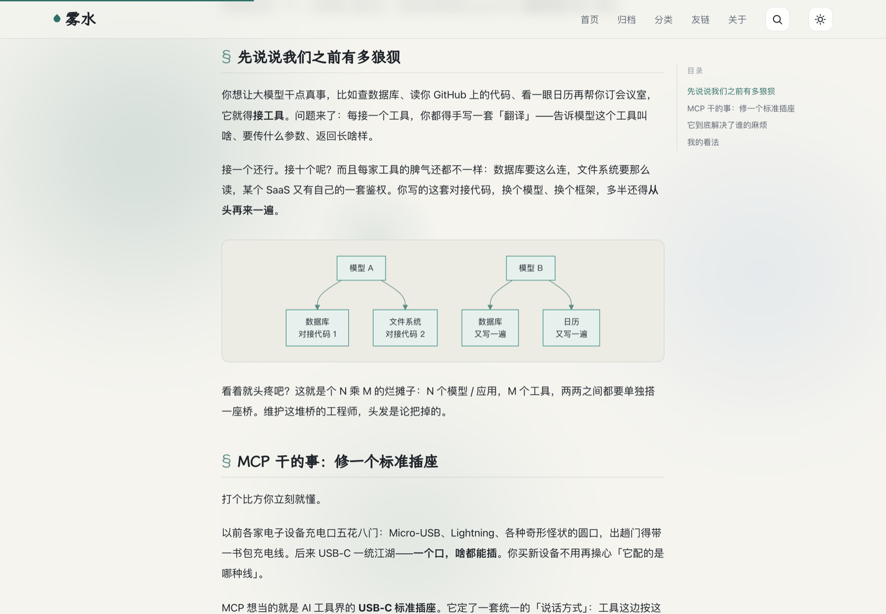

<div align="center">

# 雾水 · 水墨风 Jekyll 博客主题

> 像雾，像雨，又像风。一个「**丝滑科技感 + 文艺水墨**」的个人博客主题。

[](https://github.com/JinRudy/JinRudy.github.io/stargazers)
[](https://github.com/JinRudy/JinRudy.github.io/network/members)
[](./LICENSE)
[](https://jekyllrb.com/)

**[🌊 在线演示 Live Demo](https://a.minifog.org.cn/)** &nbsp;·&nbsp; **[🚀 用此模板创建 Use this template](https://github.com/JinRudy/JinRudy.github.io/generate)**

</div>

基于 Jekyll + GitHub Pages 的个人博客主题：墨青配色、霞鹜文楷、亮/暗双主题、轻量水墨动效、客户端全文搜索、时间线归档、Mermaid 图表、giscus 评论。**克制、优雅、信息优先，不堆炫技。**

> **English** — A water-ink (*shuimo*) themed Jekyll blog for GitHub Pages: ink-teal palette, light/dark modes, lightweight motion (ripples, scroll reveal, water-wave theme switch), client-side full-text search, timeline archive, themed Mermaid diagrams and giscus comments. Calm, elegant, content-first.

## 预览 Screenshots

<table>
  <tr>
    <td width="50%"><p align="center"><sub>首页 · 浅色</sub></p></td>
    <td width="50%"><p align="center"><sub>首页 · 深色</sub></p></td>
  </tr>
  <tr>
    <td width="50%"><p align="center"><sub>文章页 · 浮动目录 + 墨青 Mermaid 图表</sub></p></td>
    <td width="50%" align="center"><p align="center"><sub>移动端自适应</sub></p></td>
  </tr>
</table>

## 特性 Features

- 🎨 **水墨主题** — 墨青配色、霞鹜文楷标题；亮 / 暗双主题，自动记忆。
- 🌊 **轻量动效** — 水滴涟漪、滚动错落浮入、点击点水波扩散切换暗色、卡片悬停光扫、背景雾团漂移。全部走 `transform / opacity`，尊重 `prefers-reduced-motion`，不卡顿。
- 🔍 **客户端全文搜索** — 放大镜 / `⌘`·`Ctrl + K` / 双击 `Shift` 唤起，命中高亮。
- 🗂️ **时间线归档 + 分类筛选** — 归档按年份排列；分类页标签一点即筛。
- 📑 **文章浮动目录** — 宽屏右侧自动生成目录 + 滚动高亮当前章节。
- 📊 **Mermaid 图表** — 墨青配色、跟随暗色、按需懒加载、响应式。
- 💬 **giscus 评论** + 🔎 **SEO**（BlogPosting 结构化数据 + 社交分享封面）。
- ⚡ **资源构建版本号** — 更新后即时生效，无需强刷。

## 技术栈 Tech

[Jekyll](https://jekyllrb.com/)（`github-pages`）+ GitHub Pages；自研 `assets/css/shuimo.css` 与 `assets/js/shuimo.js`（纯原生 JS，无 jQuery）；[霞鹜文楷](https://github.com/lxgw/LxgwWenKai)；[giscus](https://giscus.app/zh-CN)。

## 快速开始 Quick Start

1. 点上方 **「Use this template」** 生成你自己的仓库。
2. 改 `_config.yml`：`title` / `url` / `author` / `giscus` 等。
3. 改 `CNAME`（用自定义域名）或删除它。
4. 删掉 `_posts/` 里的示例文章，开始写自己的。
5. GitHub Pages 选 `main` 分支构建即可上线。

> 用户主页站请把仓库名设为 `你的用户名.github.io`。

## 本地预览 Local Preview

Ruby 偏老时，直接用 Docker（贴近 GitHub Pages 环境）：

```bash
docker run --rm -v "$PWD":/site -w /site -v jekyll_bundle:/usr/local/bundle \
  -p 4000:4000 ruby:2.7 bash -lc \
  "gem install bundler -v 2.4.19; bundle install && \
   bundle exec jekyll serve --host 0.0.0.0 --config _config.yml,_config_dev.yml --watch --force_polling"
```

访问 <http://localhost:4000>（`_config_dev.yml` 仅本地用，把 `url` 指向 localhost）。

## 写一篇文章 Writing

在 `_posts/` 下新建 `YYYY-MM-DD-标题别名.md`：

```markdown
---
layout: post
title: 文章标题
categories: AI          # 智能体 / AI / 技术 / 生活 ……
cover: https://图片地址   # 可选：首页缩略图 + 文章封面横幅
description: 一句话简介
keywords: 关键词, 逗号分隔
---

正文……
```

正文支持 ` ```mermaid ` 图表（自动渲染成墨青矢量图）与带「复制」按钮的代码块。

## 目录结构 Structure

```text
├── _posts/          文章
├── _layouts/        布局（default / post / page / categories / archives）
├── _includes/       头部、页脚、评论
├── assets/css/shuimo.css   主题样式
├── assets/js/shuimo.js     主题脚本（主题切换 / 搜索 / 动效 / 目录 / Mermaid）
├── pages/           关于、归档、分类、友链、404
├── _data/           友链、社交、技能
├── _config.yml      站点配置
└── CNAME            自定义域名
```

## 致谢 Credits

主题前身为 [mzlogin](https://github.com/mzlogin) 的「码志」，已大幅重构为水墨风格。

## License

代码遵循仓库 [LICENSE](./LICENSE)；文章内容采用 [CC BY-NC-SA 4.0](https://creativecommons.org/licenses/by-nc-sa/4.0/deed.zh)。

<div align="center"><sub>如果这个主题帮到了你，点个 ⭐ Star 是最好的鼓励。</sub></div>
