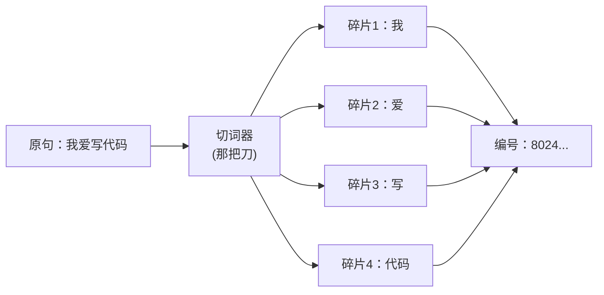

今天跟同事聊到，回家就写了。

这阵子，但凡群里有人甩出 ChatGPT 的截图，底下总有人追问一句：「这玩意儿怎么收费来着？」

答案永远是那句让人一头雾水的话——**按 token 算钱**。

于是新的疑问诞生了：token 是个啥？我打的明明是字，怎么就变成了一串让钱包发抖的计量单位？今天我就把这事儿用人话讲明白，顺便教你怎么少给 OpenAI 交点学费。

## token 不是「字」，是「碎片」

你可能会想当然地以为：一个 token 就是一个字，或者一个单词。**错，而且错得挺离谱。**

更准确的比喻是：模型读你的句子之前，会先拿一把刀，把句子剁成一堆**碎片**，再把每块碎片当成一颗乐高积木。这些积木就是 token。

剁法有讲究。常见的英文单词，比如 `apple`，可能就是一整块积木；但稍微生僻一点的，比如 `tokenization`，可能被剁成 `token` + `ization` 两块。中文更碎，一个汉字常常就要占掉一到两块积木——所以同样一句话，中文往往比英文「更费 token」。

为什么非要剁碎？因为模型不认识字，它只认识数字。每一块积木都对应词典里的一个编号，模型真正吞进肚子里的，是这一串编号。你写的「我爱写代码」，在它眼里其实是 `[8024, 1234, 5678, ...]` 这么一坨。

记住这个粗略的换算就够用了：**英文大概 4 个字符顶 1 个 token，中文 1 个字大概顶 1 到 2 个 token。** 一篇千把字的文章，差不多就是一两千个 token。

## 为什么偏偏按 token 收费

因为对模型来说，**算力的开销，几乎就是按积木块数来算的**。

你给它 10 块积木，它要把这 10 块两两之间的关系都盘算一遍；给它 1000 块，计算量不是涨 100 倍那么客气。所以无论是你输入的问题，还是它吐出来的回答，**每一块积木都实打实地烧了电、占了显卡**。

而且这里有个新手常踩的坑：**输入和输出是分开计费的，而且单价通常不一样**。你写了一长串提示词，它还没开口你就已经在花钱了；它哗哗给你生成一大段回答，那又是另一笔账。

| 算钱的部分 | 通俗理解 | 谁在掏钱 |
|---|---|---|
| 输入 token | 你递进去的料 | 你打的字越多越贵 |
| 输出 token | 它吐出来的话 | 它说得越多越贵 |
| 上下文累计 | 多轮对话会把前文一起重算 | 聊得越久越贵 |

最后一行最容易让人破防。很多人以为多轮对话只算最新那句，其实不然——**你跟它聊的越久，每问一句，它都得把前面那一大坨历史重新读一遍**。这就好比你每次请教同事问题，都得先把前因后果从头复述一遍，复述本身也是要花口舌（token）的。

## 怎么少交点学费

知道了原理，省钱的思路就很朴素了：**别让积木白白堆着**。

- **提示词别注水**：能一句话说清的别写三段。客气话、铺垫、「请你务必认真思考」这类心理按摩，模型不吃这套，但每个字都收你钱。
- **长对话适时清场**：一个话题聊完了就新开一轮，别让一屏子无关历史一直跟着你算钱。
- **该用小模型用小模型**：翻译、改错别字这种活儿，犯不着请最贵的模型出马。
- **批量任务先估算**：拿几条样本跑一下，看看平均吃多少 token，再乘以总量，心里就有数了，免得月底账单给你一个「惊喜」。

说到底，token 这套计费方式不是 OpenAI 故意为难你，它就是这门生意最诚实的标价——**你消耗了多少算力，就付多少钱**，童叟无欺，只是单位换成了你没见过的积木块。

下次再有人问你「token 是啥」，你可以淡淡地回一句：就是把你的话剁碎了之后，按块数收费的小石子。然后看着对方的表情，从茫然慢慢变成「原来如此，但好像更心疼钱了」。

---

暂记于此。