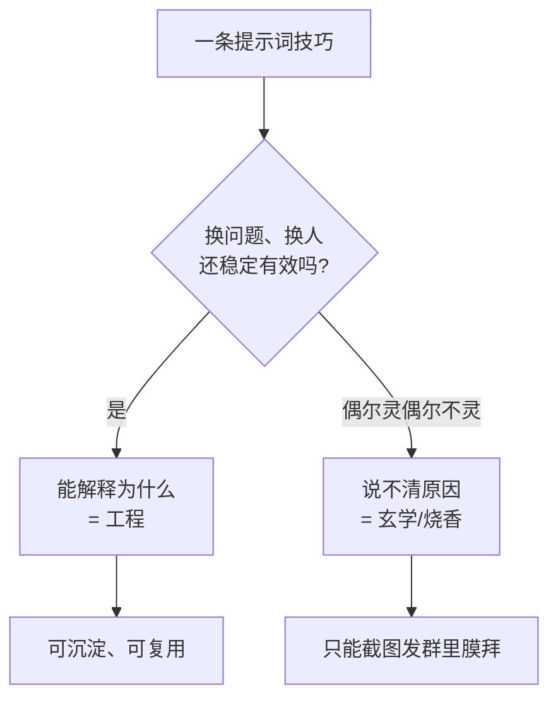

这篇憋了挺久，今天写出来。

这阵子我的收藏夹快被各种「ChatGPT 万能咒语合集」撑爆了。

什么「在提示词最后加一句『深呼吸，一步一步思考』，准确率暴涨」，什么「先让它扮演一位有 20 年经验的专家」，还有人正经卖起了「价值 999 的私藏提示词模板」。一时间，提示词工程师听起来像是个会念咒的赛博法师。

作为一个被各种「祖传咒语」坑过好几回的人，我想泼盆冷水：**能稳定复现的才配叫工程，复现不了的，那叫烧香。**

## 先分清：什么是玄学，什么是工程

判断标准其实特别朴素——**换个人、换个时间、换个问题，它还灵不灵？**

玄学的典型特征是：你照着某篇爆款帖子抄了一段咒语，第一次效果惊为天人，截图发群里收获一片膜拜；结果第二天换个问题再用，模型直接给你表演一个胡说八道。你以为是自己姿势不对，其实是这咒语本来就**碰运气**。

而工程的特征是：你能说清**为什么这么写**，换个场景照着同样的思路改一改，**还是能稳定地好使**。

注意，玄学和工程并不是看技巧本身高不高级，而是看你**能不能把它讲清楚、能不能复现**。同一句「一步一步思考」，有人当咒语乱念，有人知道它是在引导模型把推理过程显式写出来——后者就把玄学用成了工程。

## 那些「魔法咒语」，为什么有时真的有用

这里得说句公道话：很多咒语不是纯骗人，它们**偶尔真有效，只是没人告诉你背后的道理**。

拿最火的「一步一步思考」举例。它之所以有时管用，是因为它逼着模型**把中间推理过程写出来**，而不是张嘴就报个答案。模型本质是顺着前文往下接的，前面把思路铺开了，后面接出正确答案的概率自然就高了。

再比如「你是一位资深律师」这种角色扮演。它的作用是**把模型的回答往某个语境里拽**——同一个问题，挂上「律师」的前缀，它就更倾向于用严谨、规避风险的措辞来回答。

| 流传的说法 | 玄学版理解 | 工程版理解 |
|---|---|---|
| 一步一步思考 | 念了就变聪明 | 让推理过程显式化，少跳步 |
| 你是某领域专家 | 召唤大神附体 | 把回答框定在特定语境 |
| 给几个例子 | 例子玄学加成 | 用样例校准输出的格式和风格 |

看出来没？**把咒语翻译成「它实际在干嘛」，玄学的滤镜就碎了。** 剩下的，才是你能反复使用的真功夫。

## 把提示词当菜谱来写

我自己琢磨出一个特别土的心法：**好提示词就像一份靠谱的菜谱**。

菜谱为什么靠谱？因为它把模糊的东西全给量化了——不是「放适量盐」，而是「放 3 克盐」；不是「炒到差不多」，而是「中火炒 2 分钟至变色」。换个人照着做，也能复现出八九不离十的味道。

提示词同理。「帮我写篇文章」就是「放适量盐」级别的废话，模型只能瞎蒙；而「写一篇 800 字、面向初学者、用生活化比喻、避免专业术语堆砌的科普文，结尾留个开放问题」——这就是一份能复现的菜谱。

我的几条朴素经验：

- **说清楚要什么，更要说清不要什么**。「别用 Markdown」「别超过三段」这种负面约束往往比正面要求更立竿见影。
- **给例子胜过讲道理**。你想要什么格式、什么语气，丢一两个样例进去，比写五百字解释管用得多。
- **能拆步骤就拆步骤**。复杂任务别指望一句话搞定，分成「先做 A，再基于 A 做 B」，翻车率立降。
- **改一处测一处**。别一次性堆十个技巧然后惊呼「变强了」，你根本不知道是哪句起了作用——这恰恰是玄学的温床。

## 收个尾

提示词工程当然是真东西，但它配得上「工程」二字的前提是：**你得知道自己在干嘛，并且能把它复现给别人看。**

那些「价值 999 的私藏咒语」，本质上是把「我也不知道为啥但好像有用」打包卖给你。真正的本事不在某句魔法句式，而在于你能不能像写菜谱一样，把一个模糊的需求拆成模型能稳定执行的、量化的指令。

所以下次再看到「一句话让 AI 智商翻倍」的标题，先别急着抄。问自己一句：**换个问题它还灵吗？我能讲清它为啥灵吗？** 答不上来的，就当看个乐子——香火钱嘛，能省则省。
