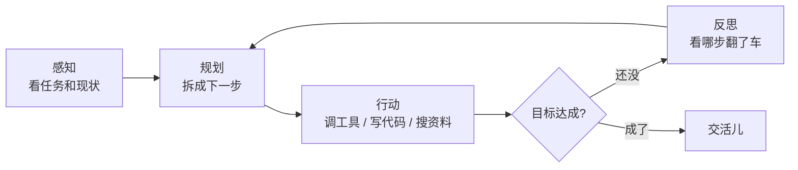
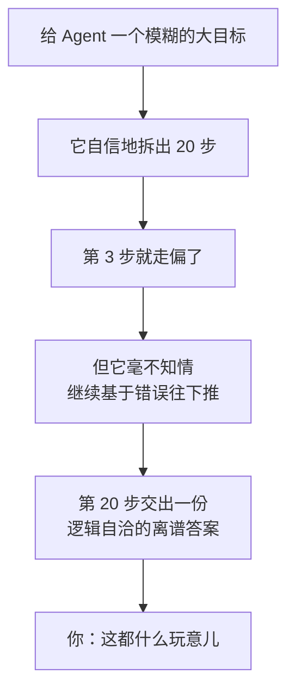

下班路上突然想清楚的，赶紧记一下。

去年这时候，朋友圈还在转「ChatGPT 帮我写了篇周报」；今年再打开，满屏都是「我用 Agent 搭了个全自动赚钱机器」。

作为一个见过太多「全自动赚钱机器」最后都变成「全自动烧钱机器」的人，我决定认真把 AI Agent 这事儿捋一捋——它到底是革命，还是又一轮 PPT 大赛？

## 先说人话：Agent 是什么

把大模型（LLM）想象成一个**记忆力惊人、但有点社恐、还从不主动起身**的实习生。你问它，它答得头头是道；可你让它「去把这事办了」，它只会礼貌地告诉你「以下是办这件事的 7 个步骤」，然后……就没有然后了。

**Agent，就是给这个实习生配了一双手、一双脚，再加一句「办不成别回来」。**

具体点说，一个 Agent 通常会循环地做四件事：

看出来了吗？这套「感知—规划—行动—反思」的循环，跟你我打工时**毫无区别**：接活、拆解、动手、踩坑、复盘、再来一遍。区别只在于它不用喝咖啡，也不会在工位上偷偷刷短视频。

## 那它和「自动化脚本」差在哪？

这是最多人犯迷糊的地方。十年前我们就有定时任务、有 RPA、有一键脚本，凭什么现在套个壳就叫「智能体」？

差别就一个词：**它会临场应变**。

传统脚本像高铁，铺好的轨道一寸都不能歪，前面掉了片树叶它都能给你急刹车报错；而 Agent 更像出租车司机——你说「去机场」，路上堵了它自己绕，遇上修路它自己改道，虽然偶尔也会把你拉到隔壁城市，但至少它**真的在想办法**。

| | 传统脚本 | AI Agent |
|---|---|---|
| 遇到没写过的情况 | 当场表演原地爆炸 | 试着自己想办法 |
| 维护成本 | 改一个字段改三天 | 改一句提示词 |
| 翻车方式 | 报错退出 | 一本正经地胡来 |

最后一行是重点，我们待会儿还要回来鞭尸。

## 真本事 vs PPT

聊点实在的。我自己用下来，Agent **真香**的场景有这么几类：

- **有明确反馈的活**：写代码（能跑就是赢）、查资料（有没有找到一目了然）、数据清洗（对不对验得出来）。
- **流程长但每步都不难**：比如「把这 50 个网页里的联系方式扒下来整理成表格」，无聊，但它不嫌烦。
- **允许试错的活**：反正失败了再来一次，成本是几毛钱 token。

而那些「**全自动**」的吹嘘，翻车通常翻在同一个地方——

这就是开头说的那个「一本正经地胡来」。Agent 最大的风险从来不是「做不到」，而是**「做错了还特别自信」**。一个会说「这题我不会」的实习生，远比一个把错答案讲得绘声绘色的实习生让人省心。

## 所以，该不该上车？

我的建议特别朴素：**别指望它替你做决定，指望它替你跑腿。**

把它当成一个不知疲倦、但需要你定期抽查作业的实习生：活儿交给它干，关键节点你来把关，给它的目标越具体、反馈越清晰，它就越靠谱。反过来，你越是甩给它一句「看着办」，它就越可能给你「看着办」出一个惊喜（惊吓）。

AI Agent 不是新瓶装旧酒，它是**给旧酒配了个会自己找下酒菜的机器人**——很有用，但你最好还是盯着它，别让它把你家厨房点了。

至于怎么给这个实习生喂资料——是「把整本书一股脑塞给它」，还是「用到哪页查到哪页」，这里头的门道够单开一篇了，改天细聊。
