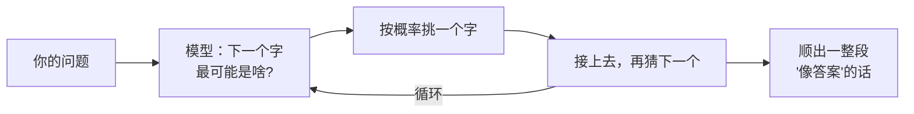

工作上踩了点坑，回头复盘。

前阵子有个朋友兴冲冲跑来找我，说他让 ChatGPT 推荐了几本书，结果**有一半压根不存在**——书名像模像样，作者头头是道，连出版社都给你编得有鼻子有眼，就是查无此书。

他一脸困惑：「这模型咋还睁眼说瞎话呢？」

这就是这阵子被吵翻天的「幻觉」（hallucination）。今天我想说一句可能有点反直觉的话：**模型胡说八道，不是因为它坏，而是因为它压根就不是在「查资料」。**

## 它不是在查数据库，是在「续写」

我们脑子里有个根深蒂固的错觉：以为问模型一个问题，它会跑到肚子里某个「知识库」里翻出答案给你。

**完全不是这么回事。**

大模型本质上干的活儿只有一件：**给定前面一串字，猜下一个字最可能是什么。** 就这么简单粗暴。它不是在检索，而是在**接龙**——根据海量训练数据里学到的「语言规律」，一个 token 一个 token 地往下顺，顺出一段读起来最顺、最像那么回事的话。

关键在于：它优化的目标是**「读起来像不像」**，而不是**「是不是真的」**。这两件事大多数时候是重合的——像真话的，往往就是真话。但一旦撞上它训练数据里没怎么见过的冷门问题，它也不会停下来，而是会**沿着「像答案」的方向，硬生生给你顺出一个**。书名要像书名，作者要像作者，于是一本不存在的书就这么诞生了。

## 它就是那个「死也不肯说不知道」的考生

我最爱用的比喻是这样的：**大模型像一个永远不肯交白卷的考生。**

你考过试就懂。有那么一种同学，遇到不会的题，绝不空着，而是凭着语感和套路，把答题区写得满满当当——逻辑通顺、术语齐全、卷面工整，唯一的问题是**内容全是编的**。判卷老师不细看，还真容易被唬住。

大模型就是这种考生的究极形态。它的「学习目标」从来不包含「不知道就承认」这一项。在它的世界里，**写点什么，总比留白得分高**。所以它宁可自信地编一个，也不愿意干巴巴地回你一句「这我真不知道」。

| | 普通人 | 大模型 |
|---|---|---|
| 遇到不会的 | 大概率会说「不知道」 | 几乎不会，硬着头皮往下编 |
| 编出来的东西 | 通常一眼假 | 流畅、自洽、像真的 |
| 危险程度 | 低，你能看出来它在蒙 | 高，它编得比真话还像真话 |

最后一行就是幻觉真正可怕的地方：**它不是错得离谱，而是错得特别可信。** 一个明显在瞎说的人不危险，一个把假话讲得绘声绘色、引经据典的人才危险。

## 那怎么少被它骗

既然根子在「它是在续写概率，不是在查事实」，那么应对思路也就清楚了——**别让它凭空发挥，给它真东西靠**。

- **把资料喂给它，而不是考它**。与其问「某政策的细则是什么」，不如把政策原文贴进去再让它总结。它续写的依据有了，瞎编的空间就小了。这也是这阵子大家聊得火热的检索增强（RAG）的核心思路：先把相关资料捞出来塞进上下文，再让它基于这些料作答。
- **逼它给出处**。让它标明「这条结论来自哪一段」，没有出处的，你就当它在蒙。
- **关键事实自己复核**。人名、数字、引文、链接——这四样是幻觉重灾区，一律默认存疑，亲自查证。
- **给它「说不知道」的台阶**。在提示词里明确写一句「如果不确定，就直接说不知道，不要编造」，能挡掉相当一部分一本正经的胡来。

## 收个尾

幻觉不是模型偶尔抽风的 bug，而是它工作原理的**自然副产品**——一个被训练成「无论如何都要顺出一段像样的话」的系统，注定会在不该开口的时候继续开口。

所以与其指望哪天它彻底「不撒谎」，不如调整自己的用法：**把它当成一个语感超群、但记性不靠谱的助手**。让它帮你组织语言、润色表达、基于你给的料干活，这些它是真行；而但凡涉及具体事实，多留个心眼，自己把那道「关」给守住。

毕竟，会编故事的从来不只是它——那个轻信它每句话的人，也得为这场误会负一半责任。

---

这一篇就到这里。