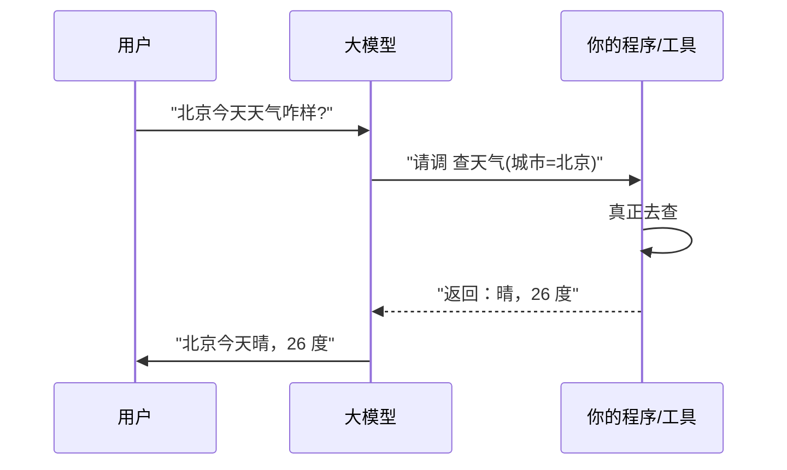

周末翻笔记翻到这个话题，整理一下。

OpenAI 这阵子刚给接口塞了个新功能，叫 **function calling**（函数调用 / 工具调用）。圈子里立马有人开始喊「工具调用元年」——听着有点中二，但这回我觉得，他们没夸张。

为啥这么说？因为在此之前，大模型一直有个特别尴尬的毛病：**它什么都懂，但什么都不会干。**

## 病根：它是个「只会动嘴」的实习生

你让大模型回答「今天北京天气咋样」，它会一脸真诚地告诉你：「抱歉，我无法获取实时信息。」——它不是不想答，是**真没法答**，因为它肚子里那点知识是训练时喂进去的，早就过期了，而且它也没法上网、没法查数据库、没法跑代码。

它就像一个**博览群书但从不起身的实习生**：你问他理论，他对答如流；你让他「去查一下今天的汇率」「帮我把这个数算一下」「订张明天的票」，他只会礼貌地告诉你「以下是查汇率的几种方法」，然后稳如泰山地坐着不动。

毛病出在哪？**它只会动嘴，不会动手。** 它没有「手」，没法碰到真实世界里的工具。

## function calling 就是给它配了个工具箱

function calling 干的事，说穿了特别朴素：**你提前告诉模型「我这儿有哪些工具可以用」，它需要的时候，就喊你帮它用。**

注意一个关键点——**模型自己并不真的去查天气、跑代码**。它干的是「**决定要用哪个工具、该传什么参数**」，然后把这个决定吐出来，由你（你的程序）去真正执行，再把结果递回给它。它负责动脑和动嘴，你负责动手。

看明白这个来回了吗？模型在第二步并没有自己变出天气，它只是**举手说「这题该用查天气这个工具，参数填北京」**。真正干活的是你的程序。等结果回来了，它再用人话把结果讲给用户听。

这就好比那个实习生终于学会了一句话：「这事我办不了，但我知道该找隔壁的查天气小哥，参数给他报『北京』就行。」——他还是不亲自动手，但他**知道该喊谁、该说啥**，这就够了。

## 为什么说这是 Agent 的「前置能力」

这阵子大家天天念叨 AI Agent（智能体），说它能「自己规划、自己干活」。但你有没有想过一个最基础的问题：**一个只会输出文字的模型，凭什么去「干活」？**

答案就是 function calling。它是 Agent 真正能落地的**地基**。

| | 没有工具调用 | 有了 function calling |
|---|---|---|
| 能力边界 | 只能聊天、生成文字 | 能查、能算、能操作外部系统 |
| 信息时效 | 卡在训练那一刻 | 能拿到实时、真实的数据 |
| 在 Agent 里的角色 | 一个嘴炮顾问 | 一个能动手的执行者 |

你想，一个 Agent 要「自动帮我订机票」，它至少得能：查航班（一个工具）、比价（一个工具）、下单（一个工具）。这每一步背后，都是一次 function calling。**没有工具调用，所谓的「自主智能体」就是空中楼阁**——一个再会规划的大脑，没有手脚也只能在原地空想。

所以这回的「工具调用元年」这个说法，我是认的。它把大模型从「一个会聊天的百科全书」，往「**一个能干活的助手**」推进了关键一步。

## 几句提醒

新东西虽好，但我还是得啰嗦两句，毕竟它不是魔法：

- **它只是「举手说要用啥」，执行和兜底全靠你**。工具报错了、参数传歪了，得你来接住，模型可不会替你擦屁股。
- **它依然会犯幻觉**。模型可能自信地调用一个**根本不存在的工具**，或者把参数填得驴唇不对马嘴——别忘了它骨子里还是那个爱编故事的考生。
- **工具的描述要写清楚**。你怎么跟模型介绍这个工具、参数啥含义，直接决定它用得准不准。这又绕回了提示词那点功夫——把工具说明书写明白，本身就是门手艺。

说到底，function calling 没让大模型变得更聪明，它做的是更实在的事：**给这个只会动嘴的脑子，接上了能够触碰真实世界的手。** 而当一个东西既会动脑、又能动手，还能看着结果决定下一步该咋办的时候——离我们整天挂在嘴边的那个「智能体」，也就不远了。

---

这个话题还没琢磨透，回头继续。