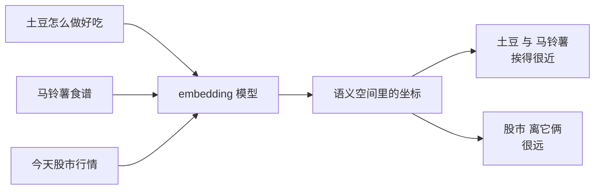

记一下最近琢磨的：

这阵子 RAG 火得不行，跟着被一起带飞的还有一个词——**向量数据库**。Pinecone、Milvus、Chroma 这些名字隔三差五就在群里刷一遍，搞得不少人以为这又是什么高深莫测的黑科技。

其实它的核心思想，用一句话就能说明白：**把「意思相近」翻译成「位置相近」，然后就能像找最近的便利店一样，把相关的内容捞出来。**

今天咱就把这事掰开揉碎讲讲。

## 传统搜索的尴尬：它只认字，不认意思

先想个问题：你在一堆文档里搜「怎么让电脑跑得更快」，结果有一篇标题叫《电脑性能优化指南》——这篇明明最相关，但传统的关键词搜索很可能**漏掉它**。

为啥？因为传统搜索是**按字面匹配**的。你搜「跑得更快」，它就吭哧吭哧找含「跑得更快」这几个字的文档，至于「性能优化」跟你想要的是不是一个意思——它压根不懂，它**不认意思，只认字**。

这就很尴尬了。人类语言里，同一个意思能有八百种说法：「土豆」和「马铃薯」，「电脑卡」和「性能差」，「订机票」和「买航班」。关键词搜索在这种「换个说法」面前，基本是睁眼瞎。

## 关键一步：给每段话发一个「语义坐标」

向量数据库解决这个问题的办法，堪称巧妙。

它先请出一个叫 **embedding（嵌入）模型** 的家伙。这个模型的本事是：**把任意一段文字，变成一串数字**——通常是几百上千个数字组成的一长串，这串数字就叫「向量」。

你可以把这串数字理解成这段话在「语义空间」里的**坐标**。就像每家店在地图上都有个经纬度，每段话在这个语义空间里也有自己的一个位置。而 embedding 模型最神的地方在于：**意思相近的话，坐标也会靠得很近。**

「土豆怎么做好吃」和「马铃薯食谱」，字面上一个字都不重样，但它们的坐标会紧紧挨在一起；而「今天股市行情」虽然也是一句中文，坐标却被甩到老远。**意思的远近，就这么变成了距离的远近。**

## 向量数据库：专门帮你「找最近的邻居」

好，现在每段话都有坐标了。剩下的问题是：当用户来提问时，怎么快速找到坐标离他最近的那几段？

这就是**向量数据库**登场的时候。它干的活，本质上就是一件事——**帮你在海量的坐标里，飞快地找出离查询点最近的几个邻居**。

流程串起来是这样的：

你可能会问：找最近的邻居，挨个算距离不就行了？问题是，库里可能有几百万、上千万段内容，**一个个算过去，黄花菜都凉了**。向量数据库真正的本事，就是用一套精巧的索引算法，让这个「找最近邻」的过程快得离谱——这也是它跟普通数据库最不一样的地方。

| | 传统数据库 | 向量数据库 |
|---|---|---|
| 存的是啥 | 字段、表格 | 一串串语义坐标 |
| 怎么查 | 精确匹配 / 关键词 | 找坐标最近的邻居 |
| 擅长啥 | 「身份证号等于 X」 | 「跟这句话意思最像的」 |

## 它和 RAG 是什么关系

绕了一圈，回到开头那个带火它的 RAG。

RAG 要干的事是「先把相关资料捞出来，再喂给大模型作答」。那「捞资料」这一步，靠的就是向量数据库——**它就是 RAG 那个「贴心助教」背后真正翻书的人**。用户一提问，转成坐标，向量库唰地找出语义最接近的几段原文，递给模型，模型就能基于真东西作答，而不是靠脑补瞎编。

所以你看，这套东西环环相扣：embedding 模型负责把「意思」变成「坐标」，向量数据库负责在坐标里「找最近的邻居」，RAG 负责把找到的料喂给模型。每一环都不神秘，拼在一起却挺好使。

下次再看到 Pinecone、Milvus、Chroma 这些名字，你心里大可以淡定：**它们不过是一群专门帮你「按意思找东西」的索引高手罢了。** 把「意思相近」变成「距离相近」，这个朴素的转换，就是它们全部魔法的来源。

---

暂时这些，欢迎指正。