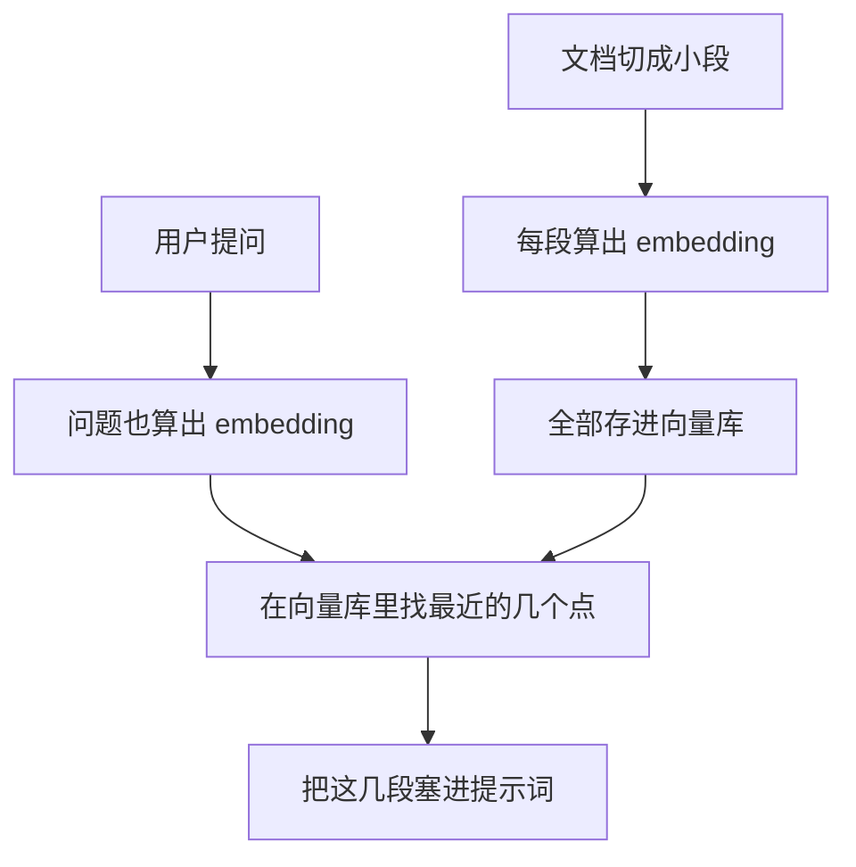

随手记，趁还没忘。

这阵子聊 RAG，几乎绕不开一个词：embedding。每次有人一本正经地说「我们把文档做了 embedding 存进向量库」，旁边总有人默默点头，眼神里写满了「我也不太懂但我不能问」。

行，今天我来当那个问的人。咱们把这串听起来高深的「向量」从头扒一遍，保证讲完你能在饭桌上唬住三个同事。

## 先打个比方：给每个词发一张「语义经纬度」

地球上任意一个地方，你都能用一对经纬度数字表示出来。北京是一个坐标，上海是另一个，两个坐标一减，你大概就知道它俩有多远。

**Embedding 干的就是这件事，只不过它给的不是地理坐标，而是「语义坐标」。**

「猫」是一个坐标，「狗」是另一个坐标。因为它俩语义上很近（都是毛茸茸的、会被人当祖宗供着的小动物），所以它们的坐标也挨得很近；而「猫」和「混凝土」呢？隔了十万八千里。

唯一的区别是：地理经纬度只要两个数字，而语义这玩意儿太复杂，两个数字根本装不下，于是模型一口气给你几百上千个数字——这一长串数字，就叫一个 **embedding（向量）**。你可以把它理解成「一个词在几百维空间里的经纬度」。

## 那这串数字到底有啥用？

最直接的用处：**让机器会「比相似」**。

过去搜索靠的是关键词匹配，你搜「怎么哄猫开心」，系统就去找包含「哄」「猫」「开心」这几个字的文章。问题是，有篇绝世好文标题叫《如何取悦你家主子》，一个关键词都没对上，于是被无情埋没。

有了 embedding 就不一样了：「哄猫开心」和「取悦主子」这两句话，虽然一个字都不重样，但**语义坐标几乎贴在一起**。机器一算距离，发现「哎这俩说的是一回事」，立马把那篇好文捞出来。

这就是所谓的**语义检索**——不看你用了什么字，看你想表达什么意思。

| | 关键词匹配 | 语义检索（靠 embedding） |
|---|---|---|
| 比的是 | 字面有没有撞上 | 意思像不像 |
| 「番茄」vs「西红柿」 | 两个词，认不出 | 几乎是同一个点 |
| 翻车场景 | 换个说法就搜不到 | 偶尔把「相关」误判成「相同」 |

## RAG 为什么离不开它

还记得 RAG 那个「贴心助教」吗——每次答题前先帮你从图书馆抽出最相关的三页。

这个「抽最相关的三页」的动作，靠的就是 embedding。

整个流程说白了就是：**先把家里所有书的「语义坐标」都登记造册，等你一提问，立刻算出你问题的坐标，然后在库里找离你最近的那几本。** 离得越近，越可能是你要的答案。

所以向量数据库这东西最近这么火，本质上就是个「专门擅长在几百维空间里快速找最近邻居」的仓库——别被名字唬住，它干的就是这点活儿。

## 几个容易踩的坑

聊到这儿，顺便提醒几个我自己栽过的跟头：

- **embedding 模型和你的语料得对路。** 拿一个只见过英文的模型去给中文文档算坐标，结果就是它给「猫」和「混凝土」也算得挺近——它根本没分清。
- **「相似」不等于「正确」。** 语义最接近的那段，未必就答得上你的问题。助教抽错书的老毛病，根子常在这儿。
- **切片大小很玄学。** 切太碎，每段缺上下文；切太大，一段里混了好几个主题，坐标就「糊」了，捞出来一锅乱炖。

说到底，embedding 就是把「猫像不像狗」这种模糊的人类直觉，硬生生翻译成了一道机器能算的减法题。它谈不上有多聪明，但正是这一手「万物皆可压成一串数字」的笨功夫，撑起了眼下大半个 RAG 江湖。

下次再有人在饭桌上抛出「embedding」三个字，你大可以慢悠悠接一句：「哦，就是给每个词发张语义经纬度嘛。」然后看他眼神由轻视转为敬佩——这串数字，值了。

---

暂记于此。