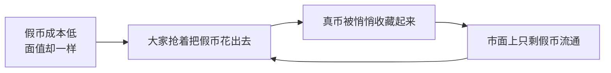

你有没有发现一个怪事：钱包里那张又新又挺的钞票，你总舍不得花，专挑那张皱巴巴、卷了边的先甩出去？

恭喜，你刚刚亲手复刻了一遍五百年前的「格雷欣法则」——好东西被你攥着，差东西在市面上到处跑。下面我们就借一个兑换银币的小故事，把这条「劣币驱除良币」的老典故唠明白。

## 一个兑银币的小场景

在经济学里，有一个广为流传的典故——「劣币驱除良币」，它源自英国金融家格雷欣的观察。这话听着玄乎，其实拿个生活里的例子一拆就懂。

设想一个再普通不过的交易场景：一个人手持金币，想把它兑换成银币。可市场上的银币偏偏分两种，一种是货真价实的真银币，另一种是偷工减料的假银币。由于假银币的制造成本更低，它在市场上的实际价值也就低于真银币。

当这个人拿金币去兑换时，他面临一个选择：接受真银币，还是假银币？接真银币，单枚价值更高，但换到手的数量少；接假银币，单枚不值钱，但能换一大把。

理性的选择，是接受假银币——反正花出去时大家都按面值认，那当然是攥住真银币、把假银币尽快出手最划算。于是真银币被一枚枚收进抽屉里压箱底，市面上流通的越来越全是假银币。这就是「劣币驱除良币」的原理。

说白了就是：当市场上存在两种价值不同、却又能相互替代的东西时，差的那个会慢慢把好的那个挤到一边去，自己占据主导地位。因为大家都精着呢——好东西自己留着，差东西赶紧花出去，久而久之，好东西就在流通里销声匿迹了。

这个典故的应用范围广得超乎想象。比如劳动力市场，如果雇主能用低技能的人替代高技能的人，那高技能的人就会逐渐被排挤出局；再比如金融市场，如果低质量的股票能伪装成高质量的样子，那真正的好股票也可能被埋没。这种现象在经济学里还有个更书面的名字——「逆向选择」。

总的来说，「劣币驱除良币」讲的就是这么个朴素又扎心的道理：在信息不对称、好坏却卖一个价的地方，劣质的往往会反过来淘汰优质的。它不只发生在钱币上，劳动力、商品、甚至我们身边各种「将就一下」的选择里，都藏着格雷欣的影子。下次当你又下意识把那张新钞攥回口袋时，不妨想想——你也是这条法则里的一环。