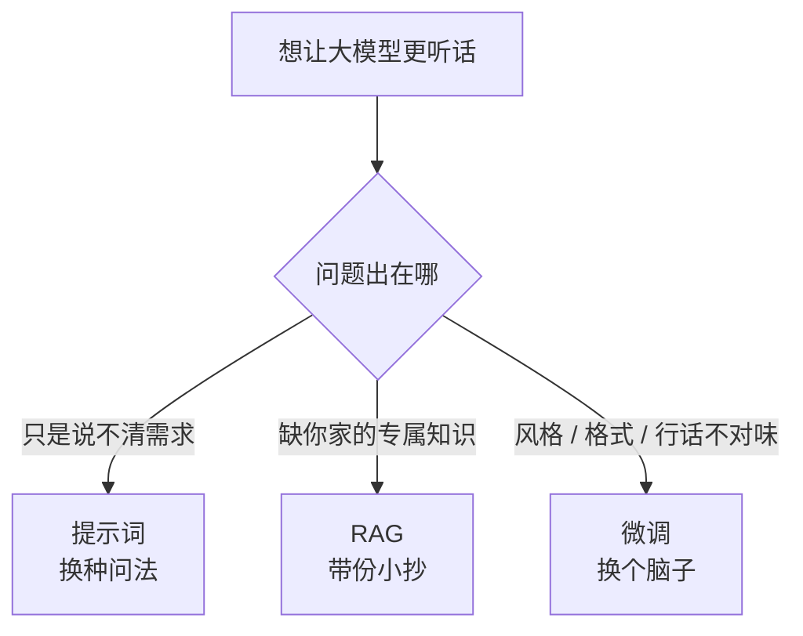

看到一个有意思的讨论，引出这篇。

最近见了好几拨想把大模型搞进自家业务的朋友，开场白出奇地一致：「我们想做个微调。」

我每次都得先按住他们：等会儿，你确定要的是微调，不是 RAG，也不是改改提示词？这三条路代价天差地别，走错一条，轻则多烧几十万，重则折腾半年最后发现一开始改两句话就能解决。

今天就把这三条路掰开揉碎，给你立个选路标。

## 三个比喻，先记住

我习惯把它们想成「让一个新员工学会干活」的三种办法：

- **提示词（Prompt）**：换种问法。你不改造这个人，只是把话说清楚——「用三句话总结，别废话，语气专业点」。一分钟搞定，零成本。
- **RAG（检索增强）**：给他一份小抄。员工脑子不动，但你考试前塞给他一沓「公司内部资料」，让他照着答。
- **微调（Fine-tuning）**：直接换脑子。送他回炉重造，把你这行的话术、风格、专业判断硬刻进脑回路里。贵、慢，但学成之后开口就是行家。

## 大多数人，其实只需要前两条

我得先泼盆冷水：**九成的需求，根本轮不到微调上场。**

你以为模型「不够懂你的业务」，十有八九是这两种情况：

第一种，**你没说清楚**。模型不是不会，是你给的指令太含糊。这种改改提示词，给它几个示例（也就是 few-shot，把「我要的好答案长这样」摆给它看），立马就对味了。

第二种，**它确实没你家的数据**。它没读过你们公司的产品手册、客户合同、内部 wiki，当然答不上「我们 V3 套餐到底含不含售后」。这种情况你给它再换多少次脑子都没用——脑子再灵，没见过的资料就是不知道。这时候该上 RAG，把资料当小抄递过去。

**记住这条铁律：缺知识，上 RAG；缺脑子，才微调。** 拿微调去补知识，相当于为了让员工记住今天的会议纪要，把他送去读了个博士——既贵又跑题。

## 那微调到底什么时候用

也不是说微调没用，它有几个 RAG 和提示词够不着的场景：

- **要的是「风格」和「格式」，而不是「知识」。** 比如你要模型永远输出一种特定结构的 JSON，或者永远用你品牌的那种贱兮兮又不失专业的语气——这种「肌肉记忆」级别的要求，靠小抄提醒不稳，刻进脑子才靠谱。
- **特定领域的「黑话」太重。** 法律、医疗、芯片这类，行话密度高到提示词喂不过来，微调能让它从骨子里熟悉这套语言。
- **想省钱省 token。** 微调过的模型，你不用每次都在提示词里塞一大堆示例和说明，请求短了，长期下来反而省。

注意这个顺序——**从便宜的往贵的试**。别一上来就掏最贵的牌。

## 一张表，收工

| 你的痛点 | 该走哪条 | 大概代价 |
|---|---|---|
| 答得跑题、太啰嗦 | 提示词 | 几分钟 |
| 不懂我家业务知识 | RAG | 几天搭一套 |
| 知识老更新、要出处 | RAG | 同上 |
| 格式 / 语气死活不对 | 微调 | 几周 + 一笔钱 |
| 行业黑话太密 | 微调 | 同上 |

这三条路最大的误区，是把它们当成「三选一」的擂台赛。**现实里它们常常一起上：** 微调过的模型负责「会说话」，RAG 负责「有料说」，提示词负责「临场调度」，三层叠起来才是能打的方案。

所以下次再有人豪气干云地说「我们要做个微调」，你不妨先问一句：你是嫌它脑子笨，还是嫌它没见过你家的料？问清楚这一句，能帮人省下的钱，够请一顿好的了。

---

先记到这，想到再补。