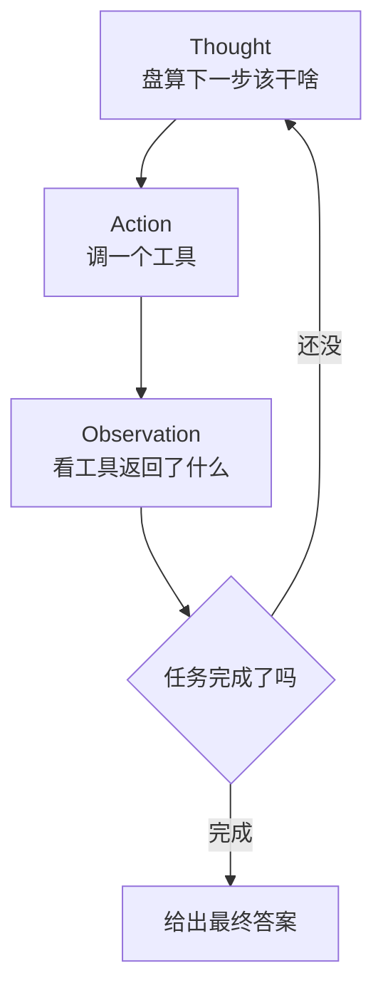

周末翻笔记翻到这个话题，整理一下。

最近搭 Agent 的朋友里，流行起一个词：ReAct。乍一听以为是前端那个框架，定睛一看，此 React 非彼 React——它是 **Reasoning + Acting**，「推理」加「行动」。

我一开始也没当回事，觉得不就是让模型多想想嘛。直到我亲眼看着一个不用 ReAct 的 Agent，闭着眼睛一口气规划了 15 步，结果第 2 步就因为查到的数据跟它预想的不一样，后面 13 步全建在沙子上——那叫一个壮烈。从那以后我服了。

## 老办法的毛病：想完再做，错了也不知道

先说说没有 ReAct 的时候，Agent 是怎么干活的。

它有点像一个**死要面子的人**：你给个任务，它当场闭门冥想，憋出一整套完整计划——「第一步这样，第二步那样，一直到第十步」——然后埋头照着执行，中途绝不抬头看路。

问题来了：现实哪有那么听话？它计划里写「去 A 网站查股价」，结果 A 网站今天抽风返回了一堆乱码。但它压根没回头看一眼，依然信心满满地拿着乱码往下推，最后给你交一份逻辑严丝合缝、数据全错的报告。

**毛病的根子在于：思考和现实脱节了。** 想是一次性想完的，做的时候发现不对，也没机会改主意。

## ReAct：边想一步，边做一步，再看一眼

ReAct 的思路朴素得近乎啰嗦：**别一口气想完，想一步、做一步、看一眼结果，再决定下一步想啥。**

像不像老司机开车？他不会在出发前把每个路口怎么打方向盘都背下来，而是开一段、看一眼路况、随机应变。前面堵了就绕，红灯了就停。**推理和行动是交替着来的**，每做完一个动作，都拿真实反馈来校准下一轮的脑子。

具体来说，它在循环里反复念叨三样东西：

- **Thought（想）**：现在该干嘛？「我得先知道今天的汇率。」
- **Action（做）**：调一个工具。「查汇率(美元转人民币)。」
- **Observation（看）**：工具吐回来啥？「7.3。」

看到结果，再开始下一轮的 Thought——而且这一轮的想法，是**建立在刚拿到的真实数据上的**，不是凭空脑补。

就这么个「想—做—看」的小循环转上几圈，活儿就办完了。

## 一个例子，体会下味道

假设你问：「我那 1000 美元的稿费，换成人民币够不够买台新发布的某款手机？」

不用 ReAct 的 Agent 会怎样？它可能直接拍脑袋：「美元大概 7 块多，那就是七千出头，应该够吧。」——汇率靠记忆、手机价格靠瞎猜，全程没查过一个数。

用了 ReAct 的，画风就稳重多了：

| 轮次 | Thought（想） | Action（做） | Observation（看） |
|---|---|---|---|
| 1 | 先得知道实时汇率 | 查汇率 | 1 美元 = 7.3 元 |
| 2 | 那是 7300 元，再查手机价 | 搜该手机售价 | 6999 元 |
| 3 | 7300 > 6999，够了 | 给出结论 | —— |

看出来区别了吗？**每一步的判断，都踩在上一步查到的真实数据上**，而不是一开始的想象。哪怕中途汇率查出来是离谱的 0.73，它在第 2 步也能立刻发现不对劲，回头重来——而不是揣着错数据一路狂奔到终点。

## 它的代价，以及一点提醒

天下没有免费的午餐。ReAct 这么个「走一步看一步」，意味着：

- **慢、费 token。** 想一轮、做一轮、看一轮，来回好几趟，每一趟都是一次模型调用，账单和耐心都得跟上。
- **可能原地打转。** 偶尔它会陷进「想了又想就是不动手」，或者反复调同一个工具——所以一般得给它设个步数上限，转够 N 圈还没结果就强制收摊。
- **Observation 得喂干净。** 工具返回一坨杂乱无章的内容，它的下一轮思考就跟着乱。垃圾进，垃圾出，这条铁律对 Agent 一样灵。

但瑕不掩瑜。ReAct 最大的价值，是把 Agent 从一个「闭眼狂奔、错了还不知道」的愣头青，调教成了一个「边干边瞅、随时纠偏」的老手。

说到底，它给 AI 补上的不是更高的智商，而是一个我们打工人天天在用、却最容易被忽略的本事——**做错了，停下来看一眼，然后改**。
