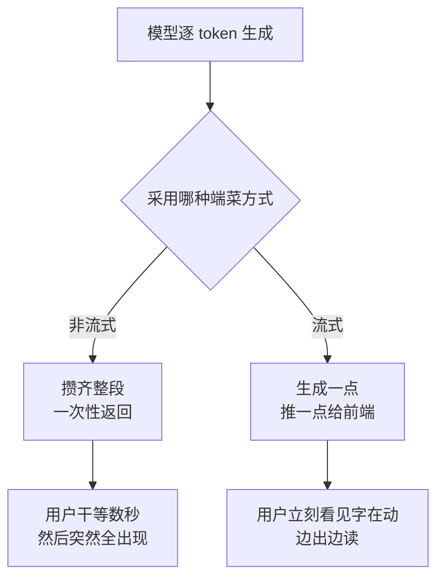

积压在草稿里很久了，发出来。

不知道你注意没有，现在跟 AI 聊天，它的回答永远是**一个字一个字往外蹦**的，跟个打字机似的。

我身边好几个人都犯过同一个嘀咕：这是不是故意装的？搞个慢慢打字的效果，显得它在「认真思考」、很高级？

还真不是装的。这背后是大模型生成文字的**真实姿势**，今天就掰扯掰扯，顺便说说为啥这么干反而更舒服。

## 它真的就是一个字一个字想出来的

得先接受一个反直觉的事实：**大模型压根没办法「一下子」想出一整段话。**

它的工作方式更像一个**接龙狂魔**：每次只预测「下一个最可能的字」（严格说是 token，一个 token 大概是一个字或半个词，咱们先粗略当成字）。预测出一个，把它接到后面，再拿这串去预测下一个……如此往复，直到它觉得「这话说完了」，吐出一个结束信号。

所以「一个字一个字蹦」不是表演，**是它本来就在一个字一个字地生成**。区别只在于：要不要让你**实时看见**这个过程。

## 两种端菜方式：等齐了再上，还是做好一道上一道

既然字是一个个产出来的，那送到你屏幕上就有两种策略，特别像饭店上菜：

- **非流式**：厨师把你点的菜全做齐了，一起端上桌。你面前先是空空如也，干等好几分钟，然后「哐」一下满桌。
- **流式（Streaming）**：做好一道先给你端一道。汤先上，你先喝着；硬菜后到，但你嘴没停过。

体感差距有多大？同样是花 8 秒生成一段话：非流式让你盯着空白屏幕焦虑 8 秒；流式让你在第 0.5 秒就看到字开始往外冒，一边出你一边读，等它写完，你也差不多读完了。

**总耗时一模一样，但「感觉」上快了一个数量级。** 这就是流式最值钱的地方——它没让模型变快，它让等待变得不那么难熬。

## 这股「字流」是怎么送到你浏览器的

那一个个字，是靠什么实时推到你屏幕上的？最常见的答案是 **SSE（Server-Sent Events，服务器发送事件）**。

普通的网页请求是「一问一答」：你发个请求，服务器憋好完整答案，一次性甩回来，连接关闭，结束。这天生就没法做流式——人家就不是为「挤牙膏」设计的。

SSE 干的事儿，是让服务器和你的浏览器之间**支起一根一直开着的水管**：连接建好后先不关，模型每蹦出几个字，服务器就顺着水管「滋」一小股过来，前端收到就立刻渲染上屏。一段话生成完了，服务器再发个「done」的信号，这才把水管关掉。

| | 普通请求 | SSE 流式 |
|---|---|---|
| 连接 | 答完即关 | 一直开着，边生成边推 |
| 用户看到的 | 等半天，整段蹦出 | 字立刻开始动 |
| 适合 | 查个数、提交个表单 | 大模型这种「边想边说」的活 |
| 翻车点 | —— | 中途断线、要处理重连 |

你可能听过 WebSocket，那是「双向对讲机」，啥都能传；而模型输出这种**只需要服务器单向往客户端喷字**的场景，SSE 更轻、更对口，杀鸡不必用牛刀。

## 几个工程上的小麻烦

听着挺美，真做起来还是有几处硌脚的地方：

- **token 边界很尴尬。** 模型吐的是 token，不一定按完整汉字或单词切。处理不好，你可能会看到屏幕上闪过半个乱码字，下一帧才补全——得在前端做点缓冲。
- **错误处理变难了。** 字都喷出去一半了，模型突然出错咋办？总不能把已经显示的字再抠掉。一般得在流的末尾补个状态信号，让前端知道这趟是善始善终还是半路夭折。
- **断线重连是个事儿。** 水管开着的这几秒，网络一抖就断。要不要从断点续传、还是干脆重来，得想清楚。

但这些麻烦都值。从「盯着空白屏幕数秒」到「字在眼前缓缓流出」，流式输出几乎凭一己之力，把跟 AI 对话从「提交—等待—刷新」的老式网页体验，变成了像在跟一个真人聊天。

所以下次再看见 AI 慢悠悠地打字，你大可以放下「它是不是在装」的怀疑——它是真在一个字一个字地憋，而那根把字实时送到你眼前的水管，恰恰是为了让你别等得那么难受。

---

这一篇就到这里。