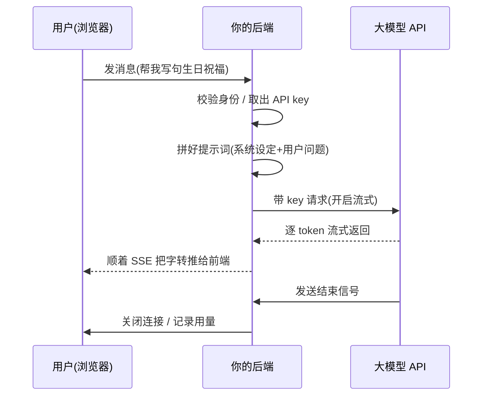

积压在草稿里很久了，发出来。

年底了，盘点这一年，最魔幻的变化大概是：**「接个大模型」从极客炫技，变成了产品经理的口头禅。** 这阵子我接到的需求十有八九带着一句「能不能也加个 AI 助手」。

加是能加，可不少人脑子里那条链路还是糊的——以为前端连上模型就完事了。今天我就带你跟着**一条用户消息**，从它在输入框被敲下，到一个字一个字回到屏幕上，把这趟旅程完整走一遍。看完你就明白，中间这层后端，省不得。

## 第一个误区：前端别直接连模型

很多人第一反应是：让浏览器直接拿着 key 去请求模型 API，多省事。

千万别。这等于把你家**金库钥匙明晃晃挂在大门口**。模型 API 的 key 是按量计费的真金白银，一旦写进前端代码，随便谁打开开发者工具就能扒走，第二天你就能收到一张天价账单，附赠一句「感谢使用」。

所以中间**必须**站一个你自己的后端，它干三件事：替你保管钥匙、检查来人是不是合法用户、顺便记个账。前端只跟自家后端说话，碰都别想碰到真正的模型 API。

## 跟着一条消息走一遍

好，假设架构对了。现在用户在输入框敲下「帮我写句生日祝福」，按下回车，这条消息要经历什么？

一步步拆开看：

1. **用户 → 后端**：消息先到你自家后端，不是直奔模型。
2. **后端校验 + 备料**：确认这是个有权限的用户，然后把用户那句话和你预设的「系统提示词」（比如「你是个温暖的祝福生成器，别太肉麻」）拼到一块儿。
3. **后端 → 模型**：后端揣着 key，带上拼好的提示词去敲模型的门，并且告诉它「请流式返回」。
4. **模型 → 后端 → 用户**：模型开始一个字一个字往外蹦，后端像个**中转水管**，收到一点就顺手转推给前端，前端立刻上屏——那个打字机效果就这么来的。
5. **收尾**：模型发来结束信号，后端关掉连接，顺便把这趟用了多少 token 记下来（不然月底对账你会哭）。

## 后端这层，到底在忙啥

你可能觉得后端就是个「传话筒」，转一下手而已。还真不止，它身上挂着一堆脏活累活：

| 职责 | 不做会怎样 |
|---|---|
| 保管 key | key 泄露，账单爆炸 |
| 鉴权限流 | 被人当免费 API 薅秃 |
| 拼装提示词 | 模型不知道自己该扮演谁 |
| 中转流式数据 | 前端拿不到打字机效果 |
| 记录用量 | 月底完全不知道钱花哪了 |
| 兜底报错 | 模型一抽风，用户对着空白屏发呆 |

尤其最后那条——**兜底**，最容易被忽略，也最容易翻车。模型超时了、限流了、返回一坨乱七八糟的内容，这些后端都得接住，给用户一句体面的「我开小差了，再试一次」，而不是把一个赤裸裸的 500 错误甩到人脸上。

## 几个上线前一定要想清楚的事

走通这条链路只是及格线，真要上线，下面几个坑我替你先踩了：

- **超时与重试**：模型偶尔会卡很久。得设超时，还得想好「重试」会不会让用户被重复扣费。
- **并发与排队**：一百个人同时问，你的后端和 API 额度扛不扛得住？扛不住就得排队，别让大家一起 502。
- **上下文怎么带**：多轮对话要不要把历史消息一起发过去？发，token 蹭蹭涨；不发，模型转头就失忆。这中间得有个取舍。
- **流式的断线处理**：前面那根水管，中途断了怎么收场，前文已经吐槽过，这里不再展开。

说到底，「给应用接上大模型」这件事，难的从来不是调那一个 API——文档照着抄，半小时能跑通 demo。难的是 demo 之外的这一整圈：钥匙怎么藏、账怎么记、错怎么兜、字怎么稳稳当当流到用户眼前。

这趟奇幻漂流，模型只是终点那片海，**真正决定体验好坏的，是你亲手搭的那条河道。** 河道挖得稳，用户才感觉不到水流过的颠簸——这大概就是这门手艺最不性感、却最值钱的地方。
