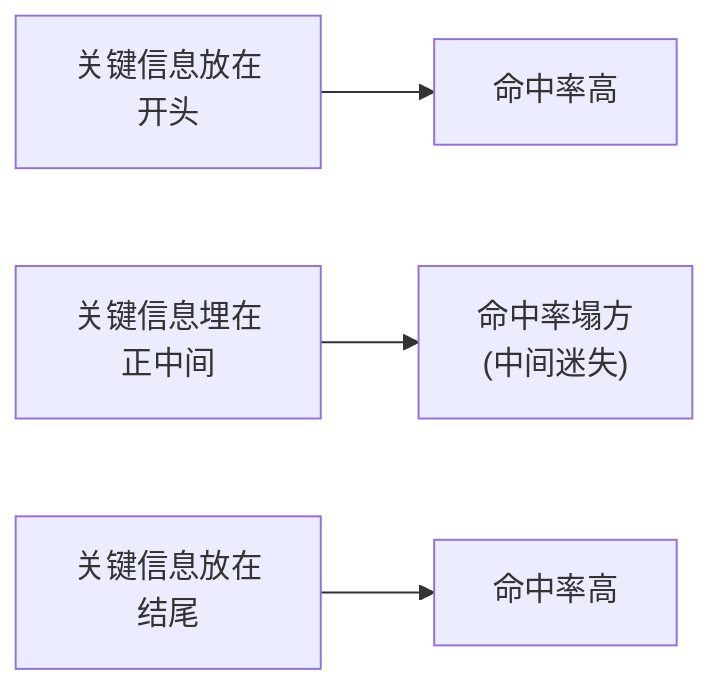

今天跟同事聊到，回家就写了。

这阵子技术群里最热闹的一句话是：「100 万 token 啊，一整本《哈利·波特》全塞进去都还有富余。」

Gemini 1.5 一出，上下文窗口从几万直接干到百万级，朋友圈里又是一片「这下 RAG 真要凉了」的欢呼。作为一个被这种欢呼骗过好几回的人，我泡了杯茶，决定泼点冷水：**窗口大，和模型真看明白了，完全是两码事。**

## 先搞清楚「上下文窗口」是个啥

打个比方。你把大模型想象成一个考前临时抱佛脚的学生，上下文窗口就是它**一次能摊在桌面上的资料**。

窗口只有 4000 token 的时候，桌面就巴掌大，你递给它一张 A4 纸它就满了，多一张就得把旧的挤下去。现在窗口飙到 100 万，相当于给它换了一张**乒乓球桌**——你能把整个项目的代码、一整本书、几个小时的会议记录一股脑摊上去。

听着是不是特爽？终于不用切片、不用做检索、不用伺候那些麻烦的向量库了，资料丢进去，坐等答案。

我也这么以为过。直到我真的塞了一大坨进去。

## 「塞得下」不等于「读得懂」

这里有个特别反直觉的事：**桌子大了，不代表学生每张纸都认真看。**

你把 80 万 token 摊在它面前，它确实「拥有」了全部信息，但它的注意力是有限的——就像你让一个人盯着一整面墙的便利贴，他眼睛是扫过去了，可真要问「左下角第三排那张写了啥」，多半得现编一个。

最经典的翻车叫**「中间迷失」（Lost in the Middle）**。学术界早就实测过：把关键信息放在一大段上下文的**开头或结尾**，模型记得清清楚楚；一旦埋到**正中间**，它的命中率就肉眼可见地往下掉。

这画面像不像你读一段超长的群聊？最早那条和最新那条你记得，中间三百条「收到」「好的」「+1」全自动划过去了。模型也一样，**两头清醒，中间打盹**。

## 还有两笔账，钱包和钟表都要哭

就算模型注意力够好，百万级上下文也不是白嫖的，有两笔硬成本绕不开：

| | 小窗口 | 百万级窗口 |
|---|---|---|
| 花钱 | 一杯奶茶 | 按量计费，一口气几块到几十块 |
| 速度 | 秒回 | 读一座图书馆，得喘口气 |
| 注意力 | 资料少，容易聚焦 | 资料太多，反而抓不住重点 |

你每塞进去一段，都是在按 token 付费、按 token 等待。把整本书扔进去问一句「主角叫啥」，技术上能做到，**经济上像是为了热一杯牛奶点了个柴火灶**。

## 那这个超大窗口到底图啥？

别误会，我不是来唱衰的。百万级上下文是**真本事**，只是它擅长的事和大家想象的不太一样：

- **需要全局通读的活**：比如「读完这整份 500 页合同，找出所有相互矛盾的条款」——这种跨段落、要前后对照的推理，窗口大了是降维打击。
- **省掉前期工程**：资料就几万 token、又图省事、又不常更新，那确实别折腾检索了，直接塞。
- **当 RAG 的下游**：先用检索把范围从一图书馆缩到几万 token，再交给大窗口去细品。**助教先筛废话，学生再开卷精读**，两个一起上才是当下最能打的组合。

所以「100 万 token，然后呢？」我的答案是：**然后你得想清楚，你是要它『拥有』这些信息，还是真的要它『用上』这些信息。**

窗口给你开到了乒乓球桌那么大，可桌子大小从来不是重点——会不会用桌上的料，才是。下次再看到「百万上下文吊打一切」的标题，你可以微微一笑：能塞进去的，未必读得进去。

---

这个话题还没琢磨透，回头继续。