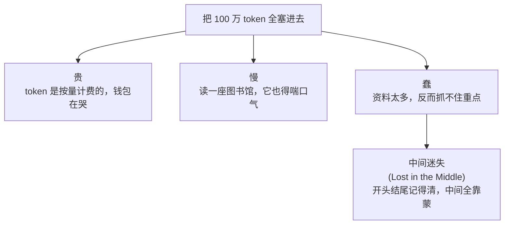

工作上踩了点坑，回头复盘。

每隔三个月，技术圈就要办一场「RAG 葬礼」。

上一次的悼词是「上下文都 100 万 token 了，谁还费劲搞检索」；这一次换成了「模型这么聪明，直接全塞进去不就行了」。然后呢？然后 RAG 该用还用，葬礼办了一场又一场，死者一次比一次精神。

今天我们不站队，就把这笔账给你算清楚。

## 一个比喻就够了：考试能不能带书

- **长上下文（Long Context）**：开卷考试，而且允许你把**整个图书馆**搬进考场。题目来了，你眼前堆着一千本书，理论上答案肯定在里面。
- **RAG（检索增强）**：闭卷考试，但你有个**贴心助教**，每道题之前先帮你从图书馆里抽出最相关的那三页，塞到你手边。

听起来当然是「把整个图书馆搬进来」更爽对吧？等等，先看看代价。

## 长上下文的爽与痛

爽点很直接：**简单**。不用搭向量库、不用调检索、不用切片，资料一股脑丢进去，模型自己看着办。

痛点也很直接，而且有三个：

最后那个「中间迷失」是实测出来的老毛病：你把关键信息埋在第 50 万个 token 的位置，模型大概率会**热情地跳过它**，就像你读一篇超长的群聊记录，只会看最早那条和最新那条，中间三百条「收到」全自动忽略。

## RAG 的爽与痛

RAG 反过来——前期搭建麻烦点，但跑起来**又省又准**：

只把「相关的三页」喂给模型，于是 token 少了、速度快了、还能告诉你答案是从哪本书第几页抄来的（也就是**可溯源**，这点在企业场景里几乎是刚需）。

它的痛点也很real：**助教抽错书，你就全盘皆输**。检索这一步要是没捞到关键资料，后面模型再聪明也是巧妇难为无米之炊——而且它还是会自信地给你编一个出来。

## 那到底用哪个？

我知道你想要一个「都听你的」的答案。给你：

| 你的情况 | 推荐 |
|---|---|
| 资料就几页，图省事 | 长上下文，别折腾 |
| 知识库巨大 / 频繁更新 | RAG，省钱又好维护 |
| 要给出处、要可信 | RAG |
| 需要全局通读、跨段推理 | 长上下文（或者两个一起上）|

看出来了吗？**这压根不是「谁干掉谁」的问题。** 现实里最能打的方案，往往是**先用 RAG 把范围缩小到几万 token，再交给长上下文模型去通读细品**——助教先帮你筛掉一图书馆的废话，剩下的精华你再开卷慢慢看。

所以下次再看到「RAG 已死」的标题，你可以微微一笑：死的不是 RAG，是**「二选一」这种非黑即白的思维**。

技术圈最贵的不是算力，是「**别人说啥你信啥**」。至于另一个被吹上天的词——「多智能体协作」，一群 AI 凑一桌到底是开会还是吵架，那是另一个值得单开一篇的故事了。
