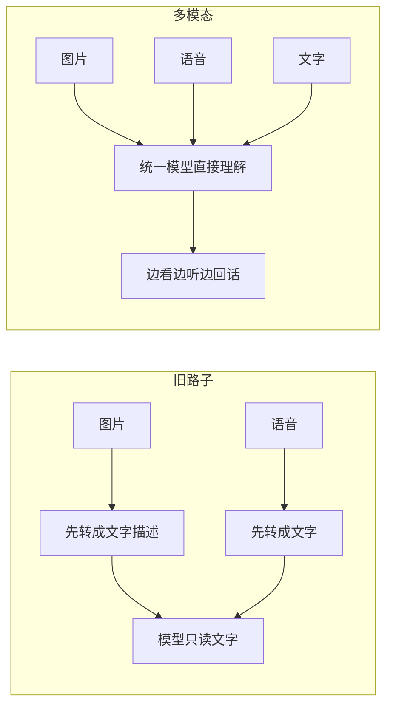

下班路上突然想清楚的，赶紧记一下。

前几天看 GPT-4o 的发布演示，有个画面我盯了好久：你把手机摄像头对着一道数学题，它一边「看」着你写，一边用接近真人的语气陪你聊、还时不时打个岔。那一刻我脑子里冒出来一句话——**这家伙不再只是个会读字的书呆子了，它长出了五官。**

## 以前的模型，是个只会读字的偏科生

回想一下早期那些大模型，它们的世界其实窄得可怜：**只认得文字**。

你想让它看图？对不起，得先有人把图片人工描述成一段文字喂给它；你想让它听语音？也得先用另一个工具把声音转成文字。它就像一个**听不见、看不见、只能靠别人写纸条沟通的偏科天才**——脑子很好，但所有信息进出都得经过「翻译成文字」这道关卡。

这道关卡的问题在哪？**信息一翻译就漏。** 一张图里那个人「皱着眉、嘴角却在笑」的微妙表情，一段语音里那句话「说到一半突然停顿」的犹豫，转成文字之后全没了。你给它的，永远是被压扁过的二手信息。

## 多模态，就是让信息别再绕路

所谓多模态（Multimodal），核心思想朴素得很：**别再把图片、声音先翻译成文字了，让模型直接『吃』原始的图像和声音。**

差别就像**「看翻译稿」和「亲临现场」**。翻译稿告诉你「他说他很开心」，现场你能听见他声音在发抖、看见他眼眶是红的——同一句话，信息量差着十万八千里。

GPT-4o 这次最唬人的地方，就是把这事做到了**「实时」**：你说话它当场接，你给它看东西它当场反应，中间那种「转文字→处理→再合成」的卡顿被压没了，于是聊起来不像在敲命令，更像在**和一个反应飞快的人对话**。

## 「五官齐全」之后能干嘛

举几个我立马想到就觉得有戏的场景：

| 场景 | 单一文字模型 | 多模态模型 |
|---|---|---|
| 拍张冰箱照片问做啥菜 | 你得自己打字描述有啥 | 它自己看，直接报菜名 |
| 对着报错截图求助 | 你得手敲一长串日志 | 截图甩过去，它读 |
| 陪你练口语 | 只能纠正文字语法 | 能听出你发音和语气 |
| 给视障朋友描述路况 | 做不到 | 摄像头一开，实时解说 |

你发现没，这些场景的共同点是——**人本来就是用眼睛和耳朵活着的，而不是用键盘。** 多模态做的事，本质上是让模型适应人的交互习惯，而不是反过来逼人去适应「只能打字」的机器。

## 别急着上头，泼两滴冷水

按惯例，我得收着点别吹过头。多模态再香，眼下也有几个坑要心里有数：

- **会自信地看错**：它把图看岔、把声听错的概率，可不比读文字时低。看走眼了照样给你一本正经地分析半天，错得理直气壮。
- **贵且重**：又听又看又实时，背后的算力开销不是小数目，落到实际产品里成本得算明白。
- **「能贫嘴」不等于「懂分寸」**：语气拟人是把双刃剑，聊得顺滑的时候很爽，可一旦它在不该俏皮的场合俏皮，那种尴尬也是实打实的。

但话说回来，方向是对的。从「只会读字」到「五官齐全」，这一步迈出去，**模型和我们之间那块冷冰冰的玻璃，确实被敲掉了一角。**

下次你对着手机摄像头问它「这是啥」，不妨多想一秒：它到底是真『看懂』了，还是又在拿一张看走眼的图，给你绘声绘色地编故事。

---

断断续续写完的，可能有跳跃。