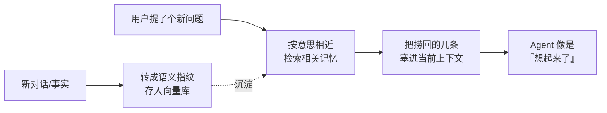
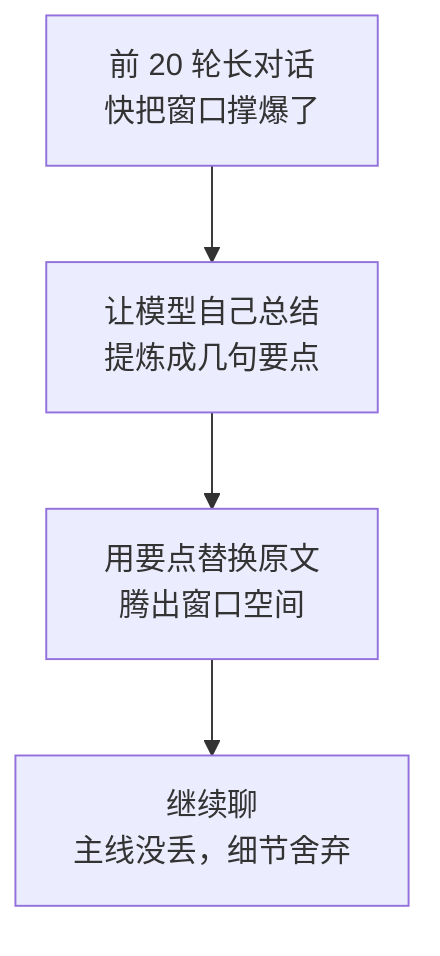

周末翻笔记翻到这个话题，整理一下。

我手头那个 Agent，前一句还信誓旦旦记着我叫啥、在干啥项目，聊了二十轮之后，张口一句「请问您是？」——好家伙，这记性比金鱼还短。

最近圈里聊「Agent 记忆」聊得火热，各种方案满天飞。今天我就把这事掰开了讲：**为什么 Agent 天生健忘，以及我们都用了哪些招儿给它续命。**

## Agent 为什么是「金鱼脑」

根子上的原因特简单：大模型**本身不记事**。

你每次跟它对话，它其实是个**每次都失忆、靠你递的小抄重新进入状态**的临时工。它哪有什么「记得」——所谓的记忆，全靠你把之前聊过的内容，**重新塞进这一次的输入里**它才知道。

而能塞的量是有上限的，这就是上下文窗口。窗口就那么大，聊得越久，前面的内容就越得被挤出去。挤出去的，它就是真忘了，跟没发生过一样。

所以「给 Agent 装记忆」，本质上是在解一个问题：**它能摊在桌面上的小抄有限，那些放不下又舍不得扔的事儿，往哪儿搁？**

## 招数一：短期记忆——就是那叠小抄本身

最朴素的办法：**把最近几轮对话原样带着走。**

这就是短期记忆，也叫对话窗口记忆。它就是你当前摊在桌上的那叠小抄，记的是「刚刚我们聊到哪儿了」。

优点是简单、忠实、不丢细节；缺点也直白——**满了就得扔旧的**。聊得久了，开头那些信息照样保不住。光靠它，金鱼还是金鱼，只是金鱼缸大了一圈。

## 招数二：长期记忆——给它配个「外接硬盘」

聪明点的做法是：别全指望桌面，**搭一个仓库，把重要的事存进去，用到的时候再捞出来。**

这就是长期记忆，最常见的实现是**向量记忆（向量数据库）**。你可以把它想成 Agent 的一个**带智能检索的笔记本**：每条信息存进去时都打上一种「语义指纹」，下次需要时，它能按「意思相近」把相关的几条捞回来，塞进当前的小抄里。

这样一来，哪怕过了一百轮，你提到「上次那个项目」，它也能从仓库里把相关的事翻出来。**桌面再小，仓库够大就行——只要你检索得准。**

## 招数三：失忆的艺术——总结压缩

但仓库不是万能的，全存进去既贵又乱。于是有了第三招，我觉得也是最有「人味儿」的一招:**总结压缩**。

人脑就是这么干的。你不会逐字记住上周开的会，但你记得「结论是 A 方案，老板让周五前出稿」。**你主动忘掉了细节，只留下了精华。**

让 Agent 也这么干:聊到一定长度，就让它把前面一大段对话**自己总结成几句要点**，然后用这几句替换掉原始的长对话。细节是丢了，但主线还在。

所以这门「失忆的艺术」讲究的是**忘对东西**:无关的废话该忘就忘，关键的决定得留下。忘得好，是节省;忘得糙，是事故。

## 三招怎么配

实战里很少只用一招，通常是**组合拳**:

| 招数 | 像什么 | 管什么 |
|---|---|---|
| 短期记忆 | 桌上的小抄 | 刚刚聊的细节 |
| 长期记忆 | 外接硬盘 | 久远但重要的事实 |
| 总结压缩 | 会议纪要 | 把长对话浓缩成主线 |

最近聊的用小抄、久远的丢硬盘、太长的就压成纪要——三者一搭，金鱼脑总算有了点正常人的样子。

说到底，给 Agent 装记忆，难的从来不是「怎么记住一切」，而是**「该忘的痛快忘，该留的稳稳留」**。这道题，其实我们这些总记不住纪念日、却忘不掉尴尬瞬间的人类，也没答好啊。
