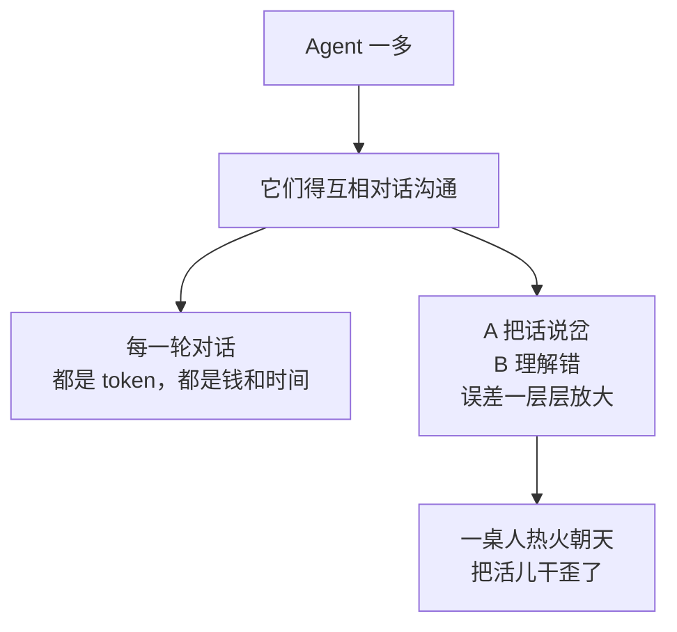

记一下最近琢磨的：

之前埋过一个钩子说「一群 AI 凑一桌到底是开会还是吵架」，最近 AutoGen、CrewAI 这些多智能体框架火得不行，那我今天就来填这个坑。

先抛结论:**多个 Agent 一起干活，有时候是高效分工，有时候是三个和尚没水喝。** 区别在哪，咱们慢慢说。

## 为啥要凑一桌

你可能会问:单个 Agent 不也能干活吗,干嘛非要凑一群?

道理跟公司一样。一个人啥都干,容易**样样通样样松**:让它既当产品、又当开发、还兼测试,它在角色之间反复横跳,经常写代码写到一半忘了需求是啥。

多智能体的思路是**专业分工**:给每个 Agent 派一个明确的角色和人设,各管一摊。

每个角色术业有专攻:产品 Agent 满脑子需求、开发 Agent 闷头写码、测试 Agent 专职挑刺。**这不就是一个标准的小团队嘛。** 思路确实漂亮。

## 「开会」的爽:专业的事交给专业的角色

分工到位的时候,多智能体是真香。我体感下来,它擅长两类活:

- **天然能拆成角色的任务**:写代码(产品/开发/测试)、做调研(资料员/分析师/审稿人),每个环节有清晰的输入输出。
- **需要『有人唱反调』的任务**:让一个 Agent 出方案,另一个专门挑刺,这种**对抗式协作**往往比单打独斗靠谱——因为单个 Agent 最大的毛病就是「错了还特别自信」,而旁边有个专门跟它对着干的,能逼它认错。

「测试 Agent 把开发 Agent 的活儿打回去重做」,这种场面看着就让人安心:**有人审稿,总比一个人闭门造车强。**

## 「吵架」的痛:沟通成本是要命的

但你只要在公司待过就知道,**人一多,事不一定快,会一定多。** 多智能体也逃不过这条铁律。

具体来说,凑桌的代价有三笔:

| 代价 | 啥意思 |
|---|---|
| 贵 | 每个 Agent 都在调模型,多轮沟通 token 哗哗烧 |
| 慢 | 你一言我一语来回好几轮,单个 Agent 早干完了 |
| 飘 | 一个理解偏了,后面顺着错的往下聊,集体跑偏 |

最坑的是第三笔。单个 Agent 走偏,至少只有一条错误路线;一群 Agent 互相「附和」起来,能把一个小误会,**热热闹闹地发酵成一场集体翻车**。三个臭皮匠没凑成诸葛亮,凑成了一个回声室。

## 那到底要不要凑一桌

我的判断特别朴素,就一句话:**任务能被清晰拆成几个角色、且角色之间接口干净,就值得凑桌;否则,单个 Agent 配好工具往往更省心。**

| 你的情况 | 建议 |
|---|---|
| 任务简单、一步到位 | 单个 Agent,别折腾 |
| 任务天然分阶段、有明确角色 | 多智能体,分工提效 |
| 需要有人审稿/唱反调 | 多智能体,对抗式协作 |
| 角色边界模糊、来回扯皮 | 退回单 Agent,省得开会开到天亮 |

说白了,多智能体不是「人多力量大」,而是**「分工对了力量大」**。凑一桌之前先想清楚:这是一场各司其职的高效晨会,还是一场谁也说服不了谁的扯皮?

毕竟,**会开多了不一定出活,但 token 一定花出去了。** 这道理,加过班的都懂。

---

这一篇就到这里。