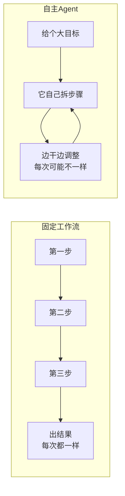
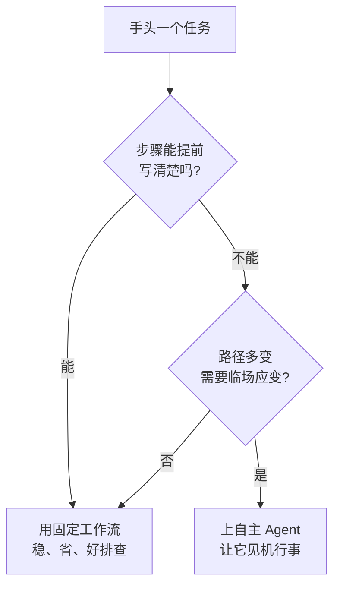

下班路上突然想清楚的，赶紧记一下。

最近一个争论吵得挺凶:**到底要不要给 Agent 完全的自主权?**

一派说「让它自己想、自己干,人别管,这才叫智能」;另一派翻个白眼:「就一个填表的活儿,你给它配个能自由发挥的大脑,图啥?」

我站后一派。今天就聊聊这个,顺便帮你省点**为『智能』交的智商税**。

## 先分清两种东西

把这俩放一块比一下,你立马就懂了:

- **固定工作流(Workflow)**:像**跟团游**。路线是排好的——上午故宫、中午烤鸭、下午长城,导游举着小旗子,你跟着走就行。死板,但**绝不会把你拉到隔壁城市**。
- **自主 Agent**:像**自驾游**。给你个目的地,怎么走你自己定,堵了绕路、想停就停。自由,但也可能**导航抽风把你导进死胡同**。

看出关键差别没?工作流是**确定性**的——同样的输入,每次跑出来一模一样;自主 Agent 是**随机性**的——同样的需求,这次和下次的走法可能完全不同。

## 「智商税」交在哪儿

很多人一上来就奔着「全自主」去,觉得越智能越高级。结果呢?给一个本可以写死的流程,硬套了个会自由发挥的脑子,代价立马来了:

| | 固定工作流 | 全自主 Agent |
|---|---|---|
| 结果稳不稳 | 每次都一样,稳 | 看心情,飘 |
| 出错好不好查 | 第几步挂的一目了然 | 它自己绕的路,鬼知道哪儿歪了 |
| 花钱 | 写好就跑,几乎不烧 token | 每步都在调模型,哗哗烧 |
| 改起来 | 改流程图 | 改提示词,改完还得反复试 |

最要命的是**稳定性**。一个「把订单状态从 A 改成 B」的活儿,你用工作流写死,它一万次都老老实实改;你交给自主 Agent,它**第 9999 次心血来潮,给你『顺手优化』成了 C**,然后还自信满满地汇报「已完成」。

这就是智商税:**你为『万一需要灵活』付了费,可绝大多数时候,你压根不需要它灵活。**

## 那啥时候才真该上自主

别误会,自主 Agent 不是原罪,它有自己的主场。关键看一个问题:**这活儿的路径,是固定的,还是没法提前写死的?**

按这张图走,大多数活儿其实都该落到「固定工作流」那一格。真正适合全自主的,是那些**你自己都说不清该怎么走**的任务:开放式调研、需要不断试错的探索、面对一堆没法预判的情况……这时候,「能临场应变」才从负担变成本事。

## 收个尾

我的建议浓缩成一句:**能用确定性工作流解决的,就别上全自主;先把能写死的步骤写死,只在真正需要『随机应变』的节点,才放手让 Agent 自己拿主意。**

最稳的架构往往是**混搭**:骨架用工作流搭好,保证主流程稳如老狗;只在那几个「确实预判不了」的环节,嵌一小段自主决策。**该跟团的跟团,该自驾的自驾——别为了显得『智能』,把一趟买菜路线整成了荒野求生。**

技术圈最贵的从来不是算力,是「**为了听起来高级,而上了用不上的复杂度**」。
