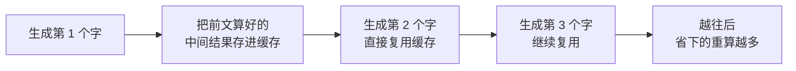
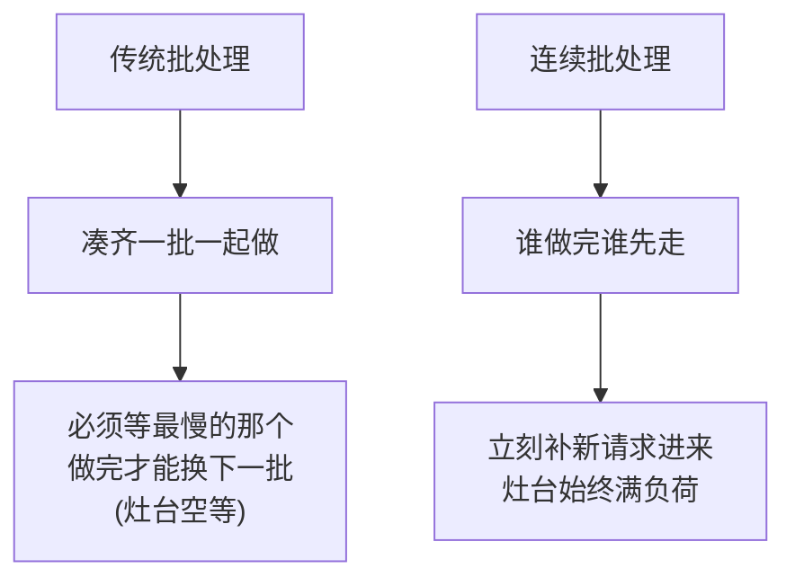

今天跟同事聊到，回家就写了。

这阵子有个现象挺有意思:模型越来越大,可调一次 API 的价格反而一路往下掉。

这背后不是厂商在做慈善,而是**推理优化**这两年实打实地把成本砍了下来。最近 vLLM 这类推理框架火得不行,量化、KV Cache、连续批处理这几个词到处刷屏。今天我就借「**开餐馆**」这个比喻,把省钱的三大招讲明白。

## 先搞懂:钱到底烧在哪

把一次大模型推理,想象成餐馆**出一道菜**。

你发一句话过去,模型不是一口气把整段答案吐出来的,而是**一个字一个字地往外蹦**(术语叫 token)。每蹦一个字,它都得把前面所有内容在脑子里**重新过一遍**,再决定下一个字是啥。

问题就出在这「重新过一遍」上:答案越长,它回头要复习的内容就越多,**到后面几乎是在反复重读一篇越来越长的作文**。又慢又费电——成本,就这么烧上去的。

## 第一招:KV Cache——别每道菜都从头熬高汤

既然模型每蹦一个字都要把前文重算一遍,那有没有办法**别重算**?

有。前文那部分的中间计算结果(叫 Key 和 Value),其实算一次就够了,后面完全可以**存起来反复用**。这就是 **KV Cache**。

放餐馆里,这就好比**高汤熬一锅,后面每道菜直接舀**,而不是每上一道菜就重新熬一遍高汤。一下子就把那些重复的笨功夫省掉了。代价是它得占一块内存来存这锅汤——所以怎么把这块内存管好,正是 vLLM 这类框架的看家本事。

## 第二招:量化——把食材切小份,锅就够用了

模型的参数,默认是用很「精细」的数字格式存的(比如 16 位浮点),占地方、算起来也重。

**量化(Quantization)**干的事,就是把这些数字**换成更粗一点的格式**(比如 8 位甚至 4 位整数)。精度稍微降一丢丢,但体积和计算量大幅下降。

| | 不量化 | 量化后 |
|---|---|---|
| 占的显存 | 大 | 小一半甚至更多 |
| 跑的速度 | 慢 | 快 |
| 精度 | 满血 | 掉一点点 |

打个比方:菜谱上写「盐 3.14159 克」,量化就是改成「盐一小撮」。**少了那点小数,菜的味道几乎没差,可备料和操作一下子轻快多了。** 关键是这点精度损失,在绝大多数场景下你**根本尝不出来**——这买卖,划算。

## 第三招:连续批处理——一锅多炒,别让灶台空着

最后这招最妙。单看一个请求,模型其实经常在**干等**——等显存搬数据、等某个慢请求蹦完最后一个字。灶台火开着,锅里却没几个菜,纯浪费。

那就**把多个用户的请求凑一锅一起炒**。传统批处理有个毛病:得等同一批里最慢的那个全做完,才能上下一批,**一桌人陪一个慢性子干瞪眼**。

**连续批处理(Continuous Batching)**改进了这点:谁的菜出完了就立刻撤盘、马上把新订单补进锅里,灶台一刻不闲。

这一招把昂贵的 GPU **利用率**拉满,单位时间能服务的人翻好几倍——分摊到每个请求头上,成本自然就薄了。这也是为啥 vLLM 跑同样的卡,吞吐能甩出原生实现一大截。

## 三招一起上

| 招数 | 餐馆比喻 | 省在哪 |
|---|---|---|
| KV Cache | 高汤熬一锅反复舀 | 不重复算前文 |
| 量化 | 食材切小份 | 显存小、算得快 |
| 连续批处理 | 灶台一刻不闲 | GPU 利用率拉满 |

你看,API 价格一路走低,靠的不是什么魔法,而是这种**「别做重复功、别用过精的料、别让灶台空着」**的朴素省钱学。

说到底,推理优化的精髓和开餐馆一模一样:**好吃是前提,但能不能赚钱,全看你会不会省那些看不见的功夫。**

---

暂记于此。