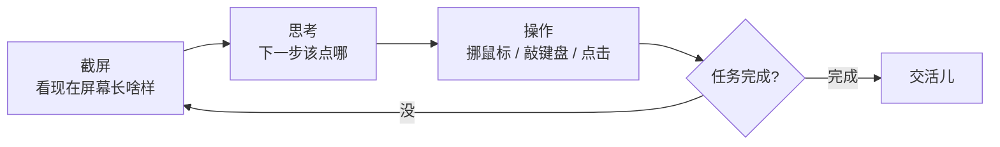
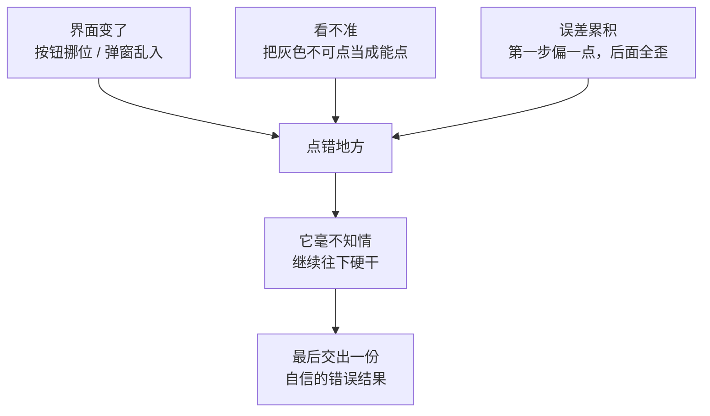

下班路上突然想清楚的，赶紧记一下。

这几天我的朋友圈又炸了：Anthropic 放出了一个叫 computer use 的能力，演示视频里，模型自己截了张屏、把鼠标挪到了浏览器的搜索框、噼里啪啦敲了一串字，然后真的点了搜索按钮。

弹幕清一色都是「以后点外卖、订机票、填报销，全交给它了！」。作为一个被各种「全自动」吹嘘伤害过太多次的人，我先把激动的心摁下去，咱认真捋一捋：这玩意儿到底是真本事，还是又一场会翻车的魔术。

## 它跟以前的「自动化」差在哪

先说人话。过去我们让程序操作软件，靠的是**接口**——你得有个 API，或者写脚本去对准某个按钮的坐标、某个输入框的 id。本质上是「程序跟程序对暗号」，对方稍微改个版、挪个按钮，你的脚本当场表演原地爆炸。

computer use 走的是另一条路：**它跟人看的是同一块屏幕**。

看出门道了吗？这就是个「看一眼—想一下—动一下手」的循环。它不需要你给它专门的接口，**它直接用图形界面**，跟你我盯着屏幕戳来戳去没本质区别。这意味着，理论上凡是人能用鼠标键盘干的事，它都有机会上手——这正是大家激动的源头。

## 那它真能替我点外卖吗

能，也不能。先看它**真香**的场景：

- **重复、无聊、但路径固定的活**：比如把一个老掉牙的内部系统里的数据一条条抄进 Excel，这种没 API、又烦人的破事，它不嫌累。
- **跨软件的搬运工**：从这个网页复制，到那个表格粘贴，中间还要切几次窗口。人干十遍想骂街，它干一百遍面不改色。
- **允许你盯着的活**：你在旁边看着，它跑偏了你随时叫停。

至于点外卖嘛……理论上它能帮你打开 App、搜「麻辣烫」、加购物车。但只要中间弹出一个「优惠券已过期」的弹窗、或者商家临时改了起送价，它就可能**一脸自信地点了一份你根本不想要的套餐**，还顺手帮你勾上了「不要餐具」——你说气不气。

## 翻车现场，提前预习

我对这类能力的一贯态度是：先想清楚它会怎么坏，再决定敢不敢用。computer use 的翻车，基本绕不开这几类。

最要命的还是那句老话：它最大的风险不是「做不到」，而是**「做错了还特别自信」**。一个会停下来说「这步我不确定，要不你看看」的 Agent，比一个闷头把订单提交了的 Agent 让人省心一百倍。

而且别忘了，它看的是屏幕、动的是真鼠标，这意味着它能点的东西可**一点不虚拟**——它能点「确认付款」，也能点「全部删除」。把它放进一个能乱花钱、能删文件的环境里，风险是实打实的。

| 场景 | 适合现在交给它吗 | 为啥 |
|---|---|---|
| 抄数据、填表格 | 比较稳 | 路径固定，错了也好查 |
| 整理截图 / 归档文件 | 还行 | 即使错了，损失可控 |
| 自动付款 / 下单 | 先别 | 一旦点错，真金白银 |
| 改生产环境配置 | 千万别 | 翻车成本你扛不起 |

## 所以现在该怎么用

我的建议还是那句朴素的话：**别指望它替你做决定，指望它替你跑腿**，而且这阵子最好把它关在一个「乱来也不会出大事」的地方——比如一台干净的测试机、一个没绑银行卡的账号。让它干那些「做错了大不了重来」的活，关键的「确认」「付款」「删除」这种动作，留给你自己点。

computer use 确实是个挺让人兴奋的进展：模型第一次像模像样地学会了用我们每天都在用的图形界面。但它现在更像一个**刚拿到驾照、方向感还不太行的新手司机**——能开，但你坐副驾时手最好别离手刹太远。

至于让它真正放心地满世界跑腿，还差的那一环是什么，我心里大概有数，但那是另一个值得好好聊的话题了。

---

这一篇就到这里。