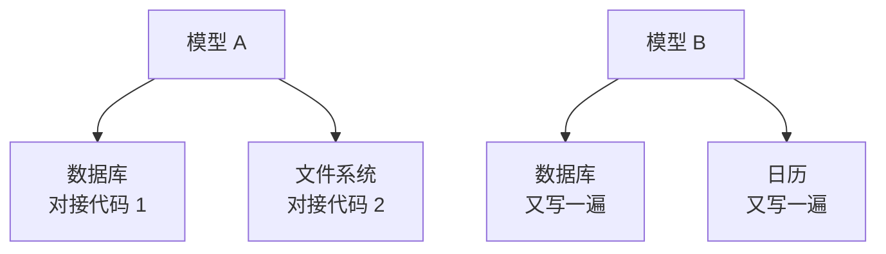
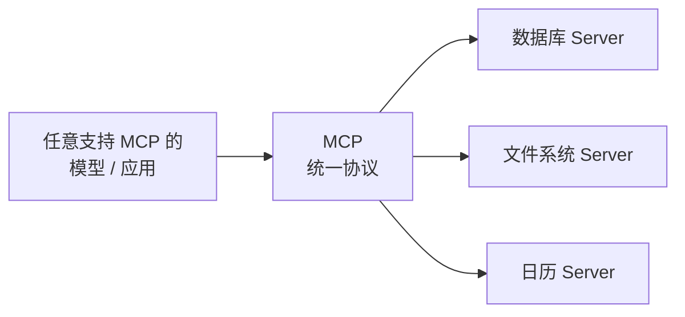

看到一个有意思的讨论，引出这篇。

最近 Anthropic 扔出来一个新东西，叫 Model Context Protocol，简称 MCP。名字一股「企业级中间件」的味儿，不少人扫一眼就划走了。

但我得拦你一下——这玩意儿解决的，恰恰是这两年做 Agent 的人**最想骂街**的那个痛点。

## 先说说我们之前有多狼狈

你想让大模型干点真事，比如查数据库、读你 GitHub 上的代码、看一眼日历再帮你订会议室，它就得**接工具**。问题来了：每接一个工具，你都得手写一套「翻译」——告诉模型这个工具叫啥、要传什么参数、返回长啥样。

接一个还行。接十个呢？而且每家工具的脾气还都不一样：数据库要这么连，文件系统要那么读，某个 SaaS 又有自己的一套鉴权。你写的这套对接代码，换个模型、换个框架，多半还得**从头再来一遍**。

看着就头疼吧？这就是个 N 乘 M 的烂摊子：N 个模型 / 应用，M 个工具，两两之间都要单独搭一座桥。维护这堆桥的工程师，头发是论把掉的。

## MCP 干的事：修一个标准插座

打个比方你立刻就懂。

以前各家电子设备充电口五花八门：Micro-USB、Lightning、各种奇形怪状的圆口，出趟门得带一书包充电线。后来 USB-C 一统江湖——**一个口，啥都能插**。你买新设备不用再操心「它配的是哪种线」。

MCP 想当的就是 AI 工具界的 **USB-C 标准插座**。它定了一套统一的「说话方式」：工具这边按这个标准把自己**包装**成一个 MCP 服务器，模型那边按这个标准来**调用**。中间这条沟通的「普通话」一旦统一，事情就清爽了。

对比一下前后两张图，差别一目了然：原来是密密麻麻一团乱麻，现在所有人都对着中间那根「普通话」说话。工具方写一次 MCP 服务器，**任何**支持 MCP 的应用都能用；应用方学一次 MCP，**任何**遵循协议的工具都能接。N 乘 M 的噩梦，一下变成了 N 加 M。

## 它到底解决了谁的麻烦

我把账给你摆开：

| 角色 | MCP 之前 | MCP 之后 |
|---|---|---|
| 做应用的 | 每接一个工具写一遍胶水代码 | 学一次协议，复用一堆现成 Server |
| 做工具的 | 不知道该适配谁，干脆都不适配 | 写一个 Server，谁都能接 |
| 普通用户 | 你的助手只会聊天，干不了实事 | 给它插上工具，它能查能办 |

最妙的一点是：它把「**能力**」和「**模型**」解耦了。以前换个模型，工具对接可能就废了；现在工具是独立的 MCP 服务器，模型只是众多「插头」之一，换谁都不影响。这种解耦，长期看才是最值钱的。

当然，标准这东西，**定出来是一回事，大家认不认是另一回事**。USB-C 也是熬了好几年、靠生态一点点堆起来才真香的。MCP 现在还很新，能不能成为那个被广泛接受的「插座」，得看后面有多少工具方、多少应用方愿意往上凑。

## 我的看法

我对 MCP 是谨慎乐观的。它不性感——没有「一句话生成 App」那种炫酷的 demo，发布会上甚至有点像在念技术文档。但 Agent 这两年最卡脖子的，从来不是模型不够聪明，而是它**手脚被绑着**：想干活，却接不上趁手的工具。

MCP 干的正是松绑那一步。它不试图比谁更聪明，它只是修了一条路，让聪明的脑子能稳稳地连上能干活的手。

往大了说，真正改变行业的东西，常常长得平平无奇——比如一个插座的形状。至于这条路修好之后，一堆 Agent 各自接着工具、又凑到一块儿协作时会擦出什么火花（或者吵成什么样），那就是另一个值得单独唠的话题了。

---

暂记于此。