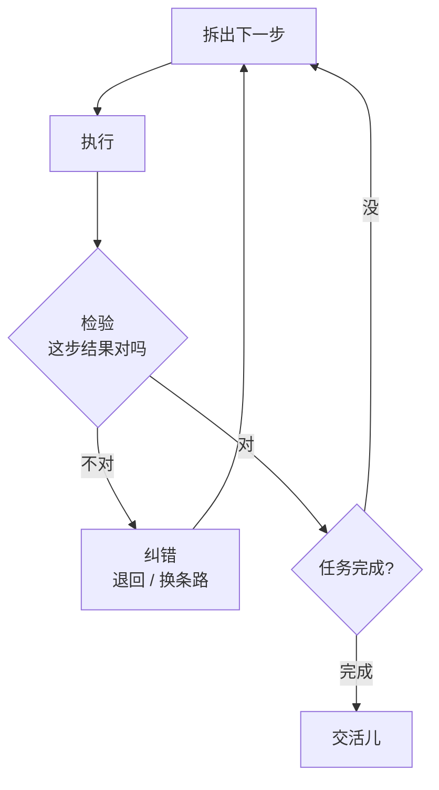

今天跟同事聊到，回家就写了。

你有没有这种体验：让 Agent 干个十来步的活，它前两步还挺像那么回事，到第三步突然就开始**一本正经地胡来**，而且越走越远，最后交出一份逻辑自洽、却离题万里的答案。

这阵子技术圈聊 Agent 可靠性的声音明显多了起来，大家发现一个尴尬的事实：模型单看挺聪明，可一旦让它**连续做长任务**，靠谱程度就断崖式下跌。今天咱就掰扯掰扯，这第三步的车，到底是怎么翻的。

## 先算一笔残忍的数学题

假设你的 Agent 每一步「做对」的概率是 95%。听起来很高对吧？学生考试 95 分都能上墙了。

但 Agent 干活是**一步接一步**的，每一步都踩在上一步的结果上。于是：

- 走 5 步全对的概率 = 0.95 的 5 次方 ≈ 77%
- 走 10 步全对 = 0.95 的 10 次方 ≈ 60%
- 走 20 步全对 = 0.95 的 20 次方 ≈ 36%

看明白了吗？**单步再准，乘起来也扛不住链条变长**。这就是「误差累积」——每一步漏一点点，攒到后面就是一场雪崩。所谓「第三步翻车」，不是真有什么魔咒卡在第三步，而是任务越长，那个「迟早要出错」的时刻就越早到来，而 Agent 还浑然不觉地接着往下推。

## 两个根子上的毛病

**一是规划太理想。** Agent 接到任务先列计划，这步它往往挺自信——「我要做 A、B、C、D」。可这计划是它**还没动手时拍脑袋想的**，现实里 A 做完发现情况变了、C 根本走不通，它却常常死守着最初那张蓝图硬走，像个揣着旧地图、绝不抬头看路牌的导游。

**二是不会及时回头。** 人干活时，心里有根弦：「咦，这结果不太对劲？」然后停下来检查。Agent 这根弦常常是松的——它默认每一步的产出都是对的，拿来就用，**很少停下来质疑自己**。错误就这么一路被当成真理传下去。

## 怎么治：给它装个「会回头」的机制

好消息是，这两个毛病都有对症的法子，核心就一句话：**别让它闷头一条道走到黑**。

关键就在中间那个**检验**环节。常见的几招：

- **每步加验证**：写代码就跑一下看报不报错，查数据就核对一下来源对不对。**有反馈的活最好治**，因为对错验得出来。
- **小步快走**：把大任务切碎，每一小段都能单独检查。链条越短，误差累积越轻。
- **关键节点叫人**：碰到「不可逆」的操作（删东西、付钱、发邮件），停下来等你点头。这就是大家最近常提的 human-in-the-loop。
- **允许认怂**：让它学会说「这步我不确定」，远比硬编一个自信的错答案强。

| 任务类型 | 为啥好治 / 难治 |
|---|---|
| 写代码、跑测试 | 好治：能跑就是对，反馈即时 |
| 查资料、对数据 | 较好治：对错能核 |
| 开放式策划、写方案 | 难治：没有客观对错，错了也看不出来 |

## 说到底

Agent 的可靠性，本质不是「让它一次做对」，而是「**让它错了能发现、发现了能改**」。我们人也不是不犯错，我们只是脸皮够厚、回头够勤——干一半发现不对就推倒重来，从不觉得丢人。

所以别再幻想给它一个模糊大目标、它就能完美交付二十步。真正稳的 Agent，是那种**愿意频繁停下来怀疑自己**的。它跑得慢一点没关系，至少不会闷着头把你领进沟里，还热情地告诉你这就是目的地。

当然，「停下来等人点头」这事说着轻巧，真要给 Agent 划清哪些动作能自己做、哪些必须报备，里头的门道可不少。

---

先记到这，想到再补。