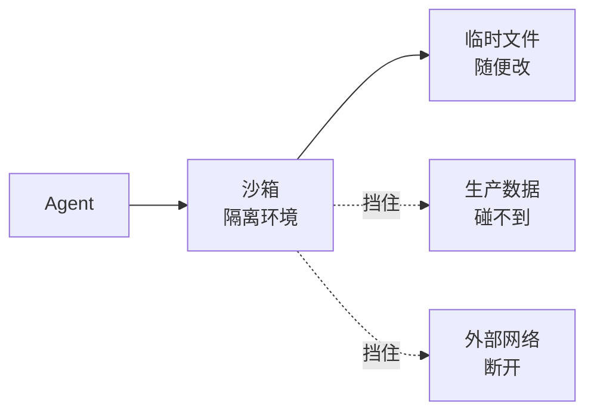
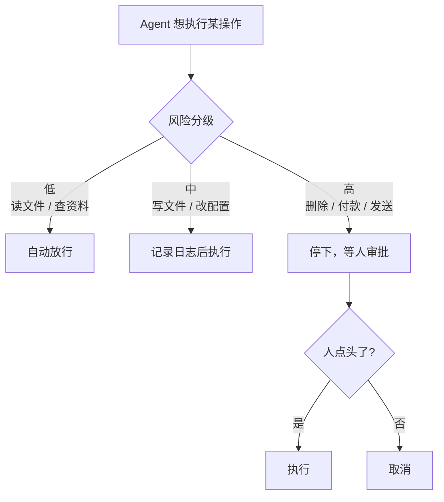

积压在草稿里很久了，发出来。

去年大家还在惊呼「Agent 居然能自己操作电脑」，进了 2025 年，画风一转，开始集体琢磨一个更现实的问题：**它要是闯祸了，谁兜底？**

这转变挺合理。一个只会聊天的助手，最多给你一个错答案；可一个能动手、能删文件、能花钱的 Agent，翻起车来是带响的。今天咱就聊聊，怎么给这个不知疲倦的实习生**上权限**，让它既能干活，又不至于把你家厨房给点了。

## 问题的根子：能力越大，闯祸越狠

我一直爱说，Agent 最大的风险不是「做不到」，而是「做错了还特别自信」。以前它最多嘴上自信，没啥杀伤力。现在不一样了——它手里攥着真鼠标、真终端、真账号，那份自信就能直接转化成**真损失**。

更要命的是，它的「错」常常你拦不住。你让它「清理一下临时文件」，它理解成「清理一下这个目录」，一个 `rm` 下去，临时文件没了，你三天的工作成果也没了。它全程态度诚恳，干得飞快，就是方向反了。

所以权限这事的核心就一句话：**默认不信任，按需放权**。别一上来就把家里钥匙、银行卡、车钥匙全塞给它。

## 第一道墙：沙箱

最朴素也最有效的招，是把它关进**沙箱**——一个隔离的环境，里头随它折腾，外头岿然不动。

打个比方：你带新来的实习生练手，不会直接让他上生产系统改数据，而是给他一台测试机，数据是假的、网络是断的、删了也不心疼。沙箱就是 Agent 的这台测试机。

沙箱的妙处在于：哪怕它彻底失控，伤害也**圈在墙内**。代价是干不了「真活」——但很多场景里，你本来也只是想让它跑个测试、改个草稿，根本不需要它碰真东西。

## 第二道墙：分级 + 人工审批

可总有些活非碰真东西不可，比如真的要往生产库写数据、真的要发那封邮件。这时候就靠第二招：**给操作分级，危险的留人来点头**。

这就是大家常念叨的 **human-in-the-loop**——人留在回路里。关键不是「啥都要你批」（那 Agent 就白用了），而是**把审批精准地卡在「不可逆」的动作上**。

怎么判断要不要卡？我有个糙但好用的标准：**问自己「这步要是错了，能撤回吗？」**

| 操作 | 能撤回吗 | 处理 |
|---|---|---|
| 读文件、搜索 | 无所谓 | 放行 |
| 改个草稿、写临时文件 | 能 | 放行 + 记日志 |
| 删数据、转账、发邮件 | 不能 | 停下来等审批 |
| 改生产环境配置 | 很难 | 停下来等审批 |

能撤回的，让它自己干，撑死了重来一遍；**撤不回的，一律先停下问你**。这一条想清楚，权限设计就成功了一大半。

## 别走另一个极端

说了半天「防」，我也得提个醒：别防过头。我见过有人把审批设得密不透风，结果 Agent 每点一下都弹窗问你「确定吗」，干完一件事你点了二十次「确定」——这跟自己手动干有啥区别？还不如不用。

权限的艺术，是在「**放手让它跑**」和「**关键处摁住它**」之间找平衡。低风险的活大胆放，让它体现价值；高风险的活死死卡，守住底线。中间地带就靠日志兜底——出了事，至少能查清是哪一步、它干了啥。

说到底，给 Agent 上权限，跟带新人没两样：**信任是慢慢给的，不是一次到位的**。它干得越久、表现越稳，你松的绳子才越长。一上来就把全部家当交给一个你还没摸透脾气的实习生，那不叫信任，那叫赌博。

它确实是个好帮手。但好帮手也得有人管着钥匙——尤其是那把能打开厨房煤气阀的。
