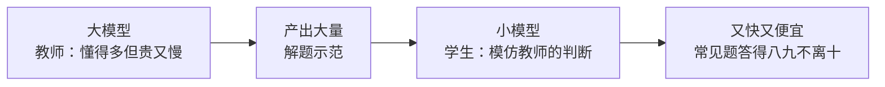
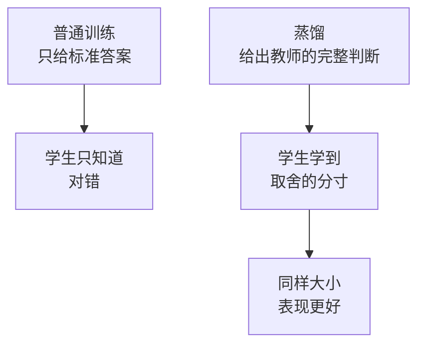

积压在草稿里很久了，发出来。

这阵子 AI 圈最热的词，从「谁家模型更大」悄悄换成了「谁家模型更便宜」。DeepSeek 上个月那一波，直接把「低成本」和「小模型」推到了聚光灯下，连带着一个略显技术的词也跟着出圈了——**蒸馏（Distillation）**。

过去几年大家信奉的是「大力出奇迹」，参数越堆越多，仿佛越大就越聪明。怎么这阵子风向变了，开始比谁能「**越做越小**」了？今天咱就把蒸馏这事讲透。

## 一个比喻：名师把套路喂给学生

蒸馏听着玄乎，其实你上学时天天经历。

想象有位**学识渊博的老教授**（这就是「大模型」，也叫教师模型）。他什么都懂，但有个毛病：贵、慢，请他答一道题成本高得吓人。

于是学校安排了个**机灵的学生**（这就是「小模型」，也叫学生模型）跟在他身边。学生不去硬啃教授读过的那一整座图书馆，而是**专盯着教授怎么解题**——看他面对一道题，是怎么权衡、怎么取舍、最后给出怎样的判断。学生把这套「思路」学到手，慢慢地，常见的题他答得跟教授八九不离十，可他**又快又便宜**。

这就是蒸馏：**不让小模型从零自学，而是让它直接模仿大模型的输出和判断**，把大模型肚子里的本事「提炼」一份精简版出来。

## 为啥「学套路」比「自己啃」强

你可能会问：那小模型自己学不行吗，干嘛非要抄教授的？

关键在于，大模型的输出里藏着**比标准答案丰富得多的信息**。普通训练好比只告诉学生「这题选 C」；而蒸馏是让教授把「我觉得 C 的可能性 80%、B 也有 15%、A 基本排除」这套**权衡的分寸**一并展示出来。学生学到的不只是答案，更是**那份判断的火候**——这恰恰是自己闷头刷题最难悟到的东西。

所以蒸馏出来的小模型，常常比「同样大小、自己硬学」的小模型聪明不少——它站在了教授的肩膀上。

## 小模型凭啥成了趋势

把账摆开看，「越做越小」的诱惑实在太大：

| 维度 | 大模型 | 蒸馏出的小模型 |
|---|---|---|
| 跑起来的成本 | 贵，烧钱 | 便宜，省一大截 |
| 速度 | 慢，得等 | 快，体感顺滑 |
| 部署 | 得上大集群 | 有机会塞进单卡、甚至端侧 |
| 常见任务表现 | 强 | 够用，差距没想象中大 |

说白了，大多数真实场景**根本用不上一个无所不知的教授**。你只是想让它帮你改个错别字、归个类、答个常见问题——这种活，请那位又贵又慢的老教授，纯属杀鸡用牛刀。一个学了套路、反应飞快的好学生，性价比高到离谱。

DeepSeek 这波之所以这么刺激，正是把这件事摆上了台面：原来不靠堆到天价的算力，靠**把已有的好模型蒸馏精炼**，也能做出又便宜又能打的东西。这等于把「玩得起 AI」的门槛往下拽了一大截。

## 当然，也别神化它

蒸馏不是魔法，它有天花板：**学生再机灵，本事的上限通常压在老师头上**。教授没见过的偏门怪题，学生大概率也抓瞎；教授要是教错了，学生还会一本正经地把错的学得有模有样。指望蒸馏出一个全面超越原版的小模型，多半是想美了。

但话说回来，技术的进步从来不只是「做得更强」，很多时候是「**让强大变得人人用得起**」。蒸馏干的正是后一件事——它把顶尖模型的本事，打包成普通人也消费得起的版本。

蒸馏这把火，烧出来的还有一个更大的问题：当好东西能被这么轻松地「提炼」走，那些花大价钱训出顶尖大模型的玩家，护城河还剩多少？这就够单开一篇好好算算了。
