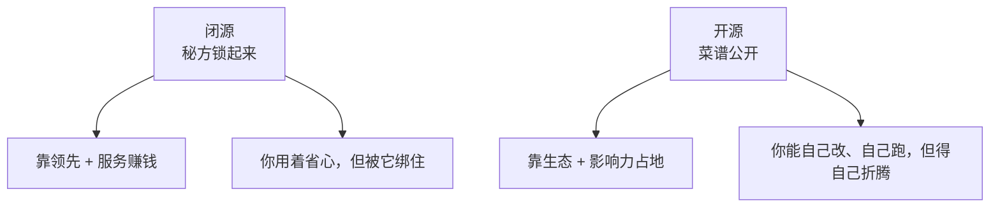

这篇憋了挺久，今天写出来。

最近饭桌上跟做技术的朋友聊天，绕来绕去总会撞上同一个问题：**这年头还该不该为闭源大模型掏钱？**

搁半年前这都不算问题——大家默认最强的就是那几家闭源的，贵有贵的道理。可 DeepSeek 这一波下来，一个又便宜、又开放、还挺能打的选项摆到了桌上，整个圈子的开源闭源之争一下就白热化了。今天咱不站队，就把这场「护城河」豪赌的账，给你算明白。

## 先把两条路说清楚

打个吃饭的比方你立刻就懂：

- **闭源**像一家**祖传秘方餐厅**。菜好吃，但配方锁在保险柜里。你只能买它做好的菜（调 API），想知道它怎么做的、能不能照着改改自家口味？没门。
- **开源**像把**菜谱公开**了。你不光能照着做，还能改盐量、换食材、搬回自己厨房，甚至按这菜谱开一家自己的店。

两边各有各的算盘：

## 闭源的护城河，到底是什么

闭源那一派的底气，过去主要押在三样东西上：**最强的模型、最贵的算力、最难复制的数据和工程**。逻辑很直白——我比你领先半年，你追上来时我又跑远了，这个「时间差」就是护城河，靠它源源不断收过路费。

DeepSeek 这波让人心里一紧的，恰恰是它**把这条护城河的水位往下拉了一截**。当一个开放的模型也能把活儿干得七七八八、成本还低得多，那「闭源 = 唯一选择」的前提就开始松动了。护城河没干，但有人发现：原来不一定非得花那么多钱过桥。

不过别急着唱衰闭源。它的真护城河，从来不只是「模型本身强」，更是**那一整套让你省心的东西**：稳定的服务、合规的保障、出事有人兜底、不用自己养一支团队伺候。对一家正经做生意的公司来说，**「省心」本身就值钱**——这部分，开源短期内还真不好抢。

## 开源的护城河，又是什么

那开源凭啥玩？它赌的是另一套逻辑：**得生态者得天下**。

这是个滚雪球：模型一开放，无数人拿去折腾，周边的工具、教程、最佳实践哗哗地长出来，用的人越多、生态越厚，新来的人就越倾向于「**默认也用它**」。它不靠把你锁住赚钱，靠的是**让你离不开这个生态**——这种护城河看不见摸不着，可一旦成了，比保险柜里的配方还难撼动。

## 那我到底该选哪个

老规矩，给你一张表，别再纠结：

| 你的情况 | 倾向 |
|---|---|
| 想快速上线、要省心、有合规要求 | 闭源，花钱买稳定 |
| 要把模型搬进自家机房 / 数据极敏感 | 开源，自己掌控 |
| 预算紧、量又大 | 开源，成本压得住 |
| 追求绝对的顶尖效果 | 闭源（眼下通常还领先一点） |
| 想深度定制、改到骨子里 | 开源，能动刀子 |

看出来了吗？**这又不是一道单选题。** 现实里活得最舒服的团队，往往是**两头都用**：核心的、要顶尖效果的活交给闭源，量大、要省钱、要私有部署的活用开源扛着。把两边当成工具箱里的两件工具，而不是非此即彼的信仰。

## 说到底，这是一场豪赌

闭源赌的是「**我能一直领先到让你愿意付费**」；开源赌的是「**只要够开放够便宜，生态迟早倒向我**」。DeepSeek 干的事，是让这场赌局的胜负看起来不再那么板上钉钉——闭源得加快跑，开源闻到了血腥味。

而对我们这些用模型的人来说，其实是天大的好事。两边越是杀红了眼，我们能用的东西就越好、越便宜、选择越多。技术圈最贵的从来不是算力，是「别人吹啥你信啥」——下次再看到「闭源已死」或者「开源不行」的标题，你大可微微一笑，然后接着该用哪个用哪个。

---

暂时这些，欢迎指正。