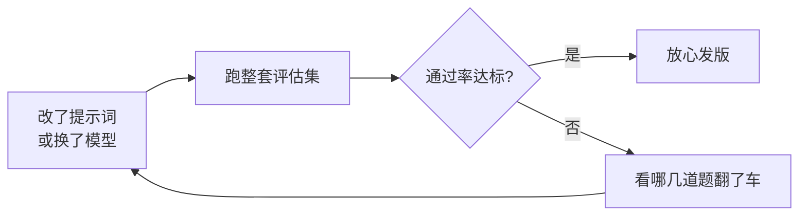

看到一个有意思的讨论，引出这篇。

「我刚才试了一下，效果挺好的！」

这阵子我每周都要听好几遍这句话，配套动作通常是同事兴奋地转过屏幕，给我看一个被精心挑选过的对话截图。我已经形成了条件反射：**手动跑通的那一次，往往是它表现最好的一次**，因为问题就是你顺着它的脾气编出来的。

2025 年了，圈子里有个越来越响的共识——做 AI 应用，得像写代码一样写「测试」。这事儿有个名字，叫**评估驱动开发（eval-driven development）**。今天我就把它掰扯清楚。

## 「跑通一次」是怎么骗到你的

传统软件你敢发版，是因为有一摞单元测试在背后兜底：改一行代码，跑一遍测试，红了就别提交。可换到大模型这边，很多人发版的依据是——**手感**。

手感这东西，骗起人来毫不手软。你调完提示词，自己拿三五个问题一试，行云流水，于是拍板上线。结果用户进来一问，画风立刻清奇：你测的是「帮我写封请假邮件」，用户问的是「帮我写封请假邮件，但要让老板觉得是他的主意」。

更阴险的是大模型**有随机性**。同一个问题问三遍能给你三个版本，你看到的「挺好的那次」，可能纯粹是运气好抽中了 SSR。靠一次手测就发版，约等于摇一次骰子摇到 6，就宣布这骰子只会出 6。

## 评估集：给 AI 配一套「错题本」

解法朴素得很：**把你期待它答对的题，攒成一个集合，每次改动都从头到尾考一遍。** 这个集合就叫评估集（eval set），本质就是 AI 版的单元测试。

跟单元测试的逻辑一模一样：改动 → 全量跑 → 不达标就别上。区别只在于，代码测试是「等于不等于」的硬碰硬，而评估集里的题，判分要灵活得多。

我一般把题分成三类：

- **送分题**：基本盘，答错就是事故。比如「公司客服不许承诺退款」，它要敢答应退款，直接零分一票否决。
- **常见题**：用户真实高频问的那些，从线上日志里捞，最有营养。
- **送命题**：专门挑刺的刁钻 case、容易越狱的提问、模棱两可的边界。它们就是你的「错题本」——每次线上翻车，就把那道题抄进来,保证同一个坑不踩第二次。

## 谁来判卷？

题攒好了，新问题来了:**这卷子谁批？**

答案不止一种，看题型下菜:

| 判分方式 | 适合的题 | 大白话 |
|---|---|---|
| 精确匹配 / 正则 | 有标准答案的 | 「首都是哪」这种，对就对错就错 |
| 规则校验 | 格式类 | JSON 能不能解析、字段全不全 |
| 模型当裁判 | 开放问答 | 让另一个模型按打分标准评 |
| 人工抽检 | 拿不准的 | 机器判完，人再瞄一眼高危的 |

「模型当裁判」（LLM-as-judge）是这阵子最常用的偷懒大法——拿一个能力强的模型，给它一份评分标准，让它去给被测模型的回答打分。挺香，但别全信它：裁判自己也会犯困，偶尔还偏心写得长的答案。所以高风险场景，我仍然留一道人工抽检的关。

## 别一上来就追求完美

最后泼盆冷水,也是给我自己泼的。我见过太多人(包括曾经的我)一听「要做评估」,就想搞一套五百道题、自动打分、CI 里全自动卡线的豪华系统,然后……就一直停在「想搞」的阶段,半年没动过。

**别。** 评估集最大的价值不在大而全,在于**它一直在长**。今天先攒 20 道题、手动跑、Excel 记分,都比你脑子里那点手感强一百倍。线上每出一次幺蛾子,就往里加一道题——半年后回头看,这个错题本就是你整个应用最值钱的资产。

毕竟,**能被量化的效果,才配叫效果**;剩下那些「我试了挺好的」,顶多算个美好的愿望。

---

断断续续写完的，可能有跳跃。