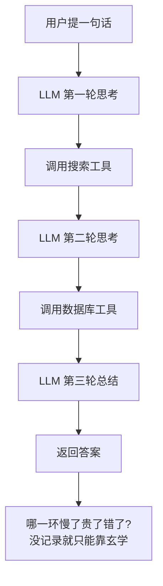

翻了几篇资料，自己梳理一遍。

月初打开账单的那一刻，我对着数字愣了三秒，然后开始严肃怀疑：是不是有人半夜偷用我的 API key 在练摊。

查了半天才发现，凶手是我自己写的那个 Agent。它在某个我以为「一步搞定」的任务上，**自己跟自己来回拉扯了 27 轮**，每轮都老老实实把前面的对话全带上重发一遍，token 像滚雪球一样越滚越大。它没偷懒，它只是太勤快了，勤快到把我的钱包啃秃了。

这事儿给我上了一课：AI 应用上线，光会写还不够，你得**看得见它在干嘛**。这阵子大家管这叫可观测性（observability）。

## 黑箱里到底发生了什么

普通后端服务出问题，你好歹有日志、有错误码、有堆栈。可大模型应用是个出了名的黑箱——你扔进去一句话，它吐出来一段话，中间发生了什么，你两眼一抹黑。

更要命的是 Agent。它不是「一问一答」，而是**一问、调工具、再想、再调、再想……**一套连招下来，中间任何一环抽风，最后你看到的只是一个莫名其妙的结果。不把这个链条摊开，你连甩锅给谁都不知道。

所谓可观测性，就是把上面这条链路上的**每一步**都记下来：谁调了谁、传了什么、花了多久、烧了多少 token。这条完整的记录，行话叫一条 **trace（调用链）**。

## 要盯的四盏灯

记什么呢？我自己常年盯四个指标，缺一盏我心里就发虚。

| 指标 | 它回答什么问题 | 不看的下场 |
|---|---|---|
| 成本 | 这次请求烧了多少钱 | 月底账单给你表演心跳过速 |
| 延迟 | 用户等了几秒 | 用户没等到，先走了 |
| Token | 输入输出各用了多少 | 不知道钱具体烧在哪一步 |
| 调用链 | 中间每一步都干了啥 | 出错了只能靠脑补 |

这四个里，**token 是钱和速度的总开关**。成本是它换算来的，延迟很大程度也是它撑大的——上下文越长，模型读得越慢、算得越贵。所以我盯账单的第一反应，永远是先去看是哪一步把 token 喂爆了。

## 把这条链照亮

实操上，这两年专门干这事的工具一抓一大把，开源的自建的都有。但工具是次要的，**思路才是关键**：给每一次用户请求生成一个唯一 ID，让这次请求里所有的模型调用、工具调用都挂在这个 ID 底下，串成一棵树。

这样一来，线上一报警，你点开那条 trace，整棵树明明白白摊在眼前：

- 哪一步耗时最长？→ 优化它，或者干脆并行。
- 哪一步 token 最肥？→ 八成是上下文塞太多，该上下手裁了。
- 哪一步报了错？→ 一眼定位，不用再凭感觉二分法瞎猜。

回到开头那个 27 轮的惨案。要是当时我有这套东西，根本不用查半天——trace 摊开，一眼就能看见那个循环在原地疯狂打转，每一轮的输入都比上一轮更臃肿。我会当场给它设个「最多转 5 圈，再转不出来就喊停」的熔断，而不是等月底被账单偷袭。

## 别等出事了才装监控

我知道，赶 deadline 的时候，「加埋点」这种活儿听起来就像「先把房子盖好，消防栓以后再说」。但我的血泪建议是:**可观测性要在上线前就接上,不是出了事再补。**

道理很简单:出事的那一刻,正是你最需要数据的时候,也正是你**最没有数据**的时候——因为你还没开始记。等你手忙脚乱补上埋点,那笔冤枉钱早就烧没了,你顶多能保证「下次同样的坑能看见」。

你的 AI 应用现在大概率正在某个角落,安静地、礼貌地、持续地烧着你的钱。给它装上几盏灯吧,至少烧的时候,你能看见火苗。
