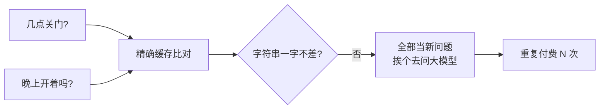
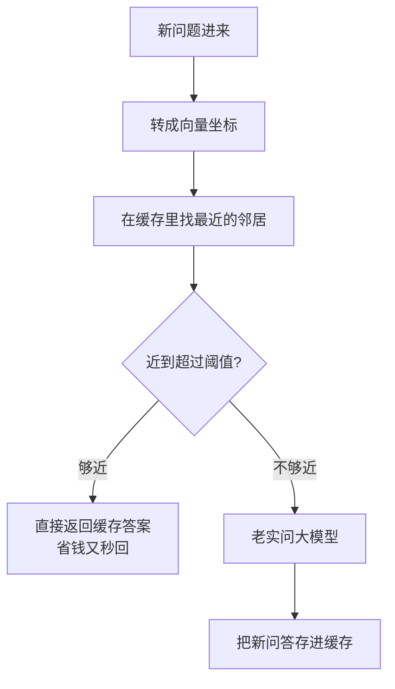

积压在草稿里很久了，发出来。

我盯着线上日志看了一下午，越看越肉疼。

「你们几点关门？」「营业时间是？」「晚上还开着吗？」「打烊时间几点？」——一整天，几百个用户用几百种说法，问的其实是**同一件事**。而我的应用呢，毫不含糊地把每一句都恭恭敬敬发给了大模型，付了几百次钱，得到了几百份意思一样的答案。

这阵子降本是头等大事，老板的眼神已经从「快上线」切换成了「这账单能不能压一压」。我琢磨着，这种重复提问，**第一次花钱情有可原，第二次还花，那就是我蠢了**。于是我搬出了语义缓存。

## 老缓存为什么不灵了

缓存这玩意儿不是新东西，后端干了几十年了。但传统缓存有个死规矩：**key 必须一模一样**才算命中。

放在大模型这儿，这规矩基本等于废了。「你们几点关门」和「晚上还开着吗」，在传统缓存眼里是两个八竿子打不着的字符串，一个标点不一样它都当陌生人。可对用户来说，这俩**就是一个意思**。

人类提问的花样实在太多了，指望大家用完全一样的字眼，跟指望食堂阿姨手不抖一样不现实。精确匹配在这种场景下，命中率低得可怜。

## 按「意思」命中，不按「字」命中

语义缓存的破局点就一句话：**不比字，比意思。**

怎么比意思？靠的是 embedding（向量化）。把每句话都转成一串数字坐标，意思相近的句子，坐标也凑得近。于是「几点关门」和「晚上开着吗」这俩，在向量空间里几乎是贴脸站着的邻居。

新问题进来，我先把它也转成坐标，去缓存里找**最近的邻居**：

够近就直接端上次的答案，又快又免费；不够近，才去打扰大模型，顺手把这次的新问答也存进缓存。跑上一阵子，缓存就把高频问题包圆了，大模型只需要伺候那些真正新鲜的提问。

## 阈值是门玄学，松紧都要命

听起来很美，但这里头藏着整个方案最阴险的一个旋钮：**「多近才算够近」的阈值。**

这玩意儿松不得也紧不得：

| 阈值设太松 | 阈值设太紧 |
|---|---|
| 八竿子打不着的也算命中 | 稍微换个说法就当陌生人 |
| 用户问 A，你答了 B | 缓存形同虚设，照样烧钱 |
| 省钱了，但答错了更糟 | 没答错，但也没省着 |

我吃过松的亏:阈值开太大,「你们几点**关门**」和「你们几点**开门**」被判成了近邻——一字之差,意思完全相反,用户被气笑了。所以我的经验是**宁紧勿松**:缓存答错一次造成的信任损失,远比多花那几毛 token 钱贵得多。

另外有几类问题,我会直接拉黑、**永不缓存**:带个人信息的、跟实时数据有关的(「我账户余额多少」)、还有那种依赖上下文的追问(「那它呢」——「它」是谁,缓存压根不知道)。这些要是也缓存,省下的是小钱,赔出去的是大事。

## 它是省钱利器，不是万金油

最后说句公道话。语义缓存特别适合那种**重复度高、答案相对固定**的场景:客服 FAQ、产品说明、政策解读,命中率能高到让你看账单时露出姨母笑。

但要是你的应用每次提问都高度个性化、千人千面,那缓存基本就是个摆设,白白多养一套向量检索,还拖慢响应。**先去你的线上日志里数一数重复问题占多少**,这个数字决定了语义缓存对你到底是金矿还是花瓶。

省钱的最高境界,从来不是把模型换便宜,而是让它**少干那些根本不必干的活**。同一个问题付两次钱这种事,咱就别干了。

---

暂时这些，欢迎指正。