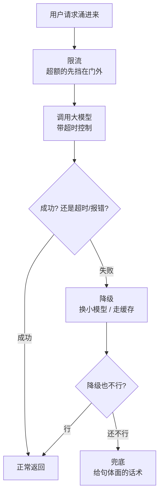

工作上踩了点坑，回头复盘。

Demo 演示那天，所有人都鼓掌。上线第三天，我被电话从被窝里捞起来。

这阵子大模型应用集体从「炫技 Demo」往「真上线」狂奔，我身边好几个团队都栽在同一个地方：**Demo 里好用的东西，到了生产环境就跟换了个物种**。一个人慢悠悠点一下，和一万个人同时点，是两个完全不同的世界。

今天不聊怎么让模型更聪明，聊点更要命的——怎么让它**别在半夜把你的服务和睡眠一起搞崩**。

## 生产环境是个修罗场

为啥 Demo 和生产差这么多？因为 Demo 里那些你默认「不会发生」的事，在生产环境里**全会发生，而且专挑你睡着的时候发生**：

- 模型 API 偶尔抽风，超时、502、限速，家常便饭。
- 用户不按套路出牌，超长输入、奇怪字符、连点八次。
- 流量忽高忽低，平时风平浪静，一推送活动瞬间洪峰。
- 你买的那点调用额度，分分钟被几个大户刷穿。

大模型这东西还有个独门毛病：**又慢又贵又不稳**。一次请求好几秒、按 token 烧钱、还时不时给你掉个链子。普通后端那套「重试一下就好」的乐观主义，在它面前会碰得头破血流——你越重试，账单越爆，它越堵。

## 四件保命符

我把上线踩过的坑，总结成四道防线，从外到内一层层兜：

**第一道，限流。** 给每个用户、每个接口都套个闸门，单位时间内只放这么多进来，超了的客气地请它稍后再试。这不是抠门，是保护——少数几个狂点的大户，足以把所有人的服务一起拖垮。

**第二道，超时。** 必须给每次模型调用设死线。模型偶尔会「卡住」半天不吭声，你要是傻等，连接就会一个个堆积，最后把整个服务拖进泥潭。宁可早点放手，也别陪它一起耗死。

**第三道，降级。** 主力模型扛不住了，别硬刚——换个便宜的小模型顶上，或者直接返回之前缓存的结果。答得糙一点，总比转圈圈转到天荒地老强。

**第四道，兜底。** 前三道全破了，也**绝对不能把原始报错甩用户脸上**。准备一句体面的话术：「抱歉，这会儿有点忙，请稍后再试」。用户能接受偶尔慢，但接受不了一句冷冰冰的 `500 Internal Server Error`。

## 重试和并发，是把双刃剑

这里单拎出来念叨两句，因为这俩是「好心办坏事」的重灾区。

| 你的直觉操作 | 实际后果 | 正确姿势 |
|---|---|---|
| 失败了赶紧重试 | 模型正堵着，你又火上浇油 | 退避重试，越失败越往后等 |
| 同时多发几个请求提速 | 瞬间打满额度，全员限速 | 用并发数闸门压着发 |
| 重试到成功为止 | 账单原地起飞 | 设个上限，超了就降级 |

核心心法就一句:**对大模型,要做最坏的打算。** 它一定会超时,一定会报错,一定会在你最忙的时候掉链子。你的代码不该问「万一它挂了怎么办」,而该默认「它就是会挂,挂了我怎么优雅地接住」。

## 慢一点没事，崩了才是事故

我最后想说的其实特别朴素:做生产环境,**「优雅地变慢」永远优于「壮烈地崩溃」**。

用户对 AI 的耐心其实比你想的好——它转两秒圈,大家忍了;它换了个稍微笨点的小模型答题,大家也认了。但只要它给你来一次白屏、一次报错、一次「服务不可用」,信任就掉一截,掉几次人就走了。

把模型当成一个能力很强、但情绪不太稳定、还偶尔旷工的同事来管理。能力你欣赏,脾气你包容,但活儿交出去之前,**你得替它把所有摔跤的姿势都先想一遍**,并在每个坑底下铺好垫子。这样哪天它真摔了,摔的是它,接住的是你,慌的不是用户。

---

这个话题还没琢磨透，回头继续。