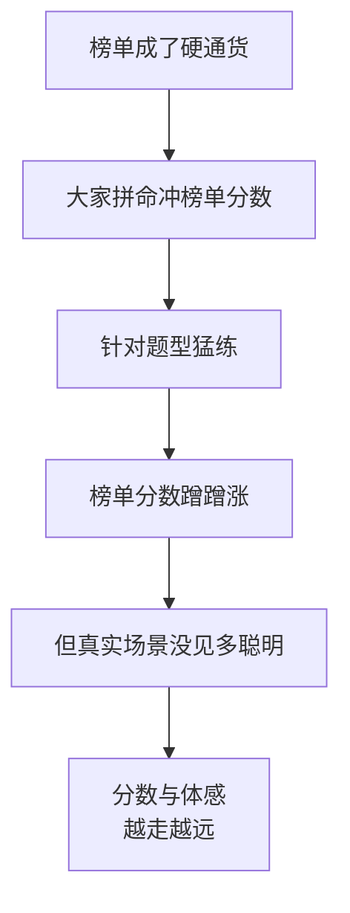

记一下最近琢磨的：

每次有新模型发布，配图必有一张表：密密麻麻一堆榜单，自家的数字全程加粗飘红，把对手按在地上摩擦。

可这阵子我发现一个怪现象越来越普遍：**榜单上屠榜的模型，真上手用，体验平平无奇**；反倒是某些榜单排名不显眼的，用着特别顺手。榜单和体感，越来越对不上了。这事儿今年吵得很凶，今天就来扒一扒：大模型评测这碗水，为啥这么浑。

## 榜单是怎么「失真」的

先说个最朴素的道理：**一旦某个考试变得很重要，大家就会开始针对这个考试复习，而不是真去学知识。** 这话搁高考、考研、KPI 上都成立，搁大模型评测上更是字字应验。

榜单一旦成了发布会的硬通货、融资的敲门砖，模型厂商的优化目标就会**悄悄从「变聪明」滑向「考高分」**。这俩听着像一回事，实则差着十万八千里。

最经典的翻车叫**数据污染**：很多榜单的题目早就公开躺在网上了，而模型训练时把半个互联网都吞了进去——于是它「考前看过原题」。这哪是考试，这是开卷抄答案。它考了满分，你还以为它天赋异禀，其实它只是**背过这张卷子**。

## 过拟合：把模拟卷背到滚瓜烂熟

光数据污染还不够阴。还有一种更隐蔽的，叫**过拟合**。

打个比方：一个学生把历年模拟卷刷了八百遍，每道题的答案、每个套路都烂熟于心，模考次次满分。可你一旦把题目换个说法、换个数字、换个场景，他立刻露馅——因为他记的是**题**，不是**会做题的能力**。

大模型也一样。针对某个 benchmark 反复调优，分数能刷得极高，但这种「高分」是**脆**的：

- 把题目里的人名地名一换，分数往下掉。
- 把问法稍微绕一下，它就懵了。
- 换个榜单没收录的新题型，原形毕露。

所以你会看到一个略显荒诞的画面:模型在某榜单上号称「超越人类专家」,转头连「你帮我把这段会议纪要整理成三条待办」都做得磕磕绊绊。**它会的是考试,不是干活。**

## 那还能信什么

泼了半天冷水，总得给点建设性的。我自己看模型，会把评测分成两类来看：

| | 公开榜单 | 自建评测 |
|---|---|---|
| 题目是否公开 | 公开（易被污染） | 私有（你说了算） |
| 反映什么 | 大致水位线 | 你真实场景的表现 |
| 能否刷 | 能，而且有人刷 | 刷不了，因为你不公开 |
| 信任度 | 当参考，别当圣旨 | 这才是你该信的 |

公开榜单不是没用，它能帮你**圈个大致范围**——一个连入门榜单都垫底的模型，大概率确实不太行。但你**绝不该靠它做最终决定**。

真正靠谱的做法，是回到上半年聊过的老路子:**拿你自己业务里的真实任务，攒一套私有评测集，让候选模型挨个上来跑。** 题目只有你知道,谁也没法提前背;跑出来的分,直接对应你掏钱买它要干的活。这种分,才是花的钱听得见响的分。

## 别为别人的考试买单

说到底,榜单是模型厂商的考试,不是你的。他们考高分,是为了上发布会的 PPT、为了下一轮融资的故事;**而你需要的,是它能不能把你手头这摊活儿干好。**

下次再看到「全面屠榜、断崖式领先」的发布会大字报,你可以礼貌地点点头,然后默默打开自己那套私有评测,让它真刀真枪跑一遍。分数会骗人,你的眼睛不会。

毕竟,你又不是在给模型颁奖,你是在雇它干活。**雇人看的是能不能干活,不是简历上的奖状有多厚。**

---

暂记于此。