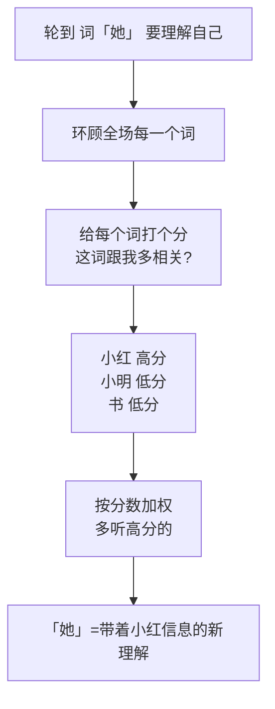

积压在草稿里很久了，发出来。

年底了，聊点不赶时髦的。

这一年我写了太多「怎么把模型用好」「怎么省钱」「怎么别翻车」的实战话题，临近收尾，我反而想往回退一步，聊个最底层、也最被当作理所当然的东西——**Transformer 里的注意力机制**。这玩意儿支撑着眼下所有大模型，可真要你一句话讲明白它在干嘛，多数人会卡壳。今天我就用一场「开会」，把它讲透。

## 一句话的麻烦：「它」到底指谁

先看个例子。一句话：「**小明把书递给小红，因为她想看。**」

「她」指谁？你一秒就知道是小红。可你脑子里其实悄悄干了件事：读到「她」的时候，你**回头扫了一遍前面的词**，在「小明」「书」「小红」里头，给「小红」分配了最高的关注度，其余几乎忽略。

机器要理解这句话，也得干一模一样的事——**读每个词的时候，决定该回头多看哪几个词。** 这个「决定多看谁」的动作，就是注意力（attention）的全部精髓。

## 把它想成一场开会

我最喜欢的比喻是开会。一个会议室里坐着一句话的所有词，每个词都是一位与会者。轮到「她」发言、要搞清自己什么意思时，它不会闭门造车，而是**环视全场，决定该多听谁说话**。

注意那个「打分」——每个词跟当前这个词有多相关，就给多高的分。分高的，多听；分低的，左耳进右耳出。这个分数就是大名鼎鼎的**注意力权重**。整句话里每个词都这么开一轮会，各自更新对自己的理解，于是「她」就和「小红」绑定了，「它」就找到了它的主人。

因为是句子里的词**互相之间**开会、彼此打量，所以这套机制有个专门的名字，叫**自注意力（self-attention）**。

## 凭啥比老办法强

在 Transformer 之前，主流是 RNN 那一套，规矩是**一个词一个词按顺序读**，像排队过安检，前面的人不过完，后面的干等着。这有两个硬伤：

| | RNN（排队读） | 注意力（开会读） |
|---|---|---|
| 处理顺序 | 一个接一个，没法并行 | 全场同时开会，并行起飞 |
| 远距离的词 | 隔太远，信息传着传着就忘了 | 再远也是一句话的距离，直接对视 |
| 训练速度 | 慢，卡在排队上 | 快，能喂进 GPU 一起算 |

最关键的是那个「远距离」。一句话里隔了几十个词的两个词要建立联系，RNN 得让信息**逐个传递**，传到后面早就衰减得七零八落（这就是著名的长程依赖难题）。而注意力机制里，任意两个词**直接对视**，距离再远也是一步到位——开会嘛，坐对角线也能直接喊话，不用一个个传纸条。

能并行、又不怕远，这两条凑齐，才让我们有底气把模型越喂越大、上下文越撑越长。今天那些动辄几十万 token 上下文的大家伙，地基就是这个「开会」的小机灵。

## 一个朴素动作，撑起一个时代

绕了一圈，注意力机制的内核朴素得让人有点不敢信:**读每个词的时候,决定回头多看哪几个词。** 没有玄学,就这一句。

但 AI 这行的魅力恰恰在这儿——一个朴素到能用「开会划重点」讲明白的动作,**堆叠几十层、灌进海量数据、铺上足够算力**之后,竟然涌现出了写代码、做翻译、陪你唠嗑的能力。复杂从来不是来自机制本身有多花哨,而是来自简单规则的**规模化重复**。

年底回看基础,我最大的感触是:越是天天用的东西,越值得偶尔停下来,把它拆开看看里头那颗螺丝。下次再有人跟你神乎其神地吹大模型,你完全可以淡定接一句——「不就是一群词在开会,商量着该多听谁说话嘛。」

---

暂记于此。