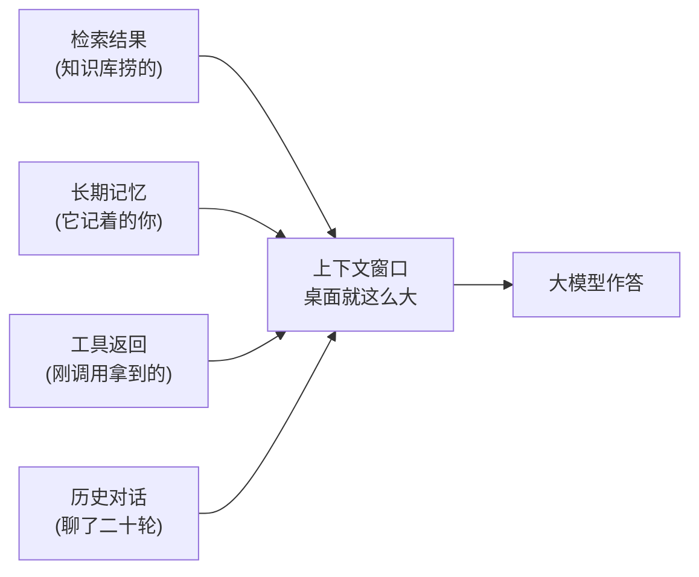
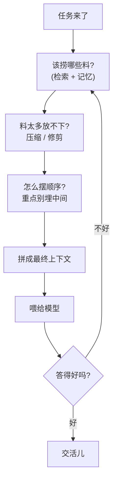

下班路上突然想清楚的，赶紧记一下。

这阵子打开技术圈，一个新词刷屏的速度肉眼可见：**上下文工程（Context Engineering）**。

前两年大家见面打招呼还是「你提示词怎么写的」，现在风向变了，开口就是「你上下文怎么管的」。我一开始也以为是换了个马甲蹭热度——毕竟这行最不缺的就是给旧东西起新名字。可真琢磨进去，发现这回还真不太一样。它更像是提示词工程长大了，懂事了，从「抠一句话」升级成了「操持一整摊子」。

## 先打个比方：从写题干，到布置整张考桌

**提示词工程**，本质上是在帮模型「写好一道题的题干」。你斟酌字眼、加几个示例、叮嘱它「请一步步思考」，盼着这道题出得清楚，它就答得漂亮。

**上下文工程**管的事大多了：它要**布置好模型答题时面前的整张考桌**。

题干当然还在桌上。但桌上同时还堆着：刚从资料库里检索回来的几页参考、模型记着的你上周的偏好、它刚调了个工具拿回来的一串返回值、还有你俩聊了二十轮的对话记录。这些东西，**全都算上下文**，全都要塞进那个有限的窗口里。

桌子就这么大，东西却越来越多。于是真正的活儿不是「写好题干」，而是：这堆料，**哪些该上桌、哪些该折叠、哪些该扔、怎么摆才顺手**。

## 桌子是会被堆爆的

你可能会说：现在窗口动辄上百万 token，桌子大得很，全摆上去不就完了？

这就又回到那个老毛病了。料越多，模型越容易**抓不住重点**，关键的那页埋在中间，它热情地跳过去。再说桌子越满，每答一题就越**贵越慢**——token 是按量计费的，钱包会哭给你看。所以「全塞进去」从来都不是答案，**取舍才是**。

于是上下文工程里冒出一堆听着玄、其实特朴素的招式：

| 招式 | 人话翻译 |
|---|---|
| 检索（Retrieval） | 用到哪页才把哪页搬上桌，别搬整座图书馆 |
| 压缩 / 摘要 | 二十轮对话太占地，捏成一段「前情提要」 |
| 排版 / 排序 | 最要紧的料放开头结尾，别埋在正中间 |
| 修剪（Pruning） | 过气的、没用的、重复的，该撤就撤 |

说白了，就是**给模型整理桌面**。一个工位上堆满杂物的实习生，和一个桌面就摊着当前任务所需材料的实习生，干起活来是两回事——后者哪怕脑子一样，出活也稳得多。

## 为什么这事现在才热起来

道理不新，但凑齐「值得专门当门手艺来练」的条件，是最近的事。

一来，模型本身够强了，强到瓶颈不再是「它笨」，而是「**你喂给它的料乱**」。二来，大家终于不满足于聊天框里一问一答，开始搭那种会检索、会调工具、会记事、还要连着聊很多轮的系统——上下文一下子从「一句话」膨胀成「一大锅杂烩」。锅一大，怎么熬就成了学问。

看这张图你大概也回过味来了：这不就是**给模型当个尽职的助理**嘛。模型负责思考，你负责把它需要的东西、按它最舒服的方式，恰到好处地递到手边——多一分嫌挤，少一分缺料。

## 所以这是不是又一个新瓶旧酒

我的看法是：瓶子是新的，酒**确实换了一茬**。

提示词工程教会我们的是「话要怎么说」；上下文工程要操心的是「**料要怎么备**」。前者关乎一句话的精雕细琢，后者关乎一整个信息流水线的进出取舍。当你的系统从「一个聊天框」长成「会检索、有记忆、能动手」的家伙，你迟早会发现：决定它聪不聪明的，往往不是那句精心打磨的提示词，而是**那张考桌收拾得干不干净**。

下回再有人跟你炫耀提示词写得多妙，你不妨瞄一眼他那张桌子——要是上面堆得跟我家年底没收拾的阳台一样，那再妙的题干，也救不回来。

---

断断续续写完的，可能有跳跃。