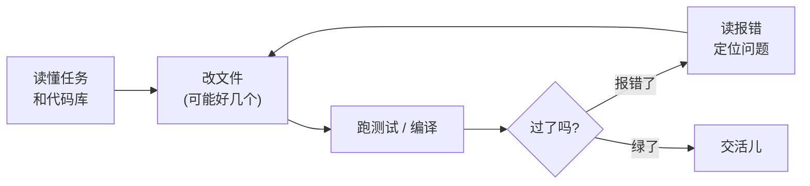
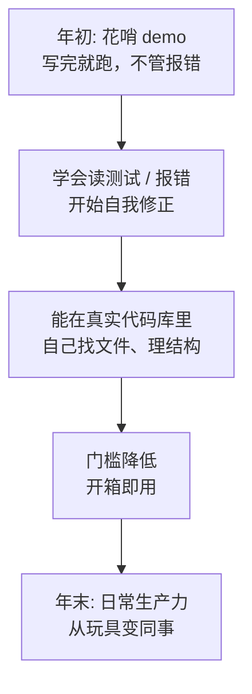

翻了几篇资料，自己梳理一遍。

去年这个时候，我对着一个号称「能自己写完整个项目」的编程智能体演示，礼貌地鼓了鼓掌，心里想的是：**又一个 demo 战神**。

一年过去，年初盘点，我得诚实地承认：打脸了。不是说它已经能替我把活全干了，而是这玩意儿不知不觉从「拿来玩玩、发个朋友圈」的稀奇物件，熬成了我每天真会用上的工具。这个转变，比任何一场发布会都更值得回望一下。

## 先说清楚，Coding Agent 到底指什么

别被名字唬住。**编程智能体**，说白了就是一个不只会「吐代码片段」，还能自己动手折腾一整个代码库的家伙。

它会：读你的代码库搞清结构、按需要改好几个文件、跑测试、看报错、然后**根据报错再改一遍**。注意最后这句——它会看着自己捅的娄子，回头收拾。这就是它和「代码补全」的本质区别。

眼熟吧？这套「改—跑—看报错—再改」的循环，跟我们打工时**一模一样**。区别只在于它不会因为第八次报错而想砸键盘——情绪稳定，这点我是真比不过。

## 这一年，到底变在哪

回望下来，我觉得不是某一个惊天动地的突破，而是几件平淡的小事悄悄凑齐了：

- **它学会了「自己看报错」**。早先的版本写完就甩手不管，红字它视而不见。后来它开始把测试输出、编译报错当成反馈吃进去，循环里多了「复盘」这一环——一字之差，从「话痨」变成了「干活的」。
- **它能在真实代码库里转悠了**。以前你得把相关文件一份份喂给它，活活把人累成人肉检索引擎。后来它能自己读目录、找定义、顺藤摸瓜地理解项目，这才像个能上手的同事。
- **门槛塌下来了**。它从「需要你折腾半天配置」变成了「打开就能用」。东西好不好用，很多时候不取决于天花板多高，而取决于**地板有多低**。

## 当成同事，就得有当同事的觉悟

用了一年，我最大的体会是：**把它当实习生，活儿干得最顺。**

它最香的场景，依然是那些「**对错验得出来**」的活——写个有测试兜底的功能、改个能复现的 bug、搭个标准的脚手架。反馈越清晰，它跑得越稳，因为它能拿测试当指南针，一步步自己往对的方向蹭。

| 交给它干 | 还是自己来 |
|---|---|
| 有测试兜底的功能 | 牵一发动全身的架构决策 |
| 能复现的 bug | 「我也说不清想要啥」的活 |
| 重复又无聊的样板代码 | 关乎安全、钱、合规的关键改动 |

那它的坑在哪？还是那个老问题——**做错了还特别自信**。它能给你交一份编译通过、测试也绿、读起来一本正经，但**压根没解决你真正问题**的代码。所以我从不盲签它的「作业」，关键节点必抽查。把它当不知疲倦的实习生使，挺好；把它当能拍板的资深工程师，迟早出事。

## 写在年初

所以这一年，Coding Agent 算不算「成」了？

我的答案是：它没成神，但**确实从玩具变成了工具**。神话它的人，怕是没让它真碰过自己那个一团乱麻的祖传代码库；瞧不上它的人，可能还停留在去年那个写完就撒手不管的版本。它现在最像的，是一个力气大、不喊累、但偶尔会一本正经胡来的实习生——你得给它清楚的活、留好测试的兜底，再时不时回头看一眼它在忙啥。

明白这点，它就是个相当能打的同事。糊涂这点，它就是个把你厨房点了还冲你憨笑的家伙。

---

暂时这些，欢迎指正。