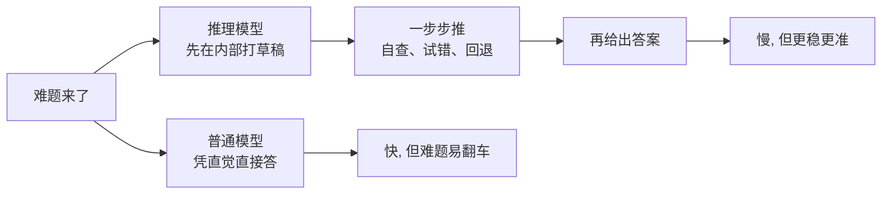
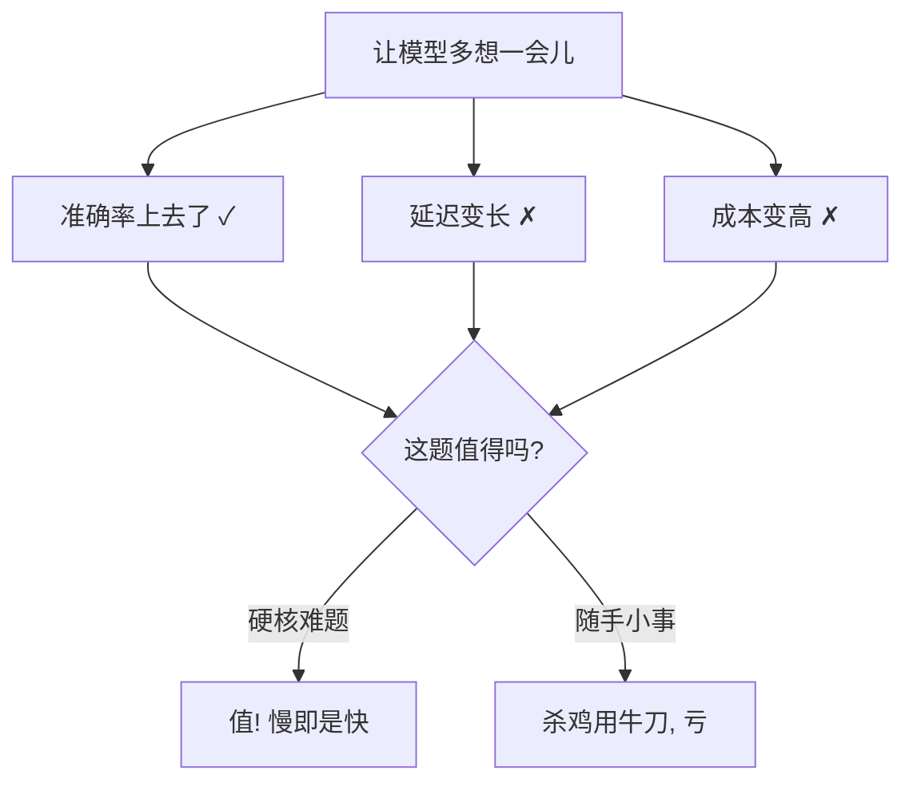

看到一个有意思的讨论，引出这篇。

有件事最近让我觉得挺反常识：我们花了好几年逼着 AI「能不能快点回话」，结果眼下被夸上天的，偏偏是一类**会先慢慢想一会儿再开口**的模型——人称**推理模型（Reasoning Models）**。

一个张口就答的模型，和一个先在心里盘算半天再开口的模型，后者居然普遍更靠谱。这事儿乍听挺玄，今天就用大白话把它捋明白：为什么对 AI 来说，有时候「慢」反而等于「聪明」。

## 一个比喻：考场上让不让你打草稿

想象两个考生面对一道烧脑的应用题。

- **甲**：扫一眼题，凭直觉「唰」地写下答案。手快，但难题翻车率感人。
- **乙**：先在草稿纸上把已知条件列出来、一步步推、算到一半发现不对还能划掉重来，最后才把答案誊上去。慢，但稳。

**普通模型像甲，推理模型像乙。**

差别就在那张草稿纸——专业点叫「**思维链（Chain of Thought）**」。推理模型在真正给你答案之前，会先在内部生成一长串推演过程：拆解、试探、自我检查、推翻重来。你看到的可能只是最后那个干净的结论，但它背后是**实打实草稿了一大片**。

## 算力花在哪：从「考前」到「考场上」

这里头有个关键的转变，值得单拎出来说。

过去我们想让模型更聪明，几乎只有一条路：**砸训练**。喂更多数据、堆更多参数——相当于让考生**考前拼命复习**，把本事全压在「平时」。

推理模型则多开了一条路：把算力花在**「推理时」**，也就是模型实际回答你那一刻——专业说法叫 **Test-time Compute（推理时算力）**。相当于允许考生**在考场上多花时间打草稿**。题越难，草稿打得越长，想得越久。

| | 训练时砸算力 | 推理时砸算力 |
|---|---|---|
| 类比 | 考前玩命复习 | 考场上多打草稿 |
| 本事来源 | 平时积累的「直觉」 | 当场一步步「推演」 |
| 加钱能换啥 | 模型整体更强 | 这一道题答得更准 |

最妙的是最后那行：推理时算力让你能**按需加码**。简单的题，少想想，省钱；难的题，多想想，舍得花。这在以前是没有的旋钮——本事是出厂就定死的，现在你能临场调档了。

## 「慢即是快」，但天下没有白吃的午餐

说了半天好处，得泼盆冷水：**想得久，是有代价的**。

那一长串草稿不是凭空来的，它本身就是模型在哗哗地生成 token——**更慢、更贵**。你为「更准」买的单，是「更慢更贵」。

所以「想得越久越聪明」是有前提的——**前提是这道题真值得想**。让推理模型去算个一加一，纯属杀鸡用牛刀，又慢又贵还显摆；可一旦碰上需要多步推理的硬骨头，那点慢和贵就花得回本了。

这跟人也像。真正的高手不是事事都慢慢盘算，而是**分得清哪些事该秒答、哪些事得关起门来想半天**。一个对鸡毛蒜皮都要深思熟虑的人，我们一般不叫他聪明，叫他纠结。

## 收个尾

把推理模型这事拎清楚，其实就一句话：**我们终于可以「花钱买它多想想」了。**

以前模型聪不聪明，出厂就焊死了；现在多了个旋钮，难题往上拧一拧，让它在草稿纸上多折腾几回，换来实打实更稳的答案。代价是更慢、更贵，所以这旋钮**不是拧到底就好**，而是看菜下饭——值得想的才让它慢慢想。

「慢即是快」从来不是说慢本身有多金贵，而是说：**在对的地方舍得花时间，最后反而少走弯路。** 这道理放模型上成立，放我们自己身上，好像也一样。

---

断断续续写完的，可能有跳跃。