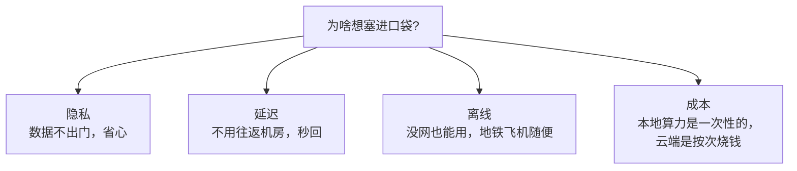
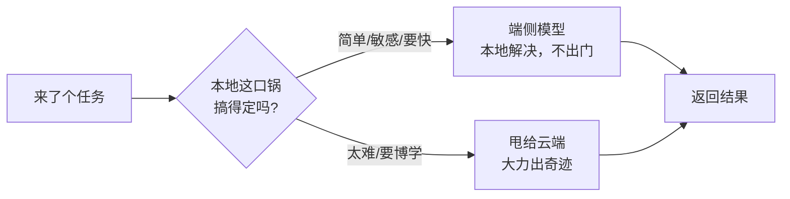

翻了几篇资料，自己梳理一遍。

这阵子跟人聊 AI，话题悄悄变了味。前两年大家比的是「谁家模型更大、更聪明」，现在饭桌上越来越多人问的是另一句：「这玩意儿能不能不联网，直接在我手机上跑？」

听起来像是开倒车——好不容易把模型养到几千亿参数，怎么又惦记着塞回口袋里了？但你只要换个角度想想就懂了：**不是大家不要聪明了，是大家发现「聪明」这件事，不一定非得发生在远在天边的机房里。**

## 一个比喻：叫外卖 vs 自己下厨

把云端大模型想象成**米其林餐厅的外卖**：手艺顶级，啥都能做，但你每点一次都得下单、等配送、付钱，而且——你点了啥、口味多重，平台门儿清。

端侧 AI 呢，就是你**自己家厨房里那口锅**。手艺没人家精，复杂大菜做不来，但煮碗面、炒个蛋这种事，它快得很：不用等配送（低延迟），断网也能开火（离线可用），更重要的是，**你今晚吃啥，没人需要知道**（隐私）。

想明白这个，端侧 AI 为啥越来越香就一目了然了。它打的从来不是「比云端更强」这张牌，而是**「有些事，根本没必要叫外卖」**。

## 把账算清楚：四个让人心动的理由

为什么这阵子大家都在惦记把模型往本地搬？我掰着手指头数，主要是这四笔账：

**隐私**是最直白的。你的相册、聊天记录、健康数据，能在本地处理完，就没必要上传到谁的服务器上转一圈。这年头，「数据没离开过我的设备」本身就是一种奢侈的安全感。

**延迟**是体感最强的。本地推理省掉了「打包请求→飞到机房→排队→飞回来」这一整趟旅程。你输入法的联想、相机的实时抠图，要是每个字都得等网络往返，那体验直接稀碎。

**离线可用**则是把使用场景从「有信号的地方」扩展到了「任何地方」。地铁、飞机、信号死角，云端模型当场失忆，本地的那口小锅照样能开火。

**长期成本**最容易被忽略。云端推理是**按次计费**的——用得越多，账单越长，跟自来水似的哗哗流。而端侧算力买回来就是你的，跑一百次跟跑一万次，电费之外几乎不额外花钱。对高频、轻量的任务来说，这笔账算下来差得很远。

## 那是不是该把大模型全废了？

打住。这又掉进「二选一」的坑里了——上回聊 RAG 那篇我就吐槽过这种非黑即白的思维。

现实里的趋势，是**分工**，不是替代。端侧那口小锅，注定做不了满汉全席。受限于内存、功耗、发热，它跑的多半是**更小、更省、更专一**的模型。真碰上要深度推理、要海量知识、要写一篇像样长文的硬骨头，还是得把活儿外包给云端那家米其林。

所以眼下越来越被看好的，是一种「**先自己看一眼，搞不定再求援**」的混合姿势：

简单的、敏感的、要求快的，本地自己消化；又难又需要博闻强识的，再恭恭敬敬送去云端。这套路子的妙处在于：**大部分日常请求其实都很简单**，能在本地拦下来的越多，又快又私密又省钱，只把真正的硬骨头送出门。

| | 云端大模型 | 端侧 AI |
|---|---|---|
| 能力上限 | 高，啥都能聊 | 受设备拖累，专一为主 |
| 响应速度 | 看网络脸色 | 本地秒回 |
| 隐私 | 数据得出门一趟 | 数据不离身 |
| 成本结构 | 按次烧钱，越用越贵 | 算力一次性，用多不亏 |

## 写在最后

把模型塞进口袋，听着像是技术的妥协，其实是**技术成熟到开始考虑「场合」了**。

就像家里有了厨房，你不会从此再不下馆子——但你也绝不会为了煮碗泡面，特意打车去米其林排号。能在身边解决的小事就在身边解决，这本就是最朴素的生活智慧，现在轮到 AI 来补这一课了。

下次再有人跟你炫耀「我家模型参数破纪录」，你不妨慢悠悠回一句：**塞进我口袋了吗？**

---

暂记于此。