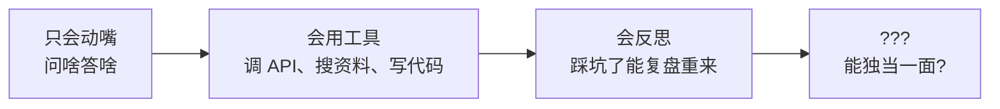
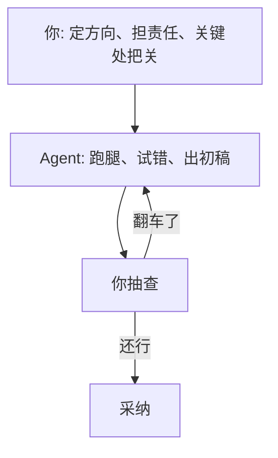

周末翻笔记翻到这个话题，整理一下。

五月的午后，我盯着屏幕上一个跑了半小时的 Agent 任务发呆，脑子里冒出一个特别朴素的问题：**说好的「AI 替我打工」，现在到底走到哪一步了？**

这问题我其实断断续续琢磨了两三年。早年间在博客里聊它的时候，那会儿的它还只是个「记忆力惊人但从不主动起身」的实习生——你问它答，问得头头是道，可你让它去把事办了，它只会礼貌地给你列七个步骤。今天再看，它确实长本事了不少。但「替我打工」这四个字，我觉得还得再压一压心里的激动。

## 这两三年，它的成长曲线

回头看这一路，智能体的进步其实有一条挺清晰的主线：

从「只会动嘴」到「会用工具」，是第一道大坎——它终于有了手脚，能真的去**动手**而不只是**动嘴**。从「会用工具」到「会反思」，是第二道——它开始能在踩坑后回头看一眼，「刚那步是不是走偏了」，然后自己改道。

这两步走得都挺扎实。可你看那个问号——从「会反思」到「能独当一面」，这一步迈得格外费劲。**手脚都有了，复盘也会了，怎么就是没法彻底撒手？**

## 卡住的，是三件不性感的小事

我盘了盘，挡在「替我打工」面前的，不是什么惊天动地的技术难题，恰恰是三件特别琐碎、特别不性感的事：

| 卡点 | 人话版 | 现状感受 |
|---|---|---|
| 可靠性 | 十次有九次对，那第十次能要命 | 还得盯着 |
| 上下文 | 它常常不知道「咱们公司一向怎么办这事」 | 得喂、得教 |
| 责任归属 | 它捅了娄子，板子打谁身上 | 没人敢全甩手 |

**可靠性**是头号拦路虎。一个实习生十次有九次干得漂亮，听着很美，但剩下那一次——而且你还**事先不知道是哪一次**——足够让你不敢真的撒手。打工的本质从来不是「平均水平高」，是「**关键时刻不掉链子**」，而这恰恰是当下智能体最虚的地方。

**上下文**是第二道。它博览群书，却唯独不了解**你**：你们团队的潜规则、那个客户的脾气、这事儿去年踩过的坑。这些没写进任何文档、全凭「老员工才懂」的东西，恰恰是真正干活时最值钱的部分。你不喂给它，它就只能凭通用常识硬猜。

**责任归属**则是最容易被技术党忽略、却最致命的一条。它把合同条款看走了眼、把钱打错了账户，**这板子打谁？** 打它？它又不发工资也不挨罚。所以最后大概率还是落到那个「按了确认键的人」头上。只要这笔账没法清楚地算到 AI 头上，人就永远不敢真的离场。

## 所以，「替我打工」该怎么理解

聊到这儿你可能觉得我在唱衰，其实正相反。我反倒觉得，**把「替我打工」理解成「替我跑腿」，期待值就对了**——这个判断我两三年前就有，到今天反而更确信。

你看，这个图跟我多年前画的那个「带实习生干活」的循环，骨架几乎一模一样。变的只是：这个实习生这两三年确实手脚更利索、犯傻后也学会复盘了。**没变的是——拍板的、担责的、最后说「这个可以发」的那个人，仍然是你。**

而且我越来越觉得，这事儿短期内可能就这样了，而且**这样挺好**。一个能把脏活累活、重复劳动、查资料写初稿全包圆的实习生，已经够香了。非得逼它「独当一面、出了事自己扛」，那不叫用工具，那叫给自己找了个不靠谱还甩不了锅的合伙人。

## 写在五月

所以回到开头那个问题：离「AI 替我打工」还有多远？

我的答案是——**「替你跑腿」早就到了，而且越来越熟练；「替你担责」还远，远到我怀疑它本就不该是个纯技术问题。**

中间那段距离，与其说是模型不够聪明，不如说是「可靠、懂行、扛得起事」这三样，本就是人类职场里最贵的东西。AI 一时半会儿补不齐，倒也不丢人——毕竟这三样，**好多人干了一辈子也没全凑齐。**

下午那个跑了半小时的任务终于跑完了。我扫了一眼结果，挺好，但还是逐条核对了一遍才点了采纳。你看，这大概就是 2026 年五月，人和 AI 之间最真实的相处姿势：**它干活，我签字。** 挺好。
