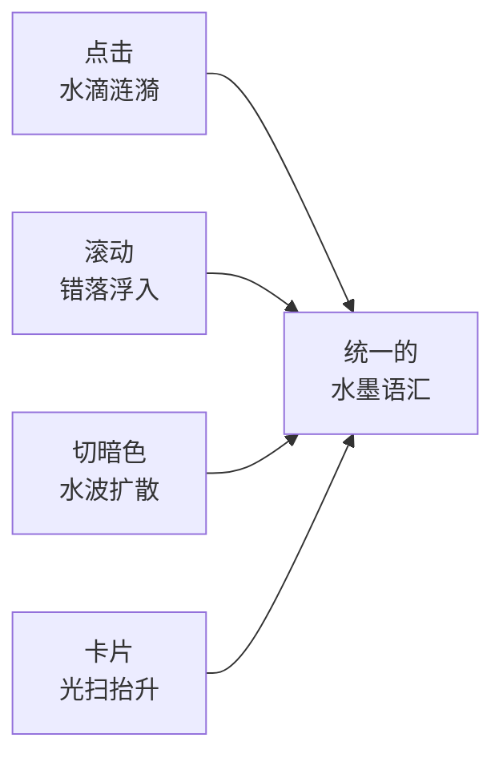

先坦白：我的博客曾经很难看。

不是那种「朴素但耐看」的难看，是套了个 GitHub 风模板、性冷淡到没有任何性格的难看——打开像个仓库 README，字体发虚，一股 2016 年的味儿。我每次想写点东西，光看那个壳就没了兴致。

于是某个周末，我把它推倒重做了。目标特别朴素：**轻、顺、有意思**，再加点我自己喜欢的「文艺水墨」气质。今天它长这样：

<i></i><i></i><i></i>

切到暗色是这样——注意，切换的瞬间是**从你点的那个按钮、像水波一样扩散**开来的，不是生硬地一闪：

<i></i><i></i><i></i>

## 我自己挺得意的几个细节

重做的时候我给自己定了条规矩：**所有动效都得「轻」**——只用 `transform / opacity`（不触发重排，走 GPU），时长短、缓动顺，还要尊重系统的「减少动态效果」。说白了就是：有意思，但绝不卡、绝不晃眼。

于是有了这一套以「水 / 墨」为母题的小动作：

除了好看，能用的功能也没落下：

- 🔍 **全文搜索**：放大镜、`⌘/Ctrl + K`、甚至**双击 Shift** 都能唤起，边打边搜、命中高亮。
- 🗂️ **时间线归档 + 分类筛选**：文章按年份排成一条时间线；分类页点个标签就只看那一类。
- 📑 **文章浮动目录**：长文右侧自动生成目录，滚动时高亮当前章节；窄屏自动收起，绝不挤占正文。
- 📊 **Mermaid 图表**：自动渲染成墨青配色的矢量图，还跟着明暗主题走（这篇里上面那张流程图就是）。

## 顺手把祖传包袱也扔了

老模板那套 jQuery + 一堆插件我全删了，换成一个纯原生 JS 文件。移动端也认真适配过——宽图自动缩放、表格能横滑、导航收成汉堡，不会再出现「手机打开是一坨」的惨剧。

## 它现在开源了，一键就能拿走

折腾完我想，这套壳与其烂在我一个人手里，不如分享出去。所以我把它**做成了 GitHub 模板仓库**——你不用 fork、不用清历史，点一下 **「Use this template」** 就能得到一个干净的副本，改改 `_config.yml` 和 `CNAME`，十分钟就能跑起自己的博客。

- 🌊 **在线体验**：<https://a.minifog.org.cn/>
- 🚀 **拿走模板**：仓库首页点 **Use this template**（[GitHub 仓库](https://github.com/JinRudy/JinRudy.github.io)）

如果你也受够了那些性冷淡或者花里胡哨的模板，想要一个**克制、好看、还带点东方气质**的博客，欢迎试试。觉得不错的话，点个 ⭐ 就是对我最大的鼓励。

毕竟博客这东西，先得自己看着顺眼，才愿意往里写东西——剩下的，慢慢沉淀就好。
