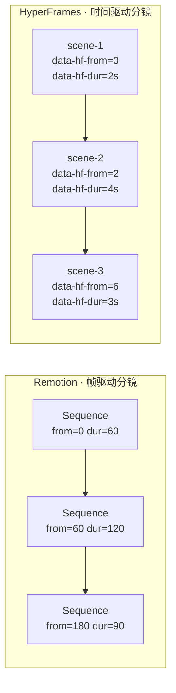
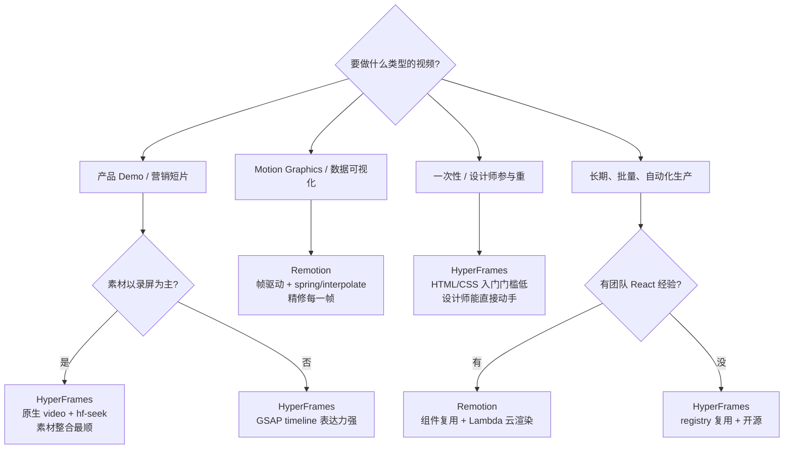

最近接了个小活——给朋友的 SaaS 做一支产品 demo 短视频。需求一句话：**用现有的产品录屏当主素材，再叠一些动态文字、转场、Lower Third**，输出 1080p mp4 投到落地页。

按惯例的第一反应是 After Effects。但工程师的执念让我多瞄了一眼——能不能用代码来做？这一瞄就栽进去了，把 Remotion 和 HyperFrames 都折腾了一遍。两个工具网上常被并列提，定位其实差得挺远。这篇就把这一周的手感、踩过的坑、和最后怎么挑的思路记下来。


## 一句话先把两个角色定位清

**Remotion** 把视频当作 React 组件：每一帧是一次 React 渲染，时间用 `useCurrentFrame()` 取，动画用 `interpolate()` 和 `spring()` 算。Composition、Sequence、AbsoluteFill 这些组件构成时间轴。**视频是 React App，按帧导出**。

**HyperFrames** 把视频当作能被 seek 的网页：你写 HTML+CSS+JS，但所有动画必须能根据 `hf-seek` 事件**确定性地跳到任意时刻的状态**。GSAP、Anime.js、CSS animation、WAAPI、Lottie、Three.js、TypeGPU、Web Animations API ——每种都有 adapter 让它"被时间驱动"。**视频是按时间轴 seek 的网页**。

听着相近，但写起来是两套手感：

- Remotion **像在写 React 应用**——TypeScript、props、children，一切 React 心智模型直接搬过来
- HyperFrames **像在写 web 动效落地页**——HTML 是骨架，动效用最熟悉的 web 标准库写，让它支持 seek 即可

## 一张表把维度撑开

|  | Remotion | HyperFrames |
|---|---|---|
| 心智模型 | React 组件 / 帧驱动 | HTML 网页 / 时间 seek 驱动 |
| 上手前置 | 会 React + TS | 会 HTML + CSS + 任一动效库 |
| 动画 API | `interpolate` / `spring` / `useCurrentFrame` | GSAP / Anime.js / CSS / WAAPI / Lottie / Three.js / TypeGPU(任挑) |
| 分镜组织 | `<Sequence from durationInFrames>` | DOM 结构 + block 系统 + GSAP timeline |
| 视频素材 | `<OffthreadVideo>` 解决多视频帧同步 | 原生 `<video>` + hf-seek 同步 currentTime |
| 文字到视频 | 自带 `<Audio>` + 社区方案 | CLI `hyperframes tts` (Kokoro) / `transcribe` (Whisper) 一条龙 |
| 抠绿 / 透明叠加 | 第三方处理 | CLI `hyperframes remove-background` (u2net) 内建 |
| 模块复用 | npm 包 + props | registry 系统 (`hyperframes add`) |
| 预览 / 渲染 | Remotion Studio + `@remotion/lambda` | `hyperframes preview` + 本地 / 云渲染 |
| 商用许可 | 商业用途需付费 license | 开源 |
| 设计师友好度 | 中（要懂 React） | 高（HTML/CSS 谁都能改） |

## 同一个动效，两种写法

来个最朴素的 case：**一行标题 0.5s 内淡入并从下方 30px 滑上来，2s 后再淡出**。

**Remotion 写法**（一切都是 React + 数学函数）：


```jsx
import { AbsoluteFill, useCurrentFrame, useVideoConfig, interpolate } from "remotion";

export const Title = () => {
  const frame = useCurrentFrame();
  const { fps } = useVideoConfig();
  // 0~15 帧淡入 + 上移; 60~75 帧淡出
  const opacity = interpolate(frame, [0, 15, 60, 75], [0, 1, 1, 0], { extrapolateRight: "clamp" });
  const y = interpolate(frame, [0, 15], [30, 0], { extrapolateRight: "clamp" });
  return (
    <AbsoluteFill style={{ alignItems: "center", justifyContent: "center" }}>
      <h1 style={{ opacity, transform: `translateY(${y}px)`, color: "#2f7068" }}>雾水博客</h1>
    </AbsoluteFill>
  );
};
```


**HyperFrames 写法**（GSAP adapter 版本）：

```html
<div class="stage">
  <h1 id="title" style="color:#2f7068">雾水博客</h1>
</div>

<script type="module">
  import gsap from "https://cdn.jsdelivr.net/npm/gsap@3/+esm";
  // 注册到 hyperframes 全局表，hf-seek 时就会自动按时间映射
  window.__hfGsap = gsap;
  const tl = gsap.timeline({ paused: true })
    .from("#title", { opacity: 0, y: 30, duration: 0.5, ease: "power2.out" })
    .to("#title", { opacity: 0, duration: 0.5 }, "+=1.5");
  // hyperframes 会在每个 hf-seek 事件里把 timeline 推到对应时间
  window.__hfTimeline = tl;
</script>
```

两段都能产出**一模一样的视觉效果**，但表达层不同：

- Remotion 的 `interpolate` 是**显式数学**，所有数值你都得算。好处是没有黑盒，坏处是动效一复杂表达式会越写越绕
- HyperFrames 给你**站位**让你用 GSAP（或任意 adapter）正常写动画，只要在 hf-seek 时能被推到任意时间点。**复杂动效里可读性优势会拉得很开**

## 跟自有视频素材结合：实战的那一刀

这一块才是工程师最关心的——不可能所有内容都用代码生成，大部分需求是**拼自有的录屏/B-roll + 文字 overlay**。两边的做法值得拉开看。

### Remotion：用 OffthreadVideo，别用普通 video

最容易掉的坑：直接用 `<video src>` 多个的时候，渲染时 Chromium 会同时跑多个 `requestAnimationFrame` 帧解码，**多个视频的帧很容易对不齐**，导出出来对不上时间。Remotion 的解：用 `<OffthreadVideo>`，它会按 frame 一帧一帧抽：

```jsx
import { OffthreadVideo, staticFile, Sequence } from "remotion";

export const Demo = () => (
  <>
    <Sequence from={0} durationInFrames={120}>
      <OffthreadVideo src={staticFile("screencast.mp4")} />
    </Sequence>
    <Sequence from={90} durationInFrames={60}>
      <h2>← 注意这里的细节</h2>
    </Sequence>
  </>
);
```

`staticFile()` 是 Remotion 的本地素材入口（指向 `public/`）。**Sequence 即分镜**，from/durationInFrames 是入场时刻和持续帧数。

### HyperFrames：原生 video + hf-seek 同步

HyperFrames 的玩法更"web"——直接 `<video>` 标签，但你得**让 video 的 currentTime 跟着 hyperframes 的时间走**：

```html
<video id="screencast" src="screencast.mp4" muted preload="auto"></video>

<script type="module">
  const v = document.getElementById("screencast");
  // hyperframes 在 hf-seek 事件里告诉你目标时间 (秒)
  window.addEventListener("hf-seek", (e) => {
    const t = e.detail.time;        // 这一帧对应的时间
    if (t >= 0 && t <= v.duration) {
      v.currentTime = t;            // 把视频也推到这个时间
    }
  });
</script>
```

这个写法有意思在于——**渲染时的 t 是确定的**，video 被强制 seek 到那一刻，**没有多视频同步的烦恼**，因为压根没有 rAF 并行播放，只有按 seek 推帧。

**额外加分**：HyperFrames 还内置 `remove-background` 命令（基于 u2net），能把任意视频的人物/产品抠出来生成 transparent webm，直接当透明叠层用：

```bash
npx hyperframes remove-background hero-recording.mp4 -o hero-transparent.webm
# 然后这个 webm 直接 <video src="hero-transparent.webm"> 当 overlay 用
```

Remotion 这边要做同样的事，得手动跑别的工具产物再喂回来。

## 分镜头设计：两套语义



**Remotion 用 frame 数**（默认 30fps，60 帧=2 秒），让你思考的是「这个动作占多少帧」。优点是跟剪辑软件直觉一致，坏处是改 fps 时所有数字要等比换算。

**HyperFrames 走 time 单位**（毫秒/秒），让你思考的是「这段持续多久」。fps 改变不影响业务时序，**业务和帧率解耦**。

> 我自己的偏好：做产品 demo 这种"时间感"很重要的视频，HyperFrames 的时间单位更顺手；做 motion graphics 那种"每一帧都精修"的视频，Remotion 的帧驱动反而合适。

## 动画设计：数学函数 vs 标准库

这块差异更深。Remotion 的世界里，**动画 = 数学**：

```jsx
// 三段式 spring：弹出 → 抖一下 → 静止
const scale = spring({ frame, fps, config: { damping: 8, stiffness: 100, mass: 1.2 } });
```

`spring` 的参数得感觉一下 damping/stiffness/mass 这种物理量，对调好需要时间。但**完全可预测、可控**——同一组参数永远出同一段动画。

HyperFrames 的世界里，**动画 = 你最熟悉的那个 web 动效库**：

- 喜欢 GSAP 的时间轴和 easing.power？写就是了，只要把 timeline 注册到 `window.__hfTimeline`
- 喜欢 Anime.js 的简洁 API？同样直接用，注册到 `window.__hfAnime`
- 想做粒子或 3D？Three.js / TypeGPU 都有 adapter
- 想跑 Lottie 的 AE 导出？dotLottie player 也有 adapter
- 纯 CSS animation？带 `animation-delay` 也能 seek

Trade-off 是：**HyperFrames 的灵活换来了入门时多一层选择疲劳**——"我到底该用哪个 adapter？"，而 Remotion 一开始就给你一套——`interpolate` + `spring`，挺纯粹。

## 我自己的选型决策树



简单说：

- **录屏拼接为主、Lower Third、转场为辅的产品视频** → HyperFrames
- **复杂数据可视化、每帧精修、有 React 团队** → Remotion
- **设计师全程参与、要快速迭代视觉** → HyperFrames
- **要做 SaaS 化的视频生成 API** → Remotion + Lambda 更成熟
- **预算敏感、商用** → HyperFrames（开源），Remotion 商用要 license

## 一些工程上的小坑

- **Remotion 的 React state 雷区**：不能在 composition 里用 `useState/useEffect` 做副作用，否则渲染不确定。一切状态都从 `useCurrentFrame()` 推出来
- **HyperFrames 的确定性约束**：任何依赖时间的动画都要支持 `hf-seek`。用了 `Date.now()` / `Math.random()` / `setInterval` 就废了。一开始我也踩
- **跨域素材**：两边都得本地准备好或服务器允许 CORS。Remotion 用 `staticFile`，HyperFrames 走 `public/` 目录
- **多视频同步**：Remotion 必须 `<OffthreadVideo>`，HyperFrames 走 hf-seek 不会有这个问题
- **音频对齐**：两边都支持，HyperFrames 内建 `tts` 命令生成 Kokoro 配音 + `transcribe` 出字幕；Remotion 自己装 OpenAI Whisper 或第三方

## 我的结论

我这次的项目最终用了 **HyperFrames**。原因很直接：

1. 主素材是 3 段产品录屏，HyperFrames 的 `<video>` + hf-seek 处理多视频零摩擦
2. 朋友的设计师只会 Figma + 一点 CSS，HTML/CSS 路径让他能直接改文案和位置
3. 要免费商用

如果换个场景——比如我下次想做个"每周技术新闻"的自动化短视频系列，配 GPT 写脚本、自动生成不同主题的 motion graphics——我估计会回头选 **Remotion**，因为它的 React 组件化 + Lambda 批渲染对**长期化、自动化生产**更友好。

工具没好坏，只有合不合适。**做之前先想清楚"这是单次精修还是流水线生产"，这条线决定一切**。

---

> **后记**：这篇憋了挺久才发，因为一开始想把所有细节都讲透，越写越长越没头。最后砍到只留两边对照、足够帮你做选型为止。再往细的——比如各个 adapter 的具体用法、Lambda 部署的成本算法——下次再单独开篇写吧。
>
> 折腾过程中要感谢这俩工具背后的工程师们，把视频生成这种黑魔法做成了 HTML/React 可以直出的东西。
