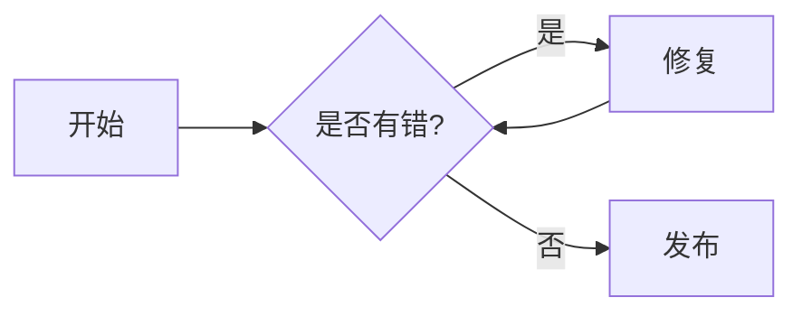

Markdown 是一种轻量级标记语言，它允许人们使用易读易写的纯文本格式编写文档。本博客对标准 Markdown 进行了增强，支持更多现代化的特性。

---

## 1. 基础语法

### 标题
使用 `#` 号表示标题，一级标题对应一个 `#`，以此类推，最多支持六级标题。
```markdown
# 一级标题
## 二级标题
### 三级标题
```

### 字体样式
*   **加粗**：`**加粗文本**`
*   *斜体*：`*斜体文本*`
*   ~~删除线~~：`~~删除线文本~~`
*   <u>下划线</u>：`<u>下划线文本</u>`

### 列表
*   **无序列表**：使用 `*`、`+` 或 `-`。
*   **有序列表**：使用数字加点，如 `1.`、`2.`。
*   **任务列表**：
    - [x] 已完成任务
    - [ ] 未完成任务

---

## 2. 引用与分割线

### 引用
使用 `>` 号：
> 这是一段引用文本。
> > 甚至可以嵌套引用。

### 分割线
使用三个或以上的星号 `***`、减号 `---` 或底划线 `___`。

---

## 3. 链接与图片

### 链接
语法：`[显示文字](URL "标题")`
[百度一下](https://www.baidu.com)

### 图片
语法：``


> **注意**：在本博客中，建议将图片放在 `assets/images/` 目录下，并使用相对路径引用。

---

## 4. 代码高亮

### 行内代码
使用反引号包裹：`` `console.log()` ``。

### 代码块
使用三个反引号包裹，并指定语言：

```javascript
function hello() {
  console.log("Hello, Markdown!");
}
```

---

## 5. 表格

使用 `|` 和 `-` 来创建表格：

| 语法 | 效果 | 说明 |
| :--- | :---: | ---: |
| 左对齐 | 居中 | 右对齐 |
| 内容 | 内容 | 内容 |

---

## 6. 数学公式 (LaTeX)

本博客支持 MathJax，可以书写数学公式：

行内公式：$E = mc^2$

块级公式：
$$
\frac{-b \pm \sqrt{b^2 - 4ac}}{2a}
$$

---

## 7. 进阶扩展 (本博客特有)

### 树状分类路径
在文章开头的 Front Matter 中设置 `category_path`，可以实现无限层级的折叠效果：
```yaml
category_path: "技术/前端/Vue"
```

### Mermaid 图表
可以直接在 Markdown 中绘制流程图：



### 自动 WebP 转换
无需手动处理图片。你上传的 `png/jpg` 原图在部署时会被 GitHub Actions 自动转为 `webp` 并优化体积。

---

希望这份手册能帮助你更愉快地进行创作！
