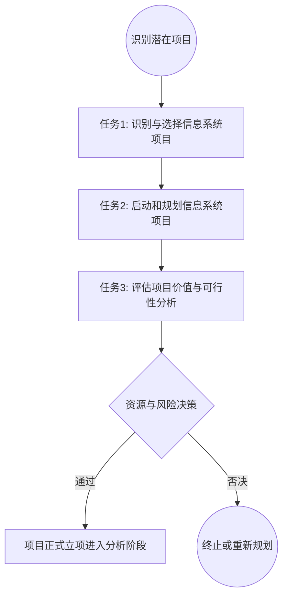

# 专题 10.1 — 系统规划概述与生命周期复习

### 10.1.1 软件生命周期核心阶段宏观对照

| **阶段名称**  | **核心目标**        | **主要活动**                    | **关键产出物**                   |
| --------- | --------------- | --------------------------- | --------------------------- |
| **定义及规划** | 明确项目**“值不值得做”** | 问题定义、可行性研究、资源与进度估算          | 《项目方案》、《可行性研究报告》、《项目开发计划》   |
| **需求分析**  | 确定系统**“必须做什么”** | 需求获取、需求建模、需求评审              | **《软件需求规格说明书》（SRS）**、用户确认报告 |
| **系统设计**  | 确定系统**“应该怎么做”** | 架构设计（概要设计）、详细设计（DB/UI/算法）   | 《概要设计说明书》、《详细设计说明书》、原型      |
| **编码实现**  | 将设计图纸转化为程序代码    | 编写代码、单元测试、代码审查（Code Review） | 源代码、可执行程序、单元测试报告            |
| **系统测试**  | 全面验证软件质量        | 集成测试、系统测试、**用户验收测试（UAT）**   | 测试计划、测试用例、缺陷记录、《测试报告》       |
| **运行维护**  | 保障长期稳定与持续演进     | 运行监控、纠正性/适应性/完善性/预防性维护      | 维护记录、变更申请、版本更新包             |

## 专题 10.2 — 系统规划的核心任务

系统规划是软件生命周期的起点，其本质是一个**高层宏观决策过程**，主要包含三大核心任务：

代码段

1. **识别与选择信息系统项目**：
    
    - **自上而下（Top-Down）**：由高层管理人员或指导委员会基于组织战略驱动提出，具有全局性、系统性和高优先级。
        
    - **自下而上（Bottom-Up）**：由业务部门或开发团队基于具体痛点（如效率低下、系统故障）提出，针对性强，但缺乏全局协同。
        
2. **启动和规划信息系统项目**：
    
    - 明确组织面临的具体业务问题、项目开发边界以及利益相关者范围，确立宏观资源基准流。
        
3. **评估项目价值（可行性分析）**：
    
    - 多维度论证项目投入产出比、技术可行性及合规风险，为组织决策层提供数据支撑。
        

## 专题 10.3 — 可行性研究的多元维度

评估项目价值不能仅看“能不能做”，必须从以下多个维度进行全面权衡，寻找多重约束下的最优解：

|**可行性维度**|**核心评估问题**|**工程实践考虑要点**|
|---|---|---|
|**技术可行性**      (Technical)|现有的技术水平和资源能否实现？|团队开发经验、技术成熟度、系统规模与复杂度、硬件/网络环境限制。|
|**经济可行性**      (Economic)|项目的财务投入与产出是否划算？|成本/效益分析（静态/动态投资回收期、净现值 NPV、净回报率 ROI）、开发与长期运维资金是否充裕。|
|**操作可行性**      (Operational)|系统上线后用户是否愿意且能够使用？|是否与现有的管理流程冲突、用户对数字化的抵制程度、培训成本、管理层的变革决心。|
|**法律与合规可行性**      (Legal)|系统是否满足法律法规与行业监管要求？|知识产权/版权合规、隐私数据保护（如 GDPR）、安全审查、特定敏感行业准入制度。|
|**进度可行性**      (Schedule)|项目能否在限定的时限内完成交付？|是否有强制性的截止日期（如政策法规生效日、市场窗口期）、开发周期估算是否合理。|
|**资源可行性**      (Resource)|所需的关键开发资源是否具备可获得性？|核心架构师与开发人员是否到位、服务器/软件许可等软硬件资源能否按时采购。|

### 💡 可行性研究决策结果处理：

- **全部通过** $\rightarrow$ 正式立项，撰写并发布《项目可行性报告》，转入需求分析阶段。
    
- **有条件通过** $\rightarrow$ 削减项目范围、追加资源或调整进度计划后重新触发评估流程。
    
- **否决** $\rightarrow$ 直接终止项目或彻底重新规划，防止资金陷入“焦油坑”。
    

## 专题 10.4 — 项目管理视角：成功与失败原因剖析

系统规划本质上就是项目管理的启动与计划过程。据权威机构（如 Standish Group）统计，传统软件工程方法下项目具有**极高的失败率（约 72% 的项目面临取消、延期、超预算或未达预期）**。

### 10.4.1 项目成败核心因素对照表

|**🚫 项目失败的主要原因（排查雷区）**|**🏆 项目成功的关键因素（最佳实践）**|
|---|---|
|1. **系统需求不完整或频繁变动**（缺乏基准控制）|1. **清晰、定义明确且具备基准的系统需求定义**|
|2. **有限的用户参与度**（导致闭门造车）|2. **大量且持续的用户/业务方深度参与**|
|3. **缺少行政支持与高层管理者的技术倾斜**|3. **上层管理人员在资源与政治层面的强力支持**|
|4. **项目计划不充分、宏观目标模糊不清**|4. **完整、详细、可量化的项目开发计划**|
|5. **缺少开发所需的必要核心资源**（人/财/物）|5. **符合实际的工作进度安排与清晰的里程碑规划**|

### 10.4.2 系统分析员的务实观念

在规划期阶段，系统分析员必须内化布鲁克斯在《人月神话》中阐述的客观规律：

- **人月不可互换**：向一个已经延期的项目盲目追加人力，只会由于沟通成本的数量级激增，导致项目**延期得更严重**。
    
- **软件工程没有银弹**：不要期待通过引入某一个最新的开源框架或技术（如 Elysia、Prisma 等）就能奇迹般地解决规划和管理层面的混乱。真正的进步来自于系统性地规范流程、明确需求约束并在边界内稳步交付。