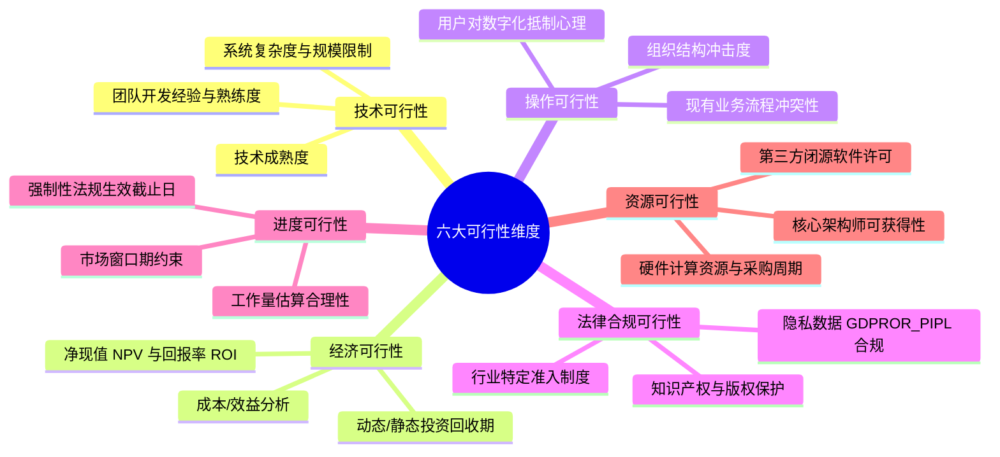
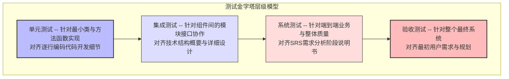

# 全生命周期的工程协同与演进哲学

在现代软件工程中，信息系统开发生命周期静态与动态模型并不是一系列孤立事件的刚性堆叠，而是一个高度协同、信息流持续递进与反馈的动态生态系统。上游阶段所确立的每一个概念、模型和约束，都会在下游阶段以十倍甚至百倍的工程成本进行具象化和质量放大。

本总章作为复习与技术攻坚的集大成篇，将拒绝任何碎片化和表层化总结。报告将深度拆解系统规划、系统分析、系统设计、系统编码、系统测试、系统运行维护这六大核心阶段的底层技术细节。

为了建立最高维度的宏观全局感，我们首先对这六大阶段的核心问题域、参与者职责边界、关注点以及核心模型演进关系进行深度建模对比：

### 生命周期核心治理矩阵深度横向对照表

| **生命周期阶段** | **核心治理问题域**  | **关键工程参与角色与职责边界**                                                                          | **核心关注点特征**                              | **底层核心工程理论基石**       | **上游输入与下游级联承接因果关系**                                                   |
| ---------- | ------------ | ------------------------------------------------------------------------------------------ | ---------------------------------------- | -------------------- | --------------------------------------------------------------------- |
| **系统规划**   | 值不值得做？       | **角色**：高层管理、指导委员会、系统分析员 **边界**：限定项目宏观边界、批准立项与预算基准。                  | 问题陈述、业务机会、系统范围、宏观可行性、基线计划                | 布鲁克斯法则、帕累托法则。        | 组织战略愿景输入 $\rightarrow$ 驱动宏观机会识别 $\rightarrow$ 产出投资决策，决定项目是否正式获批立项。    |
| **系统分析**   | 系统要做什么？      | **角色**：系统分析员、领域专家、最终用户 **边界**：抽取、清洗、提炼现实业务逻辑，确立功能边界。                | 功能需求、非功能需求、业务流程流转、用户角色职责                 | 面向对象方法论、信息隐藏原则。      | 立项决策与初始范围输入 $\rightarrow$ 驱动逻辑空间挖掘 $\rightarrow$ 确立不可动摇的需求基线。         |
| **系统设计**   | 系统该怎么构建？     | **角色**：系统架构师、系统分析员、高级开发、数据管理员、界面设计师 **边界**：将业务需求转化为具体的技术解决方案，规划技术栈。 | 系统技术架构、模块解耦、接口协议、数据库物理结构、部署拓扑、界面布局       | 三大模块化治理原则、单一职责原则。    | 需求基线输入 $\rightarrow$ 转化为高维技术解决方案与精确类设计 $\rightarrow$ 为后续编码提供确定性图纸。    |
| **系统编码**   | 如何用代码准确实现？   | **角色**：全栈开发、技术负责人、配置管理员 **边界**：负责将静态设计图纸一对一转化为精确的编程语言工件。            | 编码环境准备、团队风格规范、代码本体编写、同行静态审查、自动化单元测试、持续构建 | 辅助智能编程演进、测试驱动开发局部变体。 | 详细设计图纸输入 $\rightarrow$ 映射为具体代码、函数与数据表实体 $\rightarrow$ 实现并验证单个可重用软件构件。 |
| **系统测试**   | 我们构建的系统正确吗？  | **角色**：专业测试团队、质量保证、最终用户 **边界**：通过恶意或常规执行系统发现缺陷，验证质量。                | 缺陷深度暴露、功能行为验证、非功能属性评估、发布接收决策             | 测试基本原则。              | 可运行制品代码输入 $\rightarrow$ 全方位发现隐藏缺陷并校验非功能特性 $\rightarrow$ 支撑最终发布决策。     |
| **运行维护**   | 如何保障稳定并持续演进？ | **角色**：运维工程师、网站可靠性工程师 **边界**：负责系统上线到退役期间的可用性保障与长线演进。                | 生产全天候监控、运行巡检、事件故障快速响应、灾备恢复、变更优化管理        | 冰山原则、莱曼定律。           | 发布审批通过工件输入 $\rightarrow$ 投入真实生产环境服役 $\rightarrow$ 捕获环境变更与新需求，逆向反馈。    |

# 六大核心专题万字知识点深度提炼与考点攻坚

## 系统规划

系统规划阶段的核心目标是解决“值不值得做”的宏观投资回报与战略匹配度问题。这是系统的起点，也是项目避免陷入高维技术债务和管理焦油坑的防火墙。在此阶段，系统规划阶段一般不包括系统用户，而是聚焦于高层的宏观决策。

### 潜在项目识别的双向动力学机制

系统项目的来源与启动在组织内部通常呈现三种不同的触发规则：

### 项目启动的三类典型理由深度对照表

| 理由维度 | 核心业务含义 | 工程实践典型场景举例 |
| --- | --- | --- |
| **应对机会** | 新技术涌现或新市场开辟带来业务增长的可能，追求商业价值最大化。 | 伴随大语言模型架构成熟，企业主动立项开发智能客服推荐系统以抢占市场窗口期。 |
| **解决问题** | 当前组织现有的业务流程存在重大痛点、效率瓶颈、数据错误、严重延误或高昂的人力成本。 | 基层财务报销审批流程由于完全依赖人工走单导致周期长达两周，立项替换为自动化电子审批系统。 |
| **依照指示** | 来自国家政策法规、行业强制合规标准或组织高层董事会的硬性刚性命令。 | 为满足国家关于个人信息保护法的强监管要求，金融机构强制启动用户隐私数据加密整改系统项目。 |

### 项目范围陈述与可行性研究的六大核心维度

在项目启动阶段，项目范围陈述至关重要，它明确了系统包含与不包含的业务功能边界，是防止后期需求范围蔓延的基石。基于确定的范围，需要从以下六个刚性维度上开展全面论证：

* **技术可行性**：
评估现有技术、团队能力和系统环境能否实现需求。必须冷静评估团队当前的开发经验、技术栈在业界的成熟度与生态。需要严密核算系统规模和并发复杂度是否超出团队控制极限，以及现有的硬件和网络环境是否构成刚性硬伤。
* **经济可行性**：
进行严密的成本/效益分析。不仅要计算有形资产成本，更要量化无形效益。利用静态投资回收期、动态投资回收期、净现值和投资回报率等指标证明项目在财务上是否划算。
* **操作可行性**：
深度评估新系统对现有组织结构和管理制度的变革冲击力。需要准确衡量基层员工对数字化流程的潜在抵制心理、管理层的变革决心，以及新系统是否能被用户顺利接受并融入日常工作。
* **法律与合规可行性**：
排查项目是否存在知识产权、专利侵权、开源许可证冲突等法律漏洞。在数字化时代，必须通过严格的数据隐私合规审查，保障数据存储、跨境和传输的安全；敏感行业还必须对齐特定行业特定的准入制度。
* **进度可行性**：
核算项目是否存在强制性的硬性截止日期。分析团队能否在给定的时间内通过合理的里程碑规划按期完工。
* **资源可行性**：
重点盘点组织内部核心技术专家的档期可用性。核算关键的底层硬件采购周期是否能跟上工程节奏，以及开发所需的第三方闭源软件许可等资源是否可获得。
* **组织文化可行性**：评估系统是否与现有的管理流程、组织文化产生不可调和的冲突。

### 计划编制工具

在规划阶段，项目经理通常使用工作分解结构将项目整体自上而下分解为可管理的工作包，并利用甘特图可视化地表示任务的先后依赖、时间跨度和实际进度。对于错综复杂的依赖网络，则借由计划评审技术/关键路径法分析任务依赖和关键路径。

此时必须警惕人月神话的核心提醒：增加人手不一定缩短工期。软件开发是高度复杂的智力密集型、概念构造活动。当项目已经发生延期时，管理层如果一味陷入传统制造工业的刚性思维，盲目向其中追加新开发人员，后期加人可能因沟通和培训成本让项目更慢。

---

## 系统分析

系统分析阶段的核心任务是彻底明确“系统要做什么”。系统分析员要在排除任何具体技术实现的干扰下，将现实世界的复杂业务抽取为纯逻辑的需求基线。

### 系统需求的精准分类

系统需求直接决定了后续测试阶段的验收基准，软件工程将其严格划分为功能需求与非功能需求：

### 功能需求与非功能需求多维横向对照表

| 比较维度 | 功能需求 | 非功能需求 |
| --- | --- | --- |
| **底层核心定义** | 阐述新系统在运行期间所必须实现的具体业务功能行为。 | 阐述系统在运行期间所必须具备的质量特性、安全约束与性能指标。 |
| **核心描述方向** | 描述系统“做什么”。 | 描述系统“做得怎么样”或者满足何种约束。 |
| **经典工程示例** | 用户可在系统前端在线提交退款申请；系统根据库存自动发送补货通知邮件。 | System 在高并发下核心页面响应时间必须小于 2 秒；系统能同时承载 5000 用户在线。 |
| **在生命周期中的映射** | 直接映射为用例图、活动图、类的行为。 | 直接决定系统的架构设计、部署拓扑和底层框架的技术选型。 |

### 七种调查研究技术深度全面横向对比

获取真实需求无法闭门造车，系统分析员必须熟练运用以下七种技术，并深刻洞察各自的局限与优势：

| 调查技术 | 技术属性分类 | 核心独特优势 | 局限 | 最佳应用场景举例 |
| --- | --- | --- | --- | --- |
| **面谈** | 交互式技术 | 能够最大程度激发开放式回答；不仅能获取极深度的定性反馈，还能观察用户的身体语言并根据现场情况灵活调整提问路径。 | 极其耗时费钱；对系统分析员的沟通技巧要求极高；当干系人地理位置分散时实施极其困难。 | 针对企业高层管理者获取宏观愿景与核心痛点。 |
| **问卷调查表** | 交互式技术 | 能够以极低的成本、极快的速度覆盖地理位置分散的大量用户群体；支持匿名形式以获取真实想法；收集到的结构化数据极易进行量化与表格化分析。 | 好的问卷设计极其困难；无法观察用户身体语言，容易发生误解；回收率通常难以保证，无法进行实时追问。 | 针对拥有几万名员工或海量C端用户的大型信息系统获取普遍反馈。 |
| **联合需求计划** | 交互式技术 | 属于高度集中的研讨会机制。通过将用户、管理者和分析员聚集，能高效减少跨部门扯皮，在现场解决矛盾并直接达成全共识，极大缩短时间。 | 成功高度依赖主持人的控场与破冰能力；一旦企业政治斗争严重容易陷入僵局；前期计划、人员组织和时间协调工作量极其巨大。 | 跨部门利益冲突严重、流程错综复杂的企业级核心管理系统改造。 |
| **获取原型** | 交互式技术 | 提供直观、可触摸、可运行的动态界面概念；能极其高效地验证技术可行性与交互可用性，减少用户对需求文档的阅读误差。 | 极其容易误导用户产生“系统已经完工”的错觉，从而施加不切实际的进度压力；如果丢弃原型则会变相增加沉没成本。 | 人机交互高度密集、用户本身不具备 IT 概念的创新性互联网产品。 |
| **文档采样** | 非交互式技术 | 效率极高、成本低；能够客观、真实地获取组织现有的正式表单、账目报告、历史文档，没有任何人为的主观描述偏差。 | 具有极强的事后特征，容易产生主观选择性偏差；且往往只能反映过去或僵化的历史规程，依赖分析员的样本主观判断。 | 在进驻企业初期，快速理清客户现有的组织架构、历史业务单据格式。 |
| **实地调查** | 非交互式技术 | 允许团队积极跳出单一企业的局限，直接去外部借鉴同行业内成熟的成功经验，高效获取行业的最佳工程实践。 | 外部同行经验可能因为企业文化和硬件差异产生水土不服，无法完全匹配；且访问权限往往受到极高保密限制。 | 为一个传统零售企业规划全新的全渠道新零售数字化中台架构。 |
| **观察** | 非交互式技术 | 能够获取最真实、最高可靠性的一手数据；针对那些复杂、高频且用户自身无法用语言准确描述的体力/实操任务，具有无可替代的价值。 | 容易触发用户不自然的特殊表现；且如果观察时间选择不合适，效果大受影响。 | 建模物流中心仓储工人捡货、打包、盘点等流水线作业控制流。 |

### 黄金调查研究策略与需求管理

在实际需求工程中，机械地使用单一技术注定失败。优秀的系统分析员应遵循以下从静态到动态、从非交互到交互的黄金漏斗模型路径：

$$\text{Step 1：文档采样（零接触获取组织现状与历史单据基准）} \rightarrow \text{Step 2：实地调查（吸纳行业最佳标杆模型）}$$

$$\rightarrow \text{Step 3：现场观察（深入一线捕获最真实的实操过程与痛点）} \rightarrow \text{Step 4：问卷调查（面向大样本广泛收集统计学数据）}$$

$$\rightarrow \text{Step 5：深度面谈（针对核心关键干系人开展深度定性剖析）} \rightarrow \text{Step 6：联合需求计划会议（集中各方全面拍板，形成共识）。}$$

在完成获取后，必须通过需求管理控制需求变化。在系统投入运行以前，有 50% 或者更多的需求将发生变化。必须建立正式的变更控制流程，利用需求追溯矩阵维护需求基线。

### 系统分析阶段的 UML 使用

在需求规范化的过程中，UML 静态与动态模型的侧重点如下：

| 工具方法 | 系统分析阶段用法细节 |
| --- | --- |
| **用例图** | 定义系统功能边界，展示参与者与用例的关联关系，确立系统范围标尺。 |
| **用例描述** | 为每个用例编写详细文本描述，详细记录基本流、备选流和异常流。 |
| **活动图** | 用业务语言描述业务流程，泳道按角色或组织划分，利用决策节点表达分支。 |
| **领域类图** | 描述现实业务概念和实体关联（概念模型），不标注数据类型、可见性与操作。 |
| **状态图** | 描述关键业务对象的生命周期模型，使用业务状态名并标注事件触发条件。 |
| **高层序列图** | 可选使用，以高层业务语义描述对象间的交互场景，不涉及具体技术类与方法调用。 |

---

## 系统设计

系统设计阶段的核心任务是基于系统分析输出的 SRS，回答系统“系统应该如何构建”。这是将抽象的业务需求转化为具体的软件架构、组件、接口和数据模型的关键跃迁。

### 系统分析与系统设计对比

这两个相邻阶段在思维模型和产出物性质上存在对立：

| 维度特征 | 系统分析阶段 | 系统设计阶段 |
| --- | --- | --- |
| **根本核心问题** | 系统要做什么？ | 系统怎么做？ |
| **核心技术关注点** | 业务需求、业务规则 | 技术架构、具体技术实现方案 |
| **核心发布物性质** | 需求规格说明书（偏向业务语言） | 系统设计说明书（偏向技术规范） |
| **模型高维跃迁** | 产生用例图、活动图、领域类图。 | 演进出详细设计类图、序列图、构件图、部署图。 |
| **核心面向角色** | 业务分析师、业务方所有者、最终用户。 | 系统架构师、软件开发人员、数据库管理员。 |

### 模块化治理三大黄金原则

为了控制软件的复杂性，确保系统具备极强的可维护性和可扩展性，系统架构师在进行模块和类设计时，必须严格贯彻以下三大原则：

* **高内聚、低耦合原则**：
**内聚**：衡量模块内部元素相关联的紧密程度。应力求高内聚（如最理想的功能内聚：模块内所有元素都只为完成一个单一的、明确的业务功能）。
**耦合**：衡量模块之间相互依赖的程度。应力求低耦合，避免内容耦合和公共耦合，争取实现数据耦合。
* **高扇入、合理扇出原则**：
**扇入**：指直接调用或依赖该模块的上层模块的个数。扇入越高，说明模块的复用性与公共组件化程度越高。
**扇出**：指该模块直接调用的下层模块个数。扇出过高说明模块控制跨度过大、职责过多，需要合理划分分流。
* **保持单一职责原则**：
属于经典原则的基石。一个类应该只有一个引起它变化的原因。

### 常见反模式（应坚决避免）

* **上帝类**：一个类承担过多职责。
* **瑞士军刀接口**：接口设计过大，包含了所有不相关的方法。
* **循环依赖**：模块间互为因果依赖，导致系统无法解耦与测试。
* **功能依恋**：一个类过度使用或频繁修改另一个类的内部数据。
* **过度设计**：盲目为不存在的未来需求设计复杂的冗余结构。

---

## 系统编码

系统编码阶段的核心任务是将详细设计输出的详细设计文档，一对一地映射为具体编程语言的源代码。编码绝对不是单纯的 “把设计翻译成代码”，而是一系列有结构的工程活动。

### 编码阶段核心目标

工业级实现要求忠实于设计并具备高度的纪律性：

* **忠实实现设计**：把设计类图、序列图、状态图等物理模型高保真落实为代码。
* **保证代码质量**：通过编码规范、代码审查、单元测试提升正确性、可读性和可维护性。
* **持续集成验证**：逐步集成模块，通过自动化工具尽早发现接口和依赖问题。
* **落实非功能需求**：在底层代码实现中妥善处理性能、安全、并发、异常和资源约束。
* **产出可部署制品**：最终形成可执行文件、库、镜像或可发布的运行包。

### 编码阶段核心活动

开发团队需要推进一整套有结构的工程活动：

* **编码准备**：搭建开发环境、统一配置管理规则、制定并下发团队编码规范。
* **代码编写**：按设计文档逐模块实现，确保静态类的属性和方法签名被高保真数字化落地。
* **同行评审**：通过静态代码审查，排查逻辑漏洞、性能隐患、安全性漏洞和边界条件处理。
* **自动化单元测试**：由开发人员自行编写测试脚本，对最小独立逻辑单元进行逻辑覆盖校验。
* **持续集成与构建**：代码提交后，CI 服务器自动触发云端编译、运行测试、做静态分析，及早发现集成问题。
* **缺陷修复**：针对审查或测试暴露出的 Bug 进行精确修复，并必须触发自动化回归测试，形成严密的工程闭环。

### 现代实现方式

伴随智能化浪潮，系统实现层面的基础设施发生了颠覆性重构：

* **智能辅助编程**：开发者以自然语言、示例或图形高度精准描述意图，完全依赖大语言模型负责解题、生成代码、自主排障与迭代调整。
* **低代码开发**：通过图形化配置、拖拽组件、自动代码生成快速构建应用。极其适合内部管理工具、简单业务流程和原型快速验证；但绝对不适合高并发的核心系统和复杂算法系统。
* **版本管理**：使用分布式控制系统记录变更历史，支持多人高频协作、安全回退和分支开发。Git 是现代软件开发的基础设施。

---

## 系统测试

系统测试是软件开发生命周期中验证与确认的质量总闸。测试的核心理念是通过执行程序来发现错误。

### 测试基本原则

测试团队必须遵循以下底层铁律以控制质量：

* 测试只能显示缺陷存在，而绝不能证明系统没有缺陷。
* 穷尽测试是不现实的，必须基于风险分析和优先级来科学、精确定位设计测试用例。
* 测试越早开始，缺陷修复成本越低。需求评审、设计评审也是静态测试活动。
* 缺陷具有群集效应，少数核心高复杂度、高耦合模块常包含绝大多数缺陷（帕累托法则变体），测试资源和用例密度应向其高度倾斜。
* 重复使用完全相同的测试用例最终将无法发现新缺陷，需要不断修订更新，避免杀虫剂悖论。
* 测试活动高度依赖于项目上下文（如安全关键系统和普通业务系统的侧重点完全不同）。

### 测试层次

| **层次定位** | **测试核心针对目标对象**     | **核心对应对齐的阶段** | **具体测试执行主体角色**     | **核心测试方法论与工程细节**                                               |
| -------- | ------------------ | ------------- | ------------------ | -------------------------------------------------------------- |
| **验收测试** | 整个系统本体。            | 原始需求与规划阶段     | 最终用户、业务代表、最终客户。    | 通过正式的用户验收测试。包含 Alpha 测试与 Beta 测试。决定系统是否准予正式接收。                 |
| **系统测试** | 完整的端到端整体系统。        | 需求分析阶段     | 独立的专业测试团队、质量保证工程师。 | 将系统部署在高度模拟真实的独立测试环境中。执行功能测试、性能测试、压力测试、容量测试、安全测试、兼容性测试及可用性测试。   |
| **集成测试** | 多个模块、组件或服务之间的接口协作。 | 概要与详细设计阶段  | 开发人员、白盒测试工程师。      | 验证模块集成后能否正确协作，接口、协议和事务是否一致。策略包含：自顶向下集成、自底向上集成以及三明治集成。          |
| **单元测试** | 最小可测单元：函数、方法、独立的类。 | 编码实现阶段     | 开发人员自己。            | 属于典型的白盒测试。验证正常路径、边界条件和异常路径，强力追求极高的语句覆盖率与分支覆盖率，将 Bug 扑杀在出厂的第一线。 |
### 四种维护类型触发诱因与实例深度对照表

| 维护类型定位    | 核心触发诱因 (外部或内部刺激)                                 | 运维处理的根本目的                            | 工业工程实践具体举例说明                                                    |
| --------- | ------------------------------------------------ | ------------------------------------ | --------------------------------------------------------------- |
| **纠错性维护** | 系统在生产环境运行期，暴露出前期开发阶段未曾发现的隐藏编码错误或逻辑缺陷。            | 修复运行期故障缺陷 (修 Bug)。                   | 修复高并发下由于死锁引发的崩溃闪退；纠正由于金额计算四舍五入错误引发的扣款异常。                        |
| **适应性维护** | 外部的技术运行环境、底层基础设施生态、平台版本或国家的法律法规发生了变动。            | 使系统被动改变，以平滑适应新的外部软硬件和监管环境。           | 现有的企业级应用不得不适配最新的操作系统内核版本升级；因厂商停服被迫将数据无损迁移至全新换代的数据库平台。           |
| **完善性维护** | 业务方、客户、或最终用户在使用系统过程中，随着业务规模发展提出了新的衍生功能需求或更高体验期许。 | 主动修改和扩充系统，增强已有功能或新增功能，提升并释放系统商业附加价值。 | **完善性维护在典型运维工作量中高居一半左右（~50%）**。例如：在现有系统上平滑追加在线多评论区、点赞功能或优化查询速度。 |
| **预防性维护** | 通过静态安全审计或代码异味检测，发现系统内部结构出现劣化，堆积了较高的技术债务。         | 未雨绸缪，提前重构并优化系统，降低未来发生故障崩溃的概率。        | 赶在黑客发动大规模攻击前，紧急修补业界底层核心开源依赖组件刚刚爆出的严重安全漏洞；对硬编码泛滥的混乱模块进行配置化重构。    |

---

### 快速自测

1. **系统规划阶段为什么通常不大量引入普通用户？**
* *标准解析*：系统规划的核心任务是进行宏观的战略、经济和可行性判断，需要高层管理者与系统分析员从全局资本角度进行决策。大量引入普通用户会使注意力过早陷入具体的业务操作细节、界面样式和表单字段上，导致范围蔓延、规划失焦并急剧拉长规划周期。

2. **项目范围陈述为什么如此重要？**
* *标准解析*：它是系统规划的核心发布物。清晰划定了系统“包含”与“不包含”的业务功能边界。它是防止后期项目开发中需求无序膨胀（范围蔓延）的最高防火墙，也是后续签署合同、估算进度和预算的根本基准线。

3. **可行性分析中经济可行性和操作可行性分别关注什么？**
* *标准解析*：*经济可行性*关注财务投入与产出比，依赖投资回收期、净现值和投资回报率等刚性财务指标；*操作可行性*则聚焦于人与组织文化，重点评估新系统对现有组织层级、现有业务流程的冲击变革力，以及用户对数字化的抵制心理和培训接受度。

4. **面谈、问卷、JRP、观察分别适合什么场景？**
* *标准解析*：*面谈*适合针对少数企业高层，获取宏观愿景或挖掘错综复杂的深层次定性痛点；*问卷*适合针对地理分散的大样本基层群体，收集统计学普遍规律；*联合需求计划*适合跨部门利益扯皮严重、流程交织复杂的业务系统改造，强推各部门首脑现场拍板达成全共识；*观察*适合那些高频、且用户自身无法用语言准确描述的作业线（如仓储捡货作业线）。

5. **需求规格说明书（SRS）应解决哪些问题？**
* *标准解析*：SRS 作为系统分析的终极需求基线，必须毫无二义性地固化：新系统“要做什么”。它必须彻底说清所有的功能需求、所有的非功能需求、系统的外部接口契约以及运行的技术边界约束，为下游系统设计提供唯一的无冲突依据。

6. **架构设计和详细设计的区别是什么？**
* *标准解析*：*架构设计*是从宏观控制技术物理世界，解决系统解耦问题（规划分层、微服务划分、定义包依赖、指定构件的物理接口接口契约、设计物理部署拓扑的网络架构）；*详细设计*是从微观透视技术实体，解决代码落地问题（为开发人员提供包含精准数据类型与方法签名的设计类图、设计数据库表物理结构及算法流程）。

7. **为什么详细设计类图不能简单照搬系统分析阶段的领域类图（概念模型）？**
* *标准解析*：分析阶段的领域类图纯粹是业务驱动的逻辑概念抽象（反映现实业务实体关系）。而设计类图是直接面向编码的直接图纸，必须补充所有属性的具体数据类型、方法的精确签名与参数、方法控制的可见性修饰符（如私有、受保护），并引入设计模式等技术基类及组件实现特征。

8. **编码阶段为什么必须配合代码审查、单元测试和持续集成（CI）？**
* *标准解析*：如果编码仅仅是机械地翻译设计图纸，由于人的实现疏漏，很快会导致实现质量在代码层面发生退化。代码审查能通过静态同行评审扑杀逻辑隐患和安全漏洞；单元测试以白盒断言脚本强制确保最小单元在边界异常下的正确性；持续集成（CI）则通过频繁自动构建与分析，确保每个人提交的新代码绝不破坏、不污染系统的主干健康，从而建立强有力的工程闭环。

9. **低代码平台适合哪些场景？为什么不适合高并发核心业务系统？**
* *标准解析*：低代码开发极其适合企业内部低频的管理工具、MVP 快速原型构建或中小型组织的标准审批流程。幕后依赖配置引擎，黑盒封装过深，这会导致工程师无法针对特定的超高并发和大吞吐进行底层的物理索引微调与内存性能调优，且架构往往面临强烈的平台供应商绑定风险。

10. **单元测试、集成测试、系统测试和验收测试的对象分别是什么？**
* *标准解析*：*单元测试*对象是最小可测逻辑单元（函数、方法、独立的类）；*集成测试*对象是模块、组件或微服务之间的相互接口与协作交互关系；*系统测试*对象是把完整端到端业务与系统环境合一的完整系统本体；*验收测试*对象是即将进行最终交付、决定是否接收的待交付系统本体。

11. **黑盒测试和白盒测试的主要区别是什么？**
* *标准解析*：*黑盒测试*（功能性/数据驱动测试）完全将代码内部结构视为不可见的黑匣子，其编写用例的唯一依据是需求规格说明书，通过设计特定的输入，校验输出结果是否符合预期；*白盒测试*（结构性/逻辑驱动测试）要求内部控制流和路径逻辑结构完全可见，其编写用例的依据是底层的程序路径和语句，通过设计用例强行覆盖不同的运行分支。

12. **回归测试为什么天然适合自动化？**
* *标准解析*：回归测试是在系统代码发生中途变更、新功能追加或 Bug 修复后，为了确保历史已有功能未被破坏而重复执行的已有测试。随着项目迭代，回归测试用例的数量会发生滚雪球式的指数级暴增，如果依赖人工纯手工执行，不仅耗费巨额人力时间，且极其容易因为疲劳产生漏测。自动化回归测试套件可以秒级、不计成本地高频自动运行，是现代质量管理的看门狗。

13. **纠错性、适应性、完善性、预防性维护分别解决什么问题？**
* *标准解析*：*纠错性维护*是典型的“事后修 Bug”，修复生产环境暴露的前期残留缺陷；*适应性维护*是“被动去兼容环境”，使系统在外部操作系统、数据库版本或法规变更时得以存活；*完善性维护*是“主动加功能升值”，在用户提出新功能或更高性能期许时扩充价值，**其工作量在运维总成本中占比最大**；*预防性维护*是“未雨绸缪消隐患”，在架构味道出现劣化或漏洞暴露前，主动治理代码劣化的技术债务。

